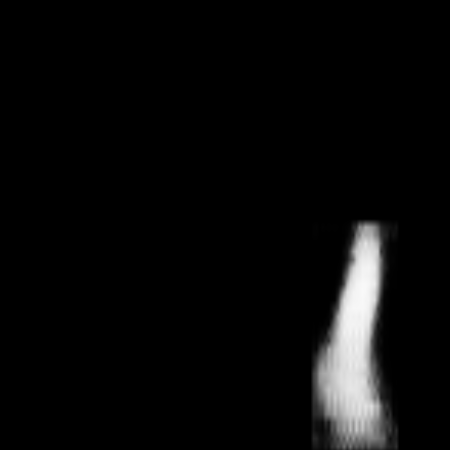
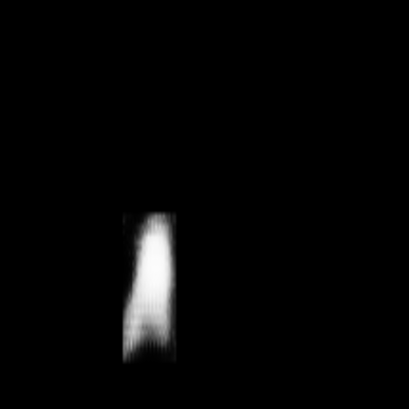
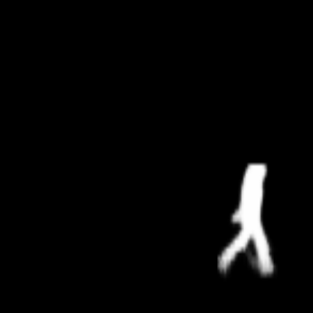
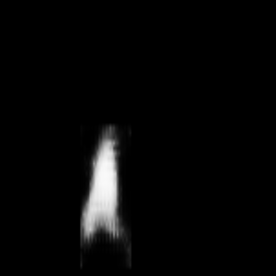
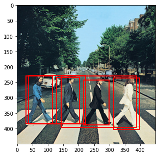
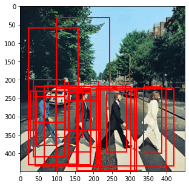

# TorchVision Instance Segmentation Finetuning Tutorial

For this tutorial, we will be finetuning a pre-trained [Mask R-CNN](https://arxiv.org/abs/1703.06870) model in the [*Penn-Fudan Database for Pedestrian Detection and Segmentation*](https://www.cis.upenn.edu/~jshi/ped_html/). It contains 170 images with 345 instances of pedestrians, and we will use it to illustrate how to use the new features in torchvision in order to train an instance segmentation model on a custom dataset.

First, we need to install `pycocotools`. This library will be used for computing the evaluation metrics following the COCO metric for intersection over union.


```python
%%shell

pip install cython
# Install pycocotools, the version by default in Colab
# has a bug fixed in https://github.com/cocodataset/cocoapi/pull/354
pip install -U 'git+https://github.com/cocodataset/cocoapi.git#subdirectory=PythonAPI'
```

    Looking in indexes: https://pypi.org/simple, https://us-python.pkg.dev/colab-wheels/public/simple/
    Requirement already satisfied: cython in /usr/local/lib/python3.7/dist-packages (0.29.32)
    Looking in indexes: https://pypi.org/simple, https://us-python.pkg.dev/colab-wheels/public/simple/
    Collecting git+https://github.com/cocodataset/cocoapi.git#subdirectory=PythonAPI
      Cloning https://github.com/cocodataset/cocoapi.git to /tmp/pip-req-build-79_us1ss
      Running command git clone -q https://github.com/cocodataset/cocoapi.git /tmp/pip-req-build-79_us1ss
    Requirement already satisfied: setuptools>=18.0 in /usr/local/lib/python3.7/dist-packages (from pycocotools==2.0) (57.4.0)
    Requirement already satisfied: cython>=0.27.3 in /usr/local/lib/python3.7/dist-packages (from pycocotools==2.0) (0.29.32)
    Requirement already satisfied: matplotlib>=2.1.0 in /usr/local/lib/python3.7/dist-packages (from pycocotools==2.0) (3.2.2)
    Requirement already satisfied: kiwisolver>=1.0.1 in /usr/local/lib/python3.7/dist-packages (from matplotlib>=2.1.0->pycocotools==2.0) (1.4.4)
    Requirement already satisfied: python-dateutil>=2.1 in /usr/local/lib/python3.7/dist-packages (from matplotlib>=2.1.0->pycocotools==2.0) (2.8.2)
    Requirement already satisfied: pyparsing!=2.0.4,!=2.1.2,!=2.1.6,>=2.0.1 in /usr/local/lib/python3.7/dist-packages (from matplotlib>=2.1.0->pycocotools==2.0) (3.0.9)
    Requirement already satisfied: cycler>=0.10 in /usr/local/lib/python3.7/dist-packages (from matplotlib>=2.1.0->pycocotools==2.0) (0.11.0)
    Requirement already satisfied: numpy>=1.11 in /usr/local/lib/python3.7/dist-packages (from matplotlib>=2.1.0->pycocotools==2.0) (1.21.6)
    Requirement already satisfied: typing-extensions in /usr/local/lib/python3.7/dist-packages (from kiwisolver>=1.0.1->matplotlib>=2.1.0->pycocotools==2.0) (4.1.1)
    Requirement already satisfied: six>=1.5 in /usr/local/lib/python3.7/dist-packages (from python-dateutil>=2.1->matplotlib>=2.1.0->pycocotools==2.0) (1.15.0)
    Building wheels for collected packages: pycocotools
      Building wheel for pycocotools (setup.py) ... [?25l[?25hdone
      Created wheel for pycocotools: filename=pycocotools-2.0-cp37-cp37m-linux_x86_64.whl size=265180 sha256=3d70542a3e4cf5305a27f33bc9a57843b9f5aa75d9d71b1676dade447c9b935a
      Stored in directory: /tmp/pip-ephem-wheel-cache-uyu8ised/wheels/e2/6b/1d/344ac773c7495ea0b85eb228bc66daec7400a143a92d36b7b1
    Successfully built pycocotools
    Installing collected packages: pycocotools
      Attempting uninstall: pycocotools
        Found existing installation: pycocotools 2.0.5
        Uninstalling pycocotools-2.0.5:
          Successfully uninstalled pycocotools-2.0.5
    Successfully installed pycocotools-2.0
    


    


## Defining the Dataset

The [torchvision reference scripts for training object detection, instance segmentation and person keypoint detection](https://github.com/pytorch/vision/tree/v0.3.0/references/detection) allows for easily supporting adding new custom datasets.
The dataset should inherit from the standard `torch.utils.data.Dataset` class, and implement `__len__` and `__getitem__`.

The only specificity that we require is that the dataset `__getitem__` should return:

* image: a PIL Image of size (H, W)
* target: a dict containing the following fields
    * `boxes` (`FloatTensor[N, 4]`): the coordinates of the `N` bounding boxes in `[x0, y0, x1, y1]` format, ranging from `0` to `W` and `0` to `H`
    * `labels` (`Int64Tensor[N]`): the label for each bounding box
    * `image_id` (`Int64Tensor[1]`): an image identifier. It should be unique between all the images in the dataset, and is used during evaluation
    * `area` (`Tensor[N]`): The area of the bounding box. This is used during evaluation with the COCO metric, to separate the metric scores between small, medium and large boxes.
    * `iscrowd` (`UInt8Tensor[N]`): instances with `iscrowd=True` will be ignored during evaluation.
    * (optionally) `masks` (`UInt8Tensor[N, H, W]`): The segmentation masks for each one of the objects
    * (optionally) `keypoints` (`FloatTensor[N, K, 3]`): For each one of the `N` objects, it contains the `K` keypoints in `[x, y, visibility]` format, defining the object. `visibility=0` means that the keypoint is not visible. Note that for data augmentation, the notion of flipping a keypoint is dependent on the data representation, and you should probably adapt `references/detection/transforms.py` for your new keypoint representation

If your model returns the above methods, they will make it work for both training and evaluation, and will use the evaluation scripts from pycocotools.


One note on the labels. The model considers class 0 as background. If your dataset does not contain the background class, you should not have 0 in your labels. For example, assuming you have just two classes, cat and dog, you can define 1 (not 0) to represent cats and 2 to represent dogs. So, for instance, if one of the images has both classes, your labels tensor should look like [1,2].

Additionally, if you want to use aspect ratio grouping during training (so that each batch only contains images with similar aspect ratio), then it is recommended to also implement a `get_height_and_width` method, which returns the height and the width of the image. If this method is not provided, we query all elements of the dataset via `__getitem__` , which loads the image in memory and is slower than if a custom method is provided.


### Writing a custom dataset for Penn-Fudan

Let's write a dataset for the Penn-Fudan dataset.

First, let's download and extract the data, present in a zip file at https://www.cis.upenn.edu/~jshi/ped_html/PennFudanPed.zip


```python
%%shell

# download the Penn-Fudan dataset
wget https://www.cis.upenn.edu/~jshi/ped_html/PennFudanPed.zip .
# extract it in the current folder
unzip PennFudanPed.zip
```

    --2022-10-14 17:02:20--  https://www.cis.upenn.edu/~jshi/ped_html/PennFudanPed.zip
    Resolving www.cis.upenn.edu (www.cis.upenn.edu)... 158.130.69.163, 2607:f470:8:64:5ea5::d
    Connecting to www.cis.upenn.edu (www.cis.upenn.edu)|158.130.69.163|:443... connected.
    HTTP request sent, awaiting response... 200 OK
    Length: 53723336 (51M) [application/zip]
    Saving to: ‘PennFudanPed.zip’
    
    PennFudanPed.zip    100%[===================>]  51.23M  11.0MB/s    in 5.6s    
    
    2022-10-14 17:02:26 (9.20 MB/s) - ‘PennFudanPed.zip’ saved [53723336/53723336]
    
    --2022-10-14 17:02:26--  http://./
    Resolving . (.)... failed: No address associated with hostname.
    wget: unable to resolve host address ‘.’
    FINISHED --2022-10-14 17:02:26--
    Total wall clock time: 6.5s
    Downloaded: 1 files, 51M in 5.6s (9.20 MB/s)
    Archive:  PennFudanPed.zip
       creating: PennFudanPed/
      inflating: PennFudanPed/added-object-list.txt  
       creating: PennFudanPed/Annotation/
      inflating: PennFudanPed/Annotation/FudanPed00001.txt  
      inflating: PennFudanPed/Annotation/FudanPed00002.txt  
      inflating: PennFudanPed/Annotation/FudanPed00003.txt  
      inflating: PennFudanPed/Annotation/FudanPed00004.txt  
      inflating: PennFudanPed/Annotation/FudanPed00005.txt  
      inflating: PennFudanPed/Annotation/FudanPed00006.txt  
      inflating: PennFudanPed/Annotation/FudanPed00007.txt  
      inflating: PennFudanPed/Annotation/FudanPed00008.txt  
      inflating: PennFudanPed/Annotation/FudanPed00009.txt  
      inflating: PennFudanPed/Annotation/FudanPed00010.txt  
      inflating: PennFudanPed/Annotation/FudanPed00011.txt  
      inflating: PennFudanPed/Annotation/FudanPed00012.txt  
      inflating: PennFudanPed/Annotation/FudanPed00013.txt  
      inflating: PennFudanPed/Annotation/FudanPed00014.txt  
      inflating: PennFudanPed/Annotation/FudanPed00015.txt  
      inflating: PennFudanPed/Annotation/FudanPed00016.txt  
      inflating: PennFudanPed/Annotation/FudanPed00017.txt  
      inflating: PennFudanPed/Annotation/FudanPed00018.txt  
      inflating: PennFudanPed/Annotation/FudanPed00019.txt  
      inflating: PennFudanPed/Annotation/FudanPed00020.txt  
      inflating: PennFudanPed/Annotation/FudanPed00021.txt  
      inflating: PennFudanPed/Annotation/FudanPed00022.txt  
      inflating: PennFudanPed/Annotation/FudanPed00023.txt  
      inflating: PennFudanPed/Annotation/FudanPed00024.txt  
      inflating: PennFudanPed/Annotation/FudanPed00025.txt  
      inflating: PennFudanPed/Annotation/FudanPed00026.txt  
      inflating: PennFudanPed/Annotation/FudanPed00027.txt  
      inflating: PennFudanPed/Annotation/FudanPed00028.txt  
      inflating: PennFudanPed/Annotation/FudanPed00029.txt  
      inflating: PennFudanPed/Annotation/FudanPed00030.txt  
      inflating: PennFudanPed/Annotation/FudanPed00031.txt  
      inflating: PennFudanPed/Annotation/FudanPed00032.txt  
      inflating: PennFudanPed/Annotation/FudanPed00033.txt  
      inflating: PennFudanPed/Annotation/FudanPed00034.txt  
      inflating: PennFudanPed/Annotation/FudanPed00035.txt  
      inflating: PennFudanPed/Annotation/FudanPed00036.txt  
      inflating: PennFudanPed/Annotation/FudanPed00037.txt  
      inflating: PennFudanPed/Annotation/FudanPed00038.txt  
      inflating: PennFudanPed/Annotation/FudanPed00039.txt  
      inflating: PennFudanPed/Annotation/FudanPed00040.txt  
      inflating: PennFudanPed/Annotation/FudanPed00041.txt  
      inflating: PennFudanPed/Annotation/FudanPed00042.txt  
      inflating: PennFudanPed/Annotation/FudanPed00043.txt  
      inflating: PennFudanPed/Annotation/FudanPed00044.txt  
      inflating: PennFudanPed/Annotation/FudanPed00045.txt  
      inflating: PennFudanPed/Annotation/FudanPed00046.txt  
      inflating: PennFudanPed/Annotation/FudanPed00047.txt  
      inflating: PennFudanPed/Annotation/FudanPed00048.txt  
      inflating: PennFudanPed/Annotation/FudanPed00049.txt  
      inflating: PennFudanPed/Annotation/FudanPed00050.txt  
      inflating: PennFudanPed/Annotation/FudanPed00051.txt  
      inflating: PennFudanPed/Annotation/FudanPed00052.txt  
      inflating: PennFudanPed/Annotation/FudanPed00053.txt  
      inflating: PennFudanPed/Annotation/FudanPed00054.txt  
      inflating: PennFudanPed/Annotation/FudanPed00055.txt  
      inflating: PennFudanPed/Annotation/FudanPed00056.txt  
      inflating: PennFudanPed/Annotation/FudanPed00057.txt  
      inflating: PennFudanPed/Annotation/FudanPed00058.txt  
      inflating: PennFudanPed/Annotation/FudanPed00059.txt  
      inflating: PennFudanPed/Annotation/FudanPed00060.txt  
      inflating: PennFudanPed/Annotation/FudanPed00061.txt  
      inflating: PennFudanPed/Annotation/FudanPed00062.txt  
      inflating: PennFudanPed/Annotation/FudanPed00063.txt  
      inflating: PennFudanPed/Annotation/FudanPed00064.txt  
      inflating: PennFudanPed/Annotation/FudanPed00065.txt  
      inflating: PennFudanPed/Annotation/FudanPed00066.txt  
      inflating: PennFudanPed/Annotation/FudanPed00067.txt  
      inflating: PennFudanPed/Annotation/FudanPed00068.txt  
      inflating: PennFudanPed/Annotation/FudanPed00069.txt  
      inflating: PennFudanPed/Annotation/FudanPed00070.txt  
      inflating: PennFudanPed/Annotation/FudanPed00071.txt  
      inflating: PennFudanPed/Annotation/FudanPed00072.txt  
      inflating: PennFudanPed/Annotation/FudanPed00073.txt  
      inflating: PennFudanPed/Annotation/FudanPed00074.txt  
      inflating: PennFudanPed/Annotation/PennPed00001.txt  
      inflating: PennFudanPed/Annotation/PennPed00002.txt  
      inflating: PennFudanPed/Annotation/PennPed00003.txt  
      inflating: PennFudanPed/Annotation/PennPed00004.txt  
      inflating: PennFudanPed/Annotation/PennPed00005.txt  
      inflating: PennFudanPed/Annotation/PennPed00006.txt  
      inflating: PennFudanPed/Annotation/PennPed00007.txt  
      inflating: PennFudanPed/Annotation/PennPed00008.txt  
      inflating: PennFudanPed/Annotation/PennPed00009.txt  
      inflating: PennFudanPed/Annotation/PennPed00010.txt  
      inflating: PennFudanPed/Annotation/PennPed00011.txt  
      inflating: PennFudanPed/Annotation/PennPed00012.txt  
      inflating: PennFudanPed/Annotation/PennPed00013.txt  
      inflating: PennFudanPed/Annotation/PennPed00014.txt  
      inflating: PennFudanPed/Annotation/PennPed00015.txt  
      inflating: PennFudanPed/Annotation/PennPed00016.txt  
      inflating: PennFudanPed/Annotation/PennPed00017.txt  
      inflating: PennFudanPed/Annotation/PennPed00018.txt  
      inflating: PennFudanPed/Annotation/PennPed00019.txt  
      inflating: PennFudanPed/Annotation/PennPed00020.txt  
      inflating: PennFudanPed/Annotation/PennPed00021.txt  
      inflating: PennFudanPed/Annotation/PennPed00022.txt  
      inflating: PennFudanPed/Annotation/PennPed00023.txt  
      inflating: PennFudanPed/Annotation/PennPed00024.txt  
      inflating: PennFudanPed/Annotation/PennPed00025.txt  
      inflating: PennFudanPed/Annotation/PennPed00026.txt  
      inflating: PennFudanPed/Annotation/PennPed00027.txt  
      inflating: PennFudanPed/Annotation/PennPed00028.txt  
      inflating: PennFudanPed/Annotation/PennPed00029.txt  
      inflating: PennFudanPed/Annotation/PennPed00030.txt  
      inflating: PennFudanPed/Annotation/PennPed00031.txt  
      inflating: PennFudanPed/Annotation/PennPed00032.txt  
      inflating: PennFudanPed/Annotation/PennPed00033.txt  
      inflating: PennFudanPed/Annotation/PennPed00034.txt  
      inflating: PennFudanPed/Annotation/PennPed00035.txt  
      inflating: PennFudanPed/Annotation/PennPed00036.txt  
      inflating: PennFudanPed/Annotation/PennPed00037.txt  
      inflating: PennFudanPed/Annotation/PennPed00038.txt  
      inflating: PennFudanPed/Annotation/PennPed00039.txt  
      inflating: PennFudanPed/Annotation/PennPed00040.txt  
      inflating: PennFudanPed/Annotation/PennPed00041.txt  
      inflating: PennFudanPed/Annotation/PennPed00042.txt  
      inflating: PennFudanPed/Annotation/PennPed00043.txt  
      inflating: PennFudanPed/Annotation/PennPed00044.txt  
      inflating: PennFudanPed/Annotation/PennPed00045.txt  
      inflating: PennFudanPed/Annotation/PennPed00046.txt  
      inflating: PennFudanPed/Annotation/PennPed00047.txt  
      inflating: PennFudanPed/Annotation/PennPed00048.txt  
      inflating: PennFudanPed/Annotation/PennPed00049.txt  
      inflating: PennFudanPed/Annotation/PennPed00050.txt  
      inflating: PennFudanPed/Annotation/PennPed00051.txt  
      inflating: PennFudanPed/Annotation/PennPed00052.txt  
      inflating: PennFudanPed/Annotation/PennPed00053.txt  
      inflating: PennFudanPed/Annotation/PennPed00054.txt  
      inflating: PennFudanPed/Annotation/PennPed00055.txt  
      inflating: PennFudanPed/Annotation/PennPed00056.txt  
      inflating: PennFudanPed/Annotation/PennPed00057.txt  
      inflating: PennFudanPed/Annotation/PennPed00058.txt  
      inflating: PennFudanPed/Annotation/PennPed00059.txt  
      inflating: PennFudanPed/Annotation/PennPed00060.txt  
      inflating: PennFudanPed/Annotation/PennPed00061.txt  
      inflating: PennFudanPed/Annotation/PennPed00062.txt  
      inflating: PennFudanPed/Annotation/PennPed00063.txt  
      inflating: PennFudanPed/Annotation/PennPed00064.txt  
      inflating: PennFudanPed/Annotation/PennPed00065.txt  
      inflating: PennFudanPed/Annotation/PennPed00066.txt  
      inflating: PennFudanPed/Annotation/PennPed00067.txt  
      inflating: PennFudanPed/Annotation/PennPed00068.txt  
      inflating: PennFudanPed/Annotation/PennPed00069.txt  
      inflating: PennFudanPed/Annotation/PennPed00070.txt  
      inflating: PennFudanPed/Annotation/PennPed00071.txt  
      inflating: PennFudanPed/Annotation/PennPed00072.txt  
      inflating: PennFudanPed/Annotation/PennPed00073.txt  
      inflating: PennFudanPed/Annotation/PennPed00074.txt  
      inflating: PennFudanPed/Annotation/PennPed00075.txt  
      inflating: PennFudanPed/Annotation/PennPed00076.txt  
      inflating: PennFudanPed/Annotation/PennPed00077.txt  
      inflating: PennFudanPed/Annotation/PennPed00078.txt  
      inflating: PennFudanPed/Annotation/PennPed00079.txt  
      inflating: PennFudanPed/Annotation/PennPed00080.txt  
      inflating: PennFudanPed/Annotation/PennPed00081.txt  
      inflating: PennFudanPed/Annotation/PennPed00082.txt  
      inflating: PennFudanPed/Annotation/PennPed00083.txt  
      inflating: PennFudanPed/Annotation/PennPed00084.txt  
      inflating: PennFudanPed/Annotation/PennPed00085.txt  
      inflating: PennFudanPed/Annotation/PennPed00086.txt  
      inflating: PennFudanPed/Annotation/PennPed00087.txt  
      inflating: PennFudanPed/Annotation/PennPed00088.txt  
      inflating: PennFudanPed/Annotation/PennPed00089.txt  
      inflating: PennFudanPed/Annotation/PennPed00090.txt  
      inflating: PennFudanPed/Annotation/PennPed00091.txt  
      inflating: PennFudanPed/Annotation/PennPed00092.txt  
      inflating: PennFudanPed/Annotation/PennPed00093.txt  
      inflating: PennFudanPed/Annotation/PennPed00094.txt  
      inflating: PennFudanPed/Annotation/PennPed00095.txt  
      inflating: PennFudanPed/Annotation/PennPed00096.txt  
       creating: PennFudanPed/PedMasks/
      inflating: PennFudanPed/PedMasks/FudanPed00001_mask.png  
      inflating: PennFudanPed/PedMasks/FudanPed00002_mask.png  
      inflating: PennFudanPed/PedMasks/FudanPed00003_mask.png  
      inflating: PennFudanPed/PedMasks/FudanPed00004_mask.png  
      inflating: PennFudanPed/PedMasks/FudanPed00005_mask.png  
      inflating: PennFudanPed/PedMasks/FudanPed00006_mask.png  
      inflating: PennFudanPed/PedMasks/FudanPed00007_mask.png  
      inflating: PennFudanPed/PedMasks/FudanPed00008_mask.png  
      inflating: PennFudanPed/PedMasks/FudanPed00009_mask.png  
      inflating: PennFudanPed/PedMasks/FudanPed00010_mask.png  
      inflating: PennFudanPed/PedMasks/FudanPed00011_mask.png  
      inflating: PennFudanPed/PedMasks/FudanPed00012_mask.png  
      inflating: PennFudanPed/PedMasks/FudanPed00013_mask.png  
      inflating: PennFudanPed/PedMasks/FudanPed00014_mask.png  
     extracting: PennFudanPed/PedMasks/FudanPed00015_mask.png  
      inflating: PennFudanPed/PedMasks/FudanPed00016_mask.png  
      inflating: PennFudanPed/PedMasks/FudanPed00017_mask.png  
     extracting: PennFudanPed/PedMasks/FudanPed00018_mask.png  
      inflating: PennFudanPed/PedMasks/FudanPed00019_mask.png  
      inflating: PennFudanPed/PedMasks/FudanPed00020_mask.png  
      inflating: PennFudanPed/PedMasks/FudanPed00021_mask.png  
      inflating: PennFudanPed/PedMasks/FudanPed00022_mask.png  
      inflating: PennFudanPed/PedMasks/FudanPed00023_mask.png  
      inflating: PennFudanPed/PedMasks/FudanPed00024_mask.png  
      inflating: PennFudanPed/PedMasks/FudanPed00025_mask.png  
      inflating: PennFudanPed/PedMasks/FudanPed00026_mask.png  
      inflating: PennFudanPed/PedMasks/FudanPed00027_mask.png  
     extracting: PennFudanPed/PedMasks/FudanPed00028_mask.png  
      inflating: PennFudanPed/PedMasks/FudanPed00029_mask.png  
      inflating: PennFudanPed/PedMasks/FudanPed00030_mask.png  
      inflating: PennFudanPed/PedMasks/FudanPed00031_mask.png  
      inflating: PennFudanPed/PedMasks/FudanPed00032_mask.png  
      inflating: PennFudanPed/PedMasks/FudanPed00033_mask.png  
      inflating: PennFudanPed/PedMasks/FudanPed00034_mask.png  
      inflating: PennFudanPed/PedMasks/FudanPed00035_mask.png  
      inflating: PennFudanPed/PedMasks/FudanPed00036_mask.png  
      inflating: PennFudanPed/PedMasks/FudanPed00037_mask.png  
      inflating: PennFudanPed/PedMasks/FudanPed00038_mask.png  
      inflating: PennFudanPed/PedMasks/FudanPed00039_mask.png  
      inflating: PennFudanPed/PedMasks/FudanPed00040_mask.png  
      inflating: PennFudanPed/PedMasks/FudanPed00041_mask.png  
      inflating: PennFudanPed/PedMasks/FudanPed00042_mask.png  
      inflating: PennFudanPed/PedMasks/FudanPed00043_mask.png  
      inflating: PennFudanPed/PedMasks/FudanPed00044_mask.png  
      inflating: PennFudanPed/PedMasks/FudanPed00045_mask.png  
      inflating: PennFudanPed/PedMasks/FudanPed00046_mask.png  
      inflating: PennFudanPed/PedMasks/FudanPed00047_mask.png  
      inflating: PennFudanPed/PedMasks/FudanPed00048_mask.png  
      inflating: PennFudanPed/PedMasks/FudanPed00049_mask.png  
      inflating: PennFudanPed/PedMasks/FudanPed00050_mask.png  
      inflating: PennFudanPed/PedMasks/FudanPed00051_mask.png  
      inflating: PennFudanPed/PedMasks/FudanPed00052_mask.png  
      inflating: PennFudanPed/PedMasks/FudanPed00053_mask.png  
      inflating: PennFudanPed/PedMasks/FudanPed00054_mask.png  
      inflating: PennFudanPed/PedMasks/FudanPed00055_mask.png  
      inflating: PennFudanPed/PedMasks/FudanPed00056_mask.png  
      inflating: PennFudanPed/PedMasks/FudanPed00057_mask.png  
      inflating: PennFudanPed/PedMasks/FudanPed00058_mask.png  
      inflating: PennFudanPed/PedMasks/FudanPed00059_mask.png  
      inflating: PennFudanPed/PedMasks/FudanPed00060_mask.png  
      inflating: PennFudanPed/PedMasks/FudanPed00061_mask.png  
      inflating: PennFudanPed/PedMasks/FudanPed00062_mask.png  
      inflating: PennFudanPed/PedMasks/FudanPed00063_mask.png  
      inflating: PennFudanPed/PedMasks/FudanPed00064_mask.png  
      inflating: PennFudanPed/PedMasks/FudanPed00065_mask.png  
      inflating: PennFudanPed/PedMasks/FudanPed00066_mask.png  
      inflating: PennFudanPed/PedMasks/FudanPed00067_mask.png  
      inflating: PennFudanPed/PedMasks/FudanPed00068_mask.png  
      inflating: PennFudanPed/PedMasks/FudanPed00069_mask.png  
      inflating: PennFudanPed/PedMasks/FudanPed00070_mask.png  
      inflating: PennFudanPed/PedMasks/FudanPed00071_mask.png  
      inflating: PennFudanPed/PedMasks/FudanPed00072_mask.png  
      inflating: PennFudanPed/PedMasks/FudanPed00073_mask.png  
      inflating: PennFudanPed/PedMasks/FudanPed00074_mask.png  
      inflating: PennFudanPed/PedMasks/PennPed00001_mask.png  
      inflating: PennFudanPed/PedMasks/PennPed00002_mask.png  
      inflating: PennFudanPed/PedMasks/PennPed00003_mask.png  
      inflating: PennFudanPed/PedMasks/PennPed00004_mask.png  
      inflating: PennFudanPed/PedMasks/PennPed00005_mask.png  
      inflating: PennFudanPed/PedMasks/PennPed00006_mask.png  
      inflating: PennFudanPed/PedMasks/PennPed00007_mask.png  
      inflating: PennFudanPed/PedMasks/PennPed00008_mask.png  
      inflating: PennFudanPed/PedMasks/PennPed00009_mask.png  
      inflating: PennFudanPed/PedMasks/PennPed00010_mask.png  
      inflating: PennFudanPed/PedMasks/PennPed00011_mask.png  
      inflating: PennFudanPed/PedMasks/PennPed00012_mask.png  
      inflating: PennFudanPed/PedMasks/PennPed00013_mask.png  
      inflating: PennFudanPed/PedMasks/PennPed00014_mask.png  
      inflating: PennFudanPed/PedMasks/PennPed00015_mask.png  
      inflating: PennFudanPed/PedMasks/PennPed00016_mask.png  
      inflating: PennFudanPed/PedMasks/PennPed00017_mask.png  
      inflating: PennFudanPed/PedMasks/PennPed00018_mask.png  
      inflating: PennFudanPed/PedMasks/PennPed00019_mask.png  
      inflating: PennFudanPed/PedMasks/PennPed00020_mask.png  
      inflating: PennFudanPed/PedMasks/PennPed00021_mask.png  
      inflating: PennFudanPed/PedMasks/PennPed00022_mask.png  
      inflating: PennFudanPed/PedMasks/PennPed00023_mask.png  
      inflating: PennFudanPed/PedMasks/PennPed00024_mask.png  
      inflating: PennFudanPed/PedMasks/PennPed00025_mask.png  
      inflating: PennFudanPed/PedMasks/PennPed00026_mask.png  
      inflating: PennFudanPed/PedMasks/PennPed00027_mask.png  
      inflating: PennFudanPed/PedMasks/PennPed00028_mask.png  
      inflating: PennFudanPed/PedMasks/PennPed00029_mask.png  
      inflating: PennFudanPed/PedMasks/PennPed00030_mask.png  
      inflating: PennFudanPed/PedMasks/PennPed00031_mask.png  
      inflating: PennFudanPed/PedMasks/PennPed00032_mask.png  
      inflating: PennFudanPed/PedMasks/PennPed00033_mask.png  
      inflating: PennFudanPed/PedMasks/PennPed00034_mask.png  
      inflating: PennFudanPed/PedMasks/PennPed00035_mask.png  
      inflating: PennFudanPed/PedMasks/PennPed00036_mask.png  
      inflating: PennFudanPed/PedMasks/PennPed00037_mask.png  
      inflating: PennFudanPed/PedMasks/PennPed00038_mask.png  
      inflating: PennFudanPed/PedMasks/PennPed00039_mask.png  
      inflating: PennFudanPed/PedMasks/PennPed00040_mask.png  
      inflating: PennFudanPed/PedMasks/PennPed00041_mask.png  
      inflating: PennFudanPed/PedMasks/PennPed00042_mask.png  
      inflating: PennFudanPed/PedMasks/PennPed00043_mask.png  
      inflating: PennFudanPed/PedMasks/PennPed00044_mask.png  
      inflating: PennFudanPed/PedMasks/PennPed00045_mask.png  
      inflating: PennFudanPed/PedMasks/PennPed00046_mask.png  
      inflating: PennFudanPed/PedMasks/PennPed00047_mask.png  
      inflating: PennFudanPed/PedMasks/PennPed00048_mask.png  
      inflating: PennFudanPed/PedMasks/PennPed00049_mask.png  
      inflating: PennFudanPed/PedMasks/PennPed00050_mask.png  
      inflating: PennFudanPed/PedMasks/PennPed00051_mask.png  
      inflating: PennFudanPed/PedMasks/PennPed00052_mask.png  
     extracting: PennFudanPed/PedMasks/PennPed00053_mask.png  
      inflating: PennFudanPed/PedMasks/PennPed00054_mask.png  
      inflating: PennFudanPed/PedMasks/PennPed00055_mask.png  
      inflating: PennFudanPed/PedMasks/PennPed00056_mask.png  
      inflating: PennFudanPed/PedMasks/PennPed00057_mask.png  
      inflating: PennFudanPed/PedMasks/PennPed00058_mask.png  
      inflating: PennFudanPed/PedMasks/PennPed00059_mask.png  
      inflating: PennFudanPed/PedMasks/PennPed00060_mask.png  
      inflating: PennFudanPed/PedMasks/PennPed00061_mask.png  
     extracting: PennFudanPed/PedMasks/PennPed00062_mask.png  
      inflating: PennFudanPed/PedMasks/PennPed00063_mask.png  
      inflating: PennFudanPed/PedMasks/PennPed00064_mask.png  
      inflating: PennFudanPed/PedMasks/PennPed00065_mask.png  
     extracting: PennFudanPed/PedMasks/PennPed00066_mask.png  
      inflating: PennFudanPed/PedMasks/PennPed00067_mask.png  
      inflating: PennFudanPed/PedMasks/PennPed00068_mask.png  
     extracting: PennFudanPed/PedMasks/PennPed00069_mask.png  
     extracting: PennFudanPed/PedMasks/PennPed00070_mask.png  
      inflating: PennFudanPed/PedMasks/PennPed00071_mask.png  
     extracting: PennFudanPed/PedMasks/PennPed00072_mask.png  
      inflating: PennFudanPed/PedMasks/PennPed00073_mask.png  
     extracting: PennFudanPed/PedMasks/PennPed00074_mask.png  
      inflating: PennFudanPed/PedMasks/PennPed00075_mask.png  
      inflating: PennFudanPed/PedMasks/PennPed00076_mask.png  
      inflating: PennFudanPed/PedMasks/PennPed00077_mask.png  
      inflating: PennFudanPed/PedMasks/PennPed00078_mask.png  
      inflating: PennFudanPed/PedMasks/PennPed00079_mask.png  
      inflating: PennFudanPed/PedMasks/PennPed00080_mask.png  
      inflating: PennFudanPed/PedMasks/PennPed00081_mask.png  
      inflating: PennFudanPed/PedMasks/PennPed00082_mask.png  
     extracting: PennFudanPed/PedMasks/PennPed00083_mask.png  
     extracting: PennFudanPed/PedMasks/PennPed00084_mask.png  
      inflating: PennFudanPed/PedMasks/PennPed00085_mask.png  
     extracting: PennFudanPed/PedMasks/PennPed00086_mask.png  
      inflating: PennFudanPed/PedMasks/PennPed00087_mask.png  
      inflating: PennFudanPed/PedMasks/PennPed00088_mask.png  
     extracting: PennFudanPed/PedMasks/PennPed00089_mask.png  
     extracting: PennFudanPed/PedMasks/PennPed00090_mask.png  
      inflating: PennFudanPed/PedMasks/PennPed00091_mask.png  
      inflating: PennFudanPed/PedMasks/PennPed00092_mask.png  
      inflating: PennFudanPed/PedMasks/PennPed00093_mask.png  
      inflating: PennFudanPed/PedMasks/PennPed00094_mask.png  
      inflating: PennFudanPed/PedMasks/PennPed00095_mask.png  
     extracting: PennFudanPed/PedMasks/PennPed00096_mask.png  
       creating: PennFudanPed/PNGImages/
      inflating: PennFudanPed/PNGImages/FudanPed00001.png  
      inflating: PennFudanPed/PNGImages/FudanPed00002.png  
      inflating: PennFudanPed/PNGImages/FudanPed00003.png  
      inflating: PennFudanPed/PNGImages/FudanPed00004.png  
      inflating: PennFudanPed/PNGImages/FudanPed00005.png  
      inflating: PennFudanPed/PNGImages/FudanPed00006.png  
      inflating: PennFudanPed/PNGImages/FudanPed00007.png  
      inflating: PennFudanPed/PNGImages/FudanPed00008.png  
      inflating: PennFudanPed/PNGImages/FudanPed00009.png  
      inflating: PennFudanPed/PNGImages/FudanPed00010.png  
      inflating: PennFudanPed/PNGImages/FudanPed00011.png  
      inflating: PennFudanPed/PNGImages/FudanPed00012.png  
      inflating: PennFudanPed/PNGImages/FudanPed00013.png  
      inflating: PennFudanPed/PNGImages/FudanPed00014.png  
      inflating: PennFudanPed/PNGImages/FudanPed00015.png  
      inflating: PennFudanPed/PNGImages/FudanPed00016.png  
      inflating: PennFudanPed/PNGImages/FudanPed00017.png  
      inflating: PennFudanPed/PNGImages/FudanPed00018.png  
      inflating: PennFudanPed/PNGImages/FudanPed00019.png  
      inflating: PennFudanPed/PNGImages/FudanPed00020.png  
      inflating: PennFudanPed/PNGImages/FudanPed00021.png  
      inflating: PennFudanPed/PNGImages/FudanPed00022.png  
      inflating: PennFudanPed/PNGImages/FudanPed00023.png  
      inflating: PennFudanPed/PNGImages/FudanPed00024.png  
      inflating: PennFudanPed/PNGImages/FudanPed00025.png  
      inflating: PennFudanPed/PNGImages/FudanPed00026.png  
      inflating: PennFudanPed/PNGImages/FudanPed00027.png  
      inflating: PennFudanPed/PNGImages/FudanPed00028.png  
      inflating: PennFudanPed/PNGImages/FudanPed00029.png  
      inflating: PennFudanPed/PNGImages/FudanPed00030.png  
      inflating: PennFudanPed/PNGImages/FudanPed00031.png  
      inflating: PennFudanPed/PNGImages/FudanPed00032.png  
      inflating: PennFudanPed/PNGImages/FudanPed00033.png  
      inflating: PennFudanPed/PNGImages/FudanPed00034.png  
      inflating: PennFudanPed/PNGImages/FudanPed00035.png  
      inflating: PennFudanPed/PNGImages/FudanPed00036.png  
      inflating: PennFudanPed/PNGImages/FudanPed00037.png  
      inflating: PennFudanPed/PNGImages/FudanPed00038.png  
      inflating: PennFudanPed/PNGImages/FudanPed00039.png  
      inflating: PennFudanPed/PNGImages/FudanPed00040.png  
      inflating: PennFudanPed/PNGImages/FudanPed00041.png  
      inflating: PennFudanPed/PNGImages/FudanPed00042.png  
      inflating: PennFudanPed/PNGImages/FudanPed00043.png  
      inflating: PennFudanPed/PNGImages/FudanPed00044.png  
      inflating: PennFudanPed/PNGImages/FudanPed00045.png  
      inflating: PennFudanPed/PNGImages/FudanPed00046.png  
      inflating: PennFudanPed/PNGImages/FudanPed00047.png  
      inflating: PennFudanPed/PNGImages/FudanPed00048.png  
      inflating: PennFudanPed/PNGImages/FudanPed00049.png  
      inflating: PennFudanPed/PNGImages/FudanPed00050.png  
      inflating: PennFudanPed/PNGImages/FudanPed00051.png  
      inflating: PennFudanPed/PNGImages/FudanPed00052.png  
      inflating: PennFudanPed/PNGImages/FudanPed00053.png  
      inflating: PennFudanPed/PNGImages/FudanPed00054.png  
      inflating: PennFudanPed/PNGImages/FudanPed00055.png  
      inflating: PennFudanPed/PNGImages/FudanPed00056.png  
      inflating: PennFudanPed/PNGImages/FudanPed00057.png  
      inflating: PennFudanPed/PNGImages/FudanPed00058.png  
      inflating: PennFudanPed/PNGImages/FudanPed00059.png  
      inflating: PennFudanPed/PNGImages/FudanPed00060.png  
      inflating: PennFudanPed/PNGImages/FudanPed00061.png  
      inflating: PennFudanPed/PNGImages/FudanPed00062.png  
      inflating: PennFudanPed/PNGImages/FudanPed00063.png  
      inflating: PennFudanPed/PNGImages/FudanPed00064.png  
      inflating: PennFudanPed/PNGImages/FudanPed00065.png  
      inflating: PennFudanPed/PNGImages/FudanPed00066.png  
      inflating: PennFudanPed/PNGImages/FudanPed00067.png  
      inflating: PennFudanPed/PNGImages/FudanPed00068.png  
      inflating: PennFudanPed/PNGImages/FudanPed00069.png  
      inflating: PennFudanPed/PNGImages/FudanPed00070.png  
      inflating: PennFudanPed/PNGImages/FudanPed00071.png  
      inflating: PennFudanPed/PNGImages/FudanPed00072.png  
      inflating: PennFudanPed/PNGImages/FudanPed00073.png  
      inflating: PennFudanPed/PNGImages/FudanPed00074.png  
      inflating: PennFudanPed/PNGImages/PennPed00001.png  
      inflating: PennFudanPed/PNGImages/PennPed00002.png  
      inflating: PennFudanPed/PNGImages/PennPed00003.png  
      inflating: PennFudanPed/PNGImages/PennPed00004.png  
      inflating: PennFudanPed/PNGImages/PennPed00005.png  
      inflating: PennFudanPed/PNGImages/PennPed00006.png  
      inflating: PennFudanPed/PNGImages/PennPed00007.png  
      inflating: PennFudanPed/PNGImages/PennPed00008.png  
      inflating: PennFudanPed/PNGImages/PennPed00009.png  
      inflating: PennFudanPed/PNGImages/PennPed00010.png  
      inflating: PennFudanPed/PNGImages/PennPed00011.png  
      inflating: PennFudanPed/PNGImages/PennPed00012.png  
      inflating: PennFudanPed/PNGImages/PennPed00013.png  
      inflating: PennFudanPed/PNGImages/PennPed00014.png  
      inflating: PennFudanPed/PNGImages/PennPed00015.png  
      inflating: PennFudanPed/PNGImages/PennPed00016.png  
      inflating: PennFudanPed/PNGImages/PennPed00017.png  
      inflating: PennFudanPed/PNGImages/PennPed00018.png  
      inflating: PennFudanPed/PNGImages/PennPed00019.png  
      inflating: PennFudanPed/PNGImages/PennPed00020.png  
      inflating: PennFudanPed/PNGImages/PennPed00021.png  
      inflating: PennFudanPed/PNGImages/PennPed00022.png  
      inflating: PennFudanPed/PNGImages/PennPed00023.png  
      inflating: PennFudanPed/PNGImages/PennPed00024.png  
      inflating: PennFudanPed/PNGImages/PennPed00025.png  
      inflating: PennFudanPed/PNGImages/PennPed00026.png  
      inflating: PennFudanPed/PNGImages/PennPed00027.png  
      inflating: PennFudanPed/PNGImages/PennPed00028.png  
      inflating: PennFudanPed/PNGImages/PennPed00029.png  
      inflating: PennFudanPed/PNGImages/PennPed00030.png  
      inflating: PennFudanPed/PNGImages/PennPed00031.png  
      inflating: PennFudanPed/PNGImages/PennPed00032.png  
      inflating: PennFudanPed/PNGImages/PennPed00033.png  
      inflating: PennFudanPed/PNGImages/PennPed00034.png  
      inflating: PennFudanPed/PNGImages/PennPed00035.png  
      inflating: PennFudanPed/PNGImages/PennPed00036.png  
      inflating: PennFudanPed/PNGImages/PennPed00037.png  
      inflating: PennFudanPed/PNGImages/PennPed00038.png  
      inflating: PennFudanPed/PNGImages/PennPed00039.png  
      inflating: PennFudanPed/PNGImages/PennPed00040.png  
      inflating: PennFudanPed/PNGImages/PennPed00041.png  
      inflating: PennFudanPed/PNGImages/PennPed00042.png  
      inflating: PennFudanPed/PNGImages/PennPed00043.png  
      inflating: PennFudanPed/PNGImages/PennPed00044.png  
      inflating: PennFudanPed/PNGImages/PennPed00045.png  
      inflating: PennFudanPed/PNGImages/PennPed00046.png  
      inflating: PennFudanPed/PNGImages/PennPed00047.png  
      inflating: PennFudanPed/PNGImages/PennPed00048.png  
      inflating: PennFudanPed/PNGImages/PennPed00049.png  
      inflating: PennFudanPed/PNGImages/PennPed00050.png  
      inflating: PennFudanPed/PNGImages/PennPed00051.png  
      inflating: PennFudanPed/PNGImages/PennPed00052.png  
      inflating: PennFudanPed/PNGImages/PennPed00053.png  
      inflating: PennFudanPed/PNGImages/PennPed00054.png  
      inflating: PennFudanPed/PNGImages/PennPed00055.png  
      inflating: PennFudanPed/PNGImages/PennPed00056.png  
      inflating: PennFudanPed/PNGImages/PennPed00057.png  
      inflating: PennFudanPed/PNGImages/PennPed00058.png  
      inflating: PennFudanPed/PNGImages/PennPed00059.png  
      inflating: PennFudanPed/PNGImages/PennPed00060.png  
      inflating: PennFudanPed/PNGImages/PennPed00061.png  
      inflating: PennFudanPed/PNGImages/PennPed00062.png  
      inflating: PennFudanPed/PNGImages/PennPed00063.png  
      inflating: PennFudanPed/PNGImages/PennPed00064.png  
      inflating: PennFudanPed/PNGImages/PennPed00065.png  
      inflating: PennFudanPed/PNGImages/PennPed00066.png  
      inflating: PennFudanPed/PNGImages/PennPed00067.png  
      inflating: PennFudanPed/PNGImages/PennPed00068.png  
      inflating: PennFudanPed/PNGImages/PennPed00069.png  
      inflating: PennFudanPed/PNGImages/PennPed00070.png  
      inflating: PennFudanPed/PNGImages/PennPed00071.png  
      inflating: PennFudanPed/PNGImages/PennPed00072.png  
      inflating: PennFudanPed/PNGImages/PennPed00073.png  
      inflating: PennFudanPed/PNGImages/PennPed00074.png  
      inflating: PennFudanPed/PNGImages/PennPed00075.png  
      inflating: PennFudanPed/PNGImages/PennPed00076.png  
      inflating: PennFudanPed/PNGImages/PennPed00077.png  
      inflating: PennFudanPed/PNGImages/PennPed00078.png  
      inflating: PennFudanPed/PNGImages/PennPed00079.png  
      inflating: PennFudanPed/PNGImages/PennPed00080.png  
      inflating: PennFudanPed/PNGImages/PennPed00081.png  
      inflating: PennFudanPed/PNGImages/PennPed00082.png  
      inflating: PennFudanPed/PNGImages/PennPed00083.png  
      inflating: PennFudanPed/PNGImages/PennPed00084.png  
      inflating: PennFudanPed/PNGImages/PennPed00085.png  
      inflating: PennFudanPed/PNGImages/PennPed00086.png  
      inflating: PennFudanPed/PNGImages/PennPed00087.png  
      inflating: PennFudanPed/PNGImages/PennPed00088.png  
      inflating: PennFudanPed/PNGImages/PennPed00089.png  
      inflating: PennFudanPed/PNGImages/PennPed00090.png  
      inflating: PennFudanPed/PNGImages/PennPed00091.png  
      inflating: PennFudanPed/PNGImages/PennPed00092.png  
      inflating: PennFudanPed/PNGImages/PennPed00093.png  
      inflating: PennFudanPed/PNGImages/PennPed00094.png  
      inflating: PennFudanPed/PNGImages/PennPed00095.png  
      inflating: PennFudanPed/PNGImages/PennPed00096.png  
      inflating: PennFudanPed/readme.txt  
    


    


Let's have a look at the dataset and how it is layed down.

The data is structured as follows
```
PennFudanPed/
  PedMasks/
    FudanPed00001_mask.png
    FudanPed00002_mask.png
    FudanPed00003_mask.png
    FudanPed00004_mask.png
    ...
  PNGImages/
    FudanPed00001.png
    FudanPed00002.png
    FudanPed00003.png
    FudanPed00004.png
```

Here is one example of an image in the dataset, with its corresponding instance segmentation mask


```python
from PIL import Image
Image.open('PennFudanPed/PNGImages/FudanPed00001.png')
```


    

    


```python
mask = Image.open('PennFudanPed/PedMasks/FudanPed00001_mask.png')
# each mask instance has a different color, from zero to N, where
# N is the number of instances. In order to make visualization easier,
# let's adda color palette to the mask.
mask.putpalette([
    0, 0, 0, # black background
    255, 0, 0, # index 1 is red
    255, 255, 0, # index 2 is yellow
    255, 153, 0, # index 3 is orange
])
mask
```


    

    


So each image has a corresponding segmentation mask, where each color correspond to a different instance. Let's write a `torch.utils.data.Dataset` class for this dataset.


```python
import os
import numpy as np
import torch
import torch.utils.data
from PIL import Image


class PennFudanDataset(torch.utils.data.Dataset):
    def __init__(self, root, transforms=None):
        self.root = root
        self.transforms = transforms
        # load all image files, sorting them to
        # ensure that they are aligned
        self.imgs = list(sorted(os.listdir(os.path.join(root, "PNGImages"))))
        self.masks = list(sorted(os.listdir(os.path.join(root, "PedMasks"))))

    def __getitem__(self, idx):
        # load images ad masks
        img_path = os.path.join(self.root, "PNGImages", self.imgs[idx])
        mask_path = os.path.join(self.root, "PedMasks", self.masks[idx])
        img = Image.open(img_path).convert("RGB")
        # note that we haven't converted the mask to RGB,
        # because each color corresponds to a different instance
        # with 0 being background
        mask = Image.open(mask_path)

        mask = np.array(mask)
        # instances are encoded as different colors
        obj_ids = np.unique(mask)
        # first id is the background, so remove it
        obj_ids = obj_ids[1:]

        # split the color-encoded mask into a set
        # of binary masks
        masks = mask == obj_ids[:, None, None]

        # get bounding box coordinates for each mask
        num_objs = len(obj_ids)
        boxes = []
        for i in range(num_objs):
            pos = np.where(masks[i])
            xmin = np.min(pos[1])
            xmax = np.max(pos[1])
            ymin = np.min(pos[0])
            ymax = np.max(pos[0])
            boxes.append([xmin, ymin, xmax, ymax])

        boxes = torch.as_tensor(boxes, dtype=torch.float32)
        # there is only one class
        labels = torch.ones((num_objs,), dtype=torch.int64)
        masks = torch.as_tensor(masks, dtype=torch.uint8)

        image_id = torch.tensor([idx])
        area = (boxes[:, 3] - boxes[:, 1]) * (boxes[:, 2] - boxes[:, 0])
        # suppose all instances are not crowd
        iscrowd = torch.zeros((num_objs,), dtype=torch.int64)

        target = {}
        target["boxes"] = boxes
        target["labels"] = labels
        target["masks"] = masks
        target["image_id"] = image_id
        target["area"] = area
        target["iscrowd"] = iscrowd
        # target["objectID"] = obj_ids
        if self.transforms is not None:
            img, target = self.transforms(img, target)

        return img, target

    def __len__(self):
        return len(self.imgs)
```

That's all for the dataset. Let's see how the outputs are structured for this dataset


```python
dataset = PennFudanDataset('PennFudanPed/')
dataset[0]
```


    (<PIL.Image.Image image mode=RGB size=559x536 at 0x7FAB7B8E5910>,
     {'boxes': tensor([[159., 181., 301., 430.],
              [419., 170., 534., 485.]]),
      'labels': tensor([1, 1]),
      'masks': tensor([[[0, 0, 0,  ..., 0, 0, 0],
               [0, 0, 0,  ..., 0, 0, 0],
               [0, 0, 0,  ..., 0, 0, 0],
               ...,
               [0, 0, 0,  ..., 0, 0, 0],
               [0, 0, 0,  ..., 0, 0, 0],
               [0, 0, 0,  ..., 0, 0, 0]],
      
              [[0, 0, 0,  ..., 0, 0, 0],
               [0, 0, 0,  ..., 0, 0, 0],
               [0, 0, 0,  ..., 0, 0, 0],
               ...,
               [0, 0, 0,  ..., 0, 0, 0],
               [0, 0, 0,  ..., 0, 0, 0],
               [0, 0, 0,  ..., 0, 0, 0]]], dtype=torch.uint8),
      'image_id': tensor([0]),
      'area': tensor([35358., 36225.]),
      'iscrowd': tensor([0, 0])})


So we can see that by default, the dataset returns a `PIL.Image` and a dictionary
containing several fields, including `boxes`, `labels` and `masks`.

## Defining your model

In this tutorial, we will be using [Mask R-CNN](https://arxiv.org/abs/1703.06870), which is based on top of [Faster R-CNN](https://arxiv.org/abs/1506.01497). Faster R-CNN is a model that predicts both bounding boxes and class scores for potential objects in the image.


Mask R-CNN adds an extra branch into Faster R-CNN, which also predicts segmentation masks for each instance.


There are two common situations where one might want to modify one of the available models in torchvision modelzoo.
The first is when we want to start from a pre-trained model, and just finetune the last layer. The other is when we want to replace the backbone of the model with a different one (for faster predictions, for example).

Let's go see how we would do one or another in the following sections.


### 1 - Finetuning from a pretrained model

Let's suppose that you want to start from a model pre-trained on COCO and want to finetune it for your particular classes. Here is a possible way of doing it:
```
import torchvision
from torchvision.models.detection.faster_rcnn import FastRCNNPredictor

# load a model pre-trained pre-trained on COCO
model = torchvision.models.detection.fasterrcnn_resnet50_fpn(pretrained=True)

# replace the classifier with a new one, that has
# num_classes which is user-defined
num_classes = 2  # 1 class (person) + background
# get number of input features for the classifier
in_features = model.roi_heads.box_predictor.cls_score.in_features
# replace the pre-trained head with a new one
model.roi_heads.box_predictor = FastRCNNPredictor(in_features, num_classes) 
```

### 2 - Modifying the model to add a different backbone

Another common situation arises when the user wants to replace the backbone of a detection
model with a different one. For example, the current default backbone (ResNet-50) might be too big for some applications, and smaller models might be necessary.

Here is how we would go into leveraging the functions provided by torchvision to modify a backbone.

```
import torchvision
from torchvision.models.detection import FasterRCNN
from torchvision.models.detection.rpn import AnchorGenerator

# load a pre-trained model for classification and return
# only the features
backbone = torchvision.models.mobilenet_v2(pretrained=True).features
# FasterRCNN needs to know the number of
# output channels in a backbone. For mobilenet_v2, it's 1280
# so we need to add it here
backbone.out_channels = 1280

# let's make the RPN generate 5 x 3 anchors per spatial
# location, with 5 different sizes and 3 different aspect
# ratios. We have a Tuple[Tuple[int]] because each feature
# map could potentially have different sizes and
# aspect ratios 
anchor_generator = AnchorGenerator(sizes=((32, 64, 128, 256, 512),),
                                   aspect_ratios=((0.5, 1.0, 2.0),))

# let's define what are the feature maps that we will
# use to perform the region of interest cropping, as well as
# the size of the crop after rescaling.
# if your backbone returns a Tensor, featmap_names is expected to
# be [0]. More generally, the backbone should return an
# OrderedDict[Tensor], and in featmap_names you can choose which
# feature maps to use.
roi_pooler = torchvision.ops.MultiScaleRoIAlign(featmap_names=[0],
                                                output_size=7,
                                                sampling_ratio=2)

# put the pieces together inside a FasterRCNN model
model = FasterRCNN(backbone,
                   num_classes=2,
                   rpn_anchor_generator=anchor_generator,
                   box_roi_pool=roi_pooler)
```

### An Instance segmentation model for PennFudan Dataset

In our case, we want to fine-tune from a pre-trained model, given that our dataset is very small. So we will be following approach number 1.

Here we want to also compute the instance segmentation masks, so we will be using Mask R-CNN:


```python
import torchvision
from torchvision.models.detection.faster_rcnn import FastRCNNPredictor
from torchvision.models.detection.mask_rcnn import MaskRCNNPredictor

      
def get_instance_segmentation_model(num_classes):
    # load an instance segmentation model pre-trained on COCO
    model = torchvision.models.detection.maskrcnn_resnet50_fpn(pretrained=True)

    # get the number of input features for the classifier
    in_features = model.roi_heads.box_predictor.cls_score.in_features
    # replace the pre-trained head with a new one
    model.roi_heads.box_predictor = FastRCNNPredictor(in_features, num_classes)

    # now get the number of input features for the mask classifier
    in_features_mask = model.roi_heads.mask_predictor.conv5_mask.in_channels
    hidden_layer = 256
    # and replace the mask predictor with a new one
    model.roi_heads.mask_predictor = MaskRCNNPredictor(in_features_mask,
                                                       hidden_layer,
                                                       num_classes)

    return model
```

That's it, this will make model be ready to be trained and evaluated on our custom dataset.

## Training and evaluation functions

In `references/detection/,` we have a number of helper functions to simplify training and evaluating detection models.
Here, we will use `references/detection/engine.py`, `references/detection/utils.py` and `references/detection/transforms.py`.

Let's copy those files (and their dependencies) in here so that they are available in the notebook


```python
%%shell

# Download TorchVision repo to use some files from
# references/detection
git clone https://github.com/pytorch/vision.git
cd vision
git checkout v0.8.2

cp references/detection/utils.py ../
cp references/detection/transforms.py ../
cp references/detection/coco_eval.py ../
cp references/detection/engine.py ../
cp references/detection/coco_utils.py ../
```

    Cloning into 'vision'...
    remote: Enumerating objects: 231701, done.
    remote: Counting objects: 100% (5372/5372), done.
    remote: Compressing objects: 100% (567/567), done.
    remote: Total 231701 (delta 4943), reused 5169 (delta 4796), pack-reused 226329
    Receiving objects: 100% (231701/231701), 466.98 MiB | 16.96 MiB/s, done.
    Resolving deltas: 100% (210013/210013), done.
    Note: checking out 'v0.8.2'.
    
    You are in 'detached HEAD' state. You can look around, make experimental
    changes and commit them, and you can discard any commits you make in this
    state without impacting any branches by performing another checkout.
    
    If you want to create a new branch to retain commits you create, you may
    do so (now or later) by using -b with the checkout command again. Example:
    
      git checkout -b <new-branch-name>
    
    HEAD is now at 2f40a483d [v0.8.X] .circleci: Add Python 3.9 to CI (#3063)
    


    


Let's write some helper functions for data augmentation / transformation, which leverages the functions in `refereces/detection` that we have just copied:


```python
from engine import train_one_epoch, evaluate
import utils
import transforms as T


def get_transform(train):
    transforms = []
    # converts the image, a PIL image, into a PyTorch Tensor
    transforms.append(T.ToTensor())
    if train:
        # during training, randomly flip the training images
        # and ground-truth for data augmentation
        transforms.append(T.RandomHorizontalFlip(0.5))
    return T.Compose(transforms)
```

#### Testing forward() method 

Before iterating over the dataset, it’s good to see what the model expects during training and inference time on sample data.


```python
model = torchvision.models.detection.fasterrcnn_resnet50_fpn(pretrained=True)
dataset = PennFudanDataset('PennFudanPed', get_transform(train=True))
data_loader = torch.utils.data.DataLoader(
    dataset, batch_size=2, shuffle=True, num_workers=4,
    collate_fn=utils.collate_fn
)
# For Training
images,targets = next(iter(data_loader))
images = list(image for image in images)
targets = [{k: v for k, v in t.items()} for t in targets]
output = model(images,targets)   # Returns losses and detections
# For inference
model.eval()
x = [torch.rand(3, 300, 400), torch.rand(3, 500, 400)]
predictions = model(x)           # Returns predictions


```

    /usr/local/lib/python3.7/dist-packages/torchvision/models/_utils.py:209: UserWarning: The parameter 'pretrained' is deprecated since 0.13 and will be removed in 0.15, please use 'weights' instead.
      f"The parameter '{pretrained_param}' is deprecated since 0.13 and will be removed in 0.15, "
    /usr/local/lib/python3.7/dist-packages/torchvision/models/_utils.py:223: UserWarning: Arguments other than a weight enum or `None` for 'weights' are deprecated since 0.13 and will be removed in 0.15. The current behavior is equivalent to passing `weights=FasterRCNN_ResNet50_FPN_Weights.COCO_V1`. You can also use `weights=FasterRCNN_ResNet50_FPN_Weights.DEFAULT` to get the most up-to-date weights.
      warnings.warn(msg)
    Downloading: "https://download.pytorch.org/models/fasterrcnn_resnet50_fpn_coco-258fb6c6.pth" to /root/.cache/torch/hub/checkpoints/fasterrcnn_resnet50_fpn_coco-258fb6c6.pth
    


      0%|          | 0.00/160M [00:00<?, ?B/s]


    /usr/local/lib/python3.7/dist-packages/torch/utils/data/dataloader.py:566: UserWarning: This DataLoader will create 4 worker processes in total. Our suggested max number of worker in current system is 2, which is smaller than what this DataLoader is going to create. Please be aware that excessive worker creation might get DataLoader running slow or even freeze, lower the worker number to avoid potential slowness/freeze if necessary.
      cpuset_checked))
    

#### Note that we do not need to add a mean/std normalization nor image rescaling in the data transforms, as those are handled internally by the Mask R-CNN model.

### Putting everything together

We now have the dataset class, the models and the data transforms. Let's instantiate them


```python
# use our dataset and defined transformations
dataset = PennFudanDataset('PennFudanPed', get_transform(train=True))
dataset_test = PennFudanDataset('PennFudanPed', get_transform(train=False))

# split the dataset in train and test set
torch.manual_seed(1)
indices = torch.randperm(len(dataset)).tolist()
dataset = torch.utils.data.Subset(dataset, indices[:-50])
dataset_test = torch.utils.data.Subset(dataset_test, indices[-50:])

# define training and validation data loaders
data_loader = torch.utils.data.DataLoader(
    dataset, batch_size=2, shuffle=True, num_workers=4,
    collate_fn=utils.collate_fn)

data_loader_test = torch.utils.data.DataLoader(
    dataset_test, batch_size=1, shuffle=False, num_workers=4,
    collate_fn=utils.collate_fn)
```

Now let's instantiate the model and the optimizer


```python
device = torch.device('cuda') if torch.cuda.is_available() else torch.device('cpu')

# our dataset has two classes only - background and person
num_classes = 2

# get the model using our helper function
model = get_instance_segmentation_model(num_classes)
# move model to the right device
model.to(device)

# construct an optimizer
params = [p for p in model.parameters() if p.requires_grad]
optimizer = torch.optim.SGD(params, lr=0.005,
                            momentum=0.9, weight_decay=0.0005)

# and a learning rate scheduler which decreases the learning rate by
# 10x every 3 epochs
lr_scheduler = torch.optim.lr_scheduler.StepLR(optimizer,
                                               step_size=3,
                                               gamma=0.1)
```

    /usr/local/lib/python3.7/dist-packages/torchvision/models/_utils.py:223: UserWarning: Arguments other than a weight enum or `None` for 'weights' are deprecated since 0.13 and will be removed in 0.15. The current behavior is equivalent to passing `weights=MaskRCNN_ResNet50_FPN_Weights.COCO_V1`. You can also use `weights=MaskRCNN_ResNet50_FPN_Weights.DEFAULT` to get the most up-to-date weights.
      warnings.warn(msg)
    Downloading: "https://download.pytorch.org/models/maskrcnn_resnet50_fpn_coco-bf2d0c1e.pth" to /root/.cache/torch/hub/checkpoints/maskrcnn_resnet50_fpn_coco-bf2d0c1e.pth
    


      0%|          | 0.00/170M [00:00<?, ?B/s]


And now let's train the model for 10 epochs, evaluating at the end of every epoch.


```python
# let's train it for 10 epochs
from torch.optim.lr_scheduler import StepLR
num_epochs = 10

for epoch in range(num_epochs):
    # train for one epoch, printing every 10 iterations
    train_one_epoch(model, optimizer, data_loader, device, epoch, print_freq=10)
    # update the learning rate
    lr_scheduler.step()
    # evaluate on the test dataset
    evaluate(model, data_loader_test, device=device)
```

    Epoch: [0]  [ 0/60]  eta: 0:07:43  lr: 0.000090  loss: 2.7899 (2.7899)  loss_classifier: 0.7401 (0.7401)  loss_box_reg: 0.3405 (0.3405)  loss_mask: 1.6637 (1.6637)  loss_objectness: 0.0430 (0.0430)  loss_rpn_box_reg: 0.0025 (0.0025)  time: 7.7270  data: 0.4604  max mem: 2162
    Epoch: [0]  [10/60]  eta: 0:01:00  lr: 0.000936  loss: 1.3922 (1.7263)  loss_classifier: 0.5135 (0.4818)  loss_box_reg: 0.2960 (0.2981)  loss_mask: 0.7157 (0.9198)  loss_objectness: 0.0169 (0.0217)  loss_rpn_box_reg: 0.0045 (0.0048)  time: 1.2079  data: 0.0480  max mem: 3320
    Epoch: [0]  [20/60]  eta: 0:00:35  lr: 0.001783  loss: 0.9970 (1.2310)  loss_classifier: 0.2229 (0.3355)  loss_box_reg: 0.2909 (0.2875)  loss_mask: 0.3238 (0.5873)  loss_objectness: 0.0109 (0.0162)  loss_rpn_box_reg: 0.0042 (0.0045)  time: 0.5347  data: 0.0075  max mem: 3320
    Epoch: [0]  [30/60]  eta: 0:00:23  lr: 0.002629  loss: 0.5537 (1.0152)  loss_classifier: 0.0993 (0.2555)  loss_box_reg: 0.2640 (0.2870)  loss_mask: 0.1822 (0.4535)  loss_objectness: 0.0087 (0.0141)  loss_rpn_box_reg: 0.0045 (0.0050)  time: 0.5395  data: 0.0082  max mem: 3320
    Epoch: [0]  [40/60]  eta: 0:00:14  lr: 0.003476  loss: 0.4513 (0.8824)  loss_classifier: 0.0626 (0.2063)  loss_box_reg: 0.2234 (0.2692)  loss_mask: 0.1691 (0.3897)  loss_objectness: 0.0037 (0.0118)  loss_rpn_box_reg: 0.0058 (0.0054)  time: 0.5548  data: 0.0088  max mem: 3320
    Epoch: [0]  [50/60]  eta: 0:00:06  lr: 0.004323  loss: 0.3893 (0.7836)  loss_classifier: 0.0426 (0.1744)  loss_box_reg: 0.1667 (0.2464)  loss_mask: 0.1667 (0.3470)  loss_objectness: 0.0019 (0.0100)  loss_rpn_box_reg: 0.0050 (0.0058)  time: 0.5292  data: 0.0091  max mem: 3320
    Epoch: [0]  [59/60]  eta: 0:00:00  lr: 0.005000  loss: 0.3106 (0.7131)  loss_classifier: 0.0376 (0.1547)  loss_box_reg: 0.1095 (0.2267)  loss_mask: 0.1537 (0.3169)  loss_objectness: 0.0014 (0.0088)  loss_rpn_box_reg: 0.0054 (0.0059)  time: 0.5441  data: 0.0126  max mem: 3320
    Epoch: [0] Total time: 0:00:40 (0.6679 s / it)
    creating index...
    index created!
    Test:  [ 0/50]  eta: 0:00:21  model_time: 0.1797 (0.1797)  evaluator_time: 0.0042 (0.0042)  time: 0.4320  data: 0.2471  max mem: 3320
    Test:  [49/50]  eta: 0:00:00  model_time: 0.1041 (0.1068)  evaluator_time: 0.0041 (0.0086)  time: 0.1186  data: 0.0046  max mem: 3320
    Test: Total time: 0:00:06 (0.1296 s / it)
    Averaged stats: model_time: 0.1041 (0.1068)  evaluator_time: 0.0041 (0.0086)
    Accumulating evaluation results...
    DONE (t=0.01s).
    Accumulating evaluation results...
    DONE (t=0.01s).
    IoU metric: bbox
     Average Precision  (AP) @[ IoU=0.50:0.95 | area=   all | maxDets=100 ] = 0.686
     Average Precision  (AP) @[ IoU=0.50      | area=   all | maxDets=100 ] = 0.979
     Average Precision  (AP) @[ IoU=0.75      | area=   all | maxDets=100 ] = 0.871
     Average Precision  (AP) @[ IoU=0.50:0.95 | area= small | maxDets=100 ] = -1.000
     Average Precision  (AP) @[ IoU=0.50:0.95 | area=medium | maxDets=100 ] = 0.375
     Average Precision  (AP) @[ IoU=0.50:0.95 | area= large | maxDets=100 ] = 0.703
     Average Recall     (AR) @[ IoU=0.50:0.95 | area=   all | maxDets=  1 ] = 0.313
     Average Recall     (AR) @[ IoU=0.50:0.95 | area=   all | maxDets= 10 ] = 0.740
     Average Recall     (AR) @[ IoU=0.50:0.95 | area=   all | maxDets=100 ] = 0.741
     Average Recall     (AR) @[ IoU=0.50:0.95 | area= small | maxDets=100 ] = -1.000
     Average Recall     (AR) @[ IoU=0.50:0.95 | area=medium | maxDets=100 ] = 0.650
     Average Recall     (AR) @[ IoU=0.50:0.95 | area= large | maxDets=100 ] = 0.748
    IoU metric: segm
     Average Precision  (AP) @[ IoU=0.50:0.95 | area=   all | maxDets=100 ] = 0.724
     Average Precision  (AP) @[ IoU=0.50      | area=   all | maxDets=100 ] = 0.979
     Average Precision  (AP) @[ IoU=0.75      | area=   all | maxDets=100 ] = 0.884
     Average Precision  (AP) @[ IoU=0.50:0.95 | area= small | maxDets=100 ] = -1.000
     Average Precision  (AP) @[ IoU=0.50:0.95 | area=medium | maxDets=100 ] = 0.456
     Average Precision  (AP) @[ IoU=0.50:0.95 | area= large | maxDets=100 ] = 0.744
     Average Recall     (AR) @[ IoU=0.50:0.95 | area=   all | maxDets=  1 ] = 0.326
     Average Recall     (AR) @[ IoU=0.50:0.95 | area=   all | maxDets= 10 ] = 0.760
     Average Recall     (AR) @[ IoU=0.50:0.95 | area=   all | maxDets=100 ] = 0.761
     Average Recall     (AR) @[ IoU=0.50:0.95 | area= small | maxDets=100 ] = -1.000
     Average Recall     (AR) @[ IoU=0.50:0.95 | area=medium | maxDets=100 ] = 0.637
     Average Recall     (AR) @[ IoU=0.50:0.95 | area= large | maxDets=100 ] = 0.769
    Epoch: [1]  [ 0/60]  eta: 0:01:04  lr: 0.005000  loss: 0.4543 (0.4543)  loss_classifier: 0.0772 (0.0772)  loss_box_reg: 0.1502 (0.1502)  loss_mask: 0.2046 (0.2046)  loss_objectness: 0.0055 (0.0055)  loss_rpn_box_reg: 0.0169 (0.0169)  time: 1.0695  data: 0.4818  max mem: 3320
    Epoch: [1]  [10/60]  eta: 0:00:28  lr: 0.005000  loss: 0.2755 (0.3003)  loss_classifier: 0.0315 (0.0388)  loss_box_reg: 0.0756 (0.0971)  loss_mask: 0.1616 (0.1547)  loss_objectness: 0.0013 (0.0032)  loss_rpn_box_reg: 0.0060 (0.0065)  time: 0.5719  data: 0.0496  max mem: 3320
    Epoch: [1]  [20/60]  eta: 0:00:22  lr: 0.005000  loss: 0.2459 (0.2872)  loss_classifier: 0.0326 (0.0400)  loss_box_reg: 0.0641 (0.0892)  loss_mask: 0.1464 (0.1495)  loss_objectness: 0.0010 (0.0024)  loss_rpn_box_reg: 0.0046 (0.0061)  time: 0.5434  data: 0.0073  max mem: 3360
    Epoch: [1]  [30/60]  eta: 0:00:16  lr: 0.005000  loss: 0.2589 (0.2967)  loss_classifier: 0.0364 (0.0415)  loss_box_reg: 0.0801 (0.0960)  loss_mask: 0.1379 (0.1509)  loss_objectness: 0.0007 (0.0021)  loss_rpn_box_reg: 0.0046 (0.0062)  time: 0.5616  data: 0.0083  max mem: 3360
    Epoch: [1]  [40/60]  eta: 0:00:11  lr: 0.005000  loss: 0.2526 (0.2828)  loss_classifier: 0.0343 (0.0395)  loss_box_reg: 0.0719 (0.0881)  loss_mask: 0.1362 (0.1477)  loss_objectness: 0.0005 (0.0019)  loss_rpn_box_reg: 0.0044 (0.0056)  time: 0.5339  data: 0.0082  max mem: 3360
    Epoch: [1]  [50/60]  eta: 0:00:05  lr: 0.005000  loss: 0.2492 (0.2749)  loss_classifier: 0.0302 (0.0377)  loss_box_reg: 0.0643 (0.0849)  loss_mask: 0.1351 (0.1454)  loss_objectness: 0.0005 (0.0019)  loss_rpn_box_reg: 0.0027 (0.0051)  time: 0.5329  data: 0.0081  max mem: 3360
    Epoch: [1]  [59/60]  eta: 0:00:00  lr: 0.005000  loss: 0.2543 (0.2774)  loss_classifier: 0.0366 (0.0399)  loss_box_reg: 0.0796 (0.0874)  loss_mask: 0.1351 (0.1433)  loss_objectness: 0.0007 (0.0018)  loss_rpn_box_reg: 0.0036 (0.0050)  time: 0.5630  data: 0.0080  max mem: 3360
    Epoch: [1] Total time: 0:00:33 (0.5576 s / it)
    creating index...
    index created!
    Test:  [ 0/50]  eta: 0:00:21  model_time: 0.1655 (0.1655)  evaluator_time: 0.0041 (0.0041)  time: 0.4331  data: 0.2626  max mem: 3360
    Test:  [49/50]  eta: 0:00:00  model_time: 0.1049 (0.1058)  evaluator_time: 0.0033 (0.0061)  time: 0.1149  data: 0.0040  max mem: 3360
    Test: Total time: 0:00:06 (0.1258 s / it)
    Averaged stats: model_time: 0.1049 (0.1058)  evaluator_time: 0.0033 (0.0061)
    Accumulating evaluation results...
    DONE (t=0.01s).
    Accumulating evaluation results...
    DONE (t=0.01s).
    IoU metric: bbox
     Average Precision  (AP) @[ IoU=0.50:0.95 | area=   all | maxDets=100 ] = 0.742
     Average Precision  (AP) @[ IoU=0.50      | area=   all | maxDets=100 ] = 0.984
     Average Precision  (AP) @[ IoU=0.75      | area=   all | maxDets=100 ] = 0.920
     Average Precision  (AP) @[ IoU=0.50:0.95 | area= small | maxDets=100 ] = -1.000
     Average Precision  (AP) @[ IoU=0.50:0.95 | area=medium | maxDets=100 ] = 0.444
     Average Precision  (AP) @[ IoU=0.50:0.95 | area= large | maxDets=100 ] = 0.755
     Average Recall     (AR) @[ IoU=0.50:0.95 | area=   all | maxDets=  1 ] = 0.346
     Average Recall     (AR) @[ IoU=0.50:0.95 | area=   all | maxDets= 10 ] = 0.796
     Average Recall     (AR) @[ IoU=0.50:0.95 | area=   all | maxDets=100 ] = 0.796
     Average Recall     (AR) @[ IoU=0.50:0.95 | area= small | maxDets=100 ] = -1.000
     Average Recall     (AR) @[ IoU=0.50:0.95 | area=medium | maxDets=100 ] = 0.738
     Average Recall     (AR) @[ IoU=0.50:0.95 | area= large | maxDets=100 ] = 0.800
    IoU metric: segm
     Average Precision  (AP) @[ IoU=0.50:0.95 | area=   all | maxDets=100 ] = 0.683
     Average Precision  (AP) @[ IoU=0.50      | area=   all | maxDets=100 ] = 0.980
     Average Precision  (AP) @[ IoU=0.75      | area=   all | maxDets=100 ] = 0.820
     Average Precision  (AP) @[ IoU=0.50:0.95 | area= small | maxDets=100 ] = -1.000
     Average Precision  (AP) @[ IoU=0.50:0.95 | area=medium | maxDets=100 ] = 0.437
     Average Precision  (AP) @[ IoU=0.50:0.95 | area= large | maxDets=100 ] = 0.694
     Average Recall     (AR) @[ IoU=0.50:0.95 | area=   all | maxDets=  1 ] = 0.323
     Average Recall     (AR) @[ IoU=0.50:0.95 | area=   all | maxDets= 10 ] = 0.745
     Average Recall     (AR) @[ IoU=0.50:0.95 | area=   all | maxDets=100 ] = 0.745
     Average Recall     (AR) @[ IoU=0.50:0.95 | area= small | maxDets=100 ] = -1.000
     Average Recall     (AR) @[ IoU=0.50:0.95 | area=medium | maxDets=100 ] = 0.700
     Average Recall     (AR) @[ IoU=0.50:0.95 | area= large | maxDets=100 ] = 0.748
    Epoch: [2]  [ 0/60]  eta: 0:00:55  lr: 0.005000  loss: 0.2384 (0.2384)  loss_classifier: 0.0155 (0.0155)  loss_box_reg: 0.0445 (0.0445)  loss_mask: 0.1709 (0.1709)  loss_objectness: 0.0013 (0.0013)  loss_rpn_box_reg: 0.0062 (0.0062)  time: 0.9171  data: 0.3818  max mem: 3360
    Epoch: [2]  [10/60]  eta: 0:00:29  lr: 0.005000  loss: 0.2198 (0.2441)  loss_classifier: 0.0261 (0.0327)  loss_box_reg: 0.0469 (0.0709)  loss_mask: 0.1269 (0.1349)  loss_objectness: 0.0006 (0.0008)  loss_rpn_box_reg: 0.0039 (0.0049)  time: 0.5991  data: 0.0427  max mem: 3360
    Epoch: [2]  [20/60]  eta: 0:00:23  lr: 0.005000  loss: 0.2216 (0.2478)  loss_classifier: 0.0305 (0.0351)  loss_box_reg: 0.0600 (0.0739)  loss_mask: 0.1191 (0.1335)  loss_objectness: 0.0005 (0.0009)  loss_rpn_box_reg: 0.0036 (0.0043)  time: 0.5668  data: 0.0096  max mem: 3360
    Epoch: [2]  [30/60]  eta: 0:00:17  lr: 0.005000  loss: 0.2257 (0.2414)  loss_classifier: 0.0365 (0.0350)  loss_box_reg: 0.0600 (0.0726)  loss_mask: 0.1087 (0.1281)  loss_objectness: 0.0008 (0.0014)  loss_rpn_box_reg: 0.0035 (0.0042)  time: 0.5628  data: 0.0095  max mem: 3360
    Epoch: [2]  [40/60]  eta: 0:00:11  lr: 0.005000  loss: 0.2185 (0.2410)  loss_classifier: 0.0317 (0.0337)  loss_box_reg: 0.0635 (0.0722)  loss_mask: 0.1147 (0.1295)  loss_objectness: 0.0006 (0.0013)  loss_rpn_box_reg: 0.0034 (0.0043)  time: 0.5603  data: 0.0088  max mem: 3360
    Epoch: [2]  [50/60]  eta: 0:00:05  lr: 0.005000  loss: 0.1957 (0.2349)  loss_classifier: 0.0269 (0.0322)  loss_box_reg: 0.0538 (0.0706)  loss_mask: 0.1157 (0.1267)  loss_objectness: 0.0006 (0.0015)  loss_rpn_box_reg: 0.0022 (0.0039)  time: 0.5609  data: 0.0087  max mem: 3360
    Epoch: [2]  [59/60]  eta: 0:00:00  lr: 0.005000  loss: 0.1972 (0.2353)  loss_classifier: 0.0248 (0.0318)  loss_box_reg: 0.0538 (0.0710)  loss_mask: 0.1163 (0.1273)  loss_objectness: 0.0006 (0.0014)  loss_rpn_box_reg: 0.0022 (0.0038)  time: 0.5465  data: 0.0082  max mem: 3360
    Epoch: [2] Total time: 0:00:34 (0.5680 s / it)
    creating index...
    index created!
    Test:  [ 0/50]  eta: 0:00:21  model_time: 0.1704 (0.1704)  evaluator_time: 0.0035 (0.0035)  time: 0.4272  data: 0.2522  max mem: 3360
    Test:  [49/50]  eta: 0:00:00  model_time: 0.1061 (0.1066)  evaluator_time: 0.0034 (0.0059)  time: 0.1170  data: 0.0042  max mem: 3360
    Test: Total time: 0:00:06 (0.1265 s / it)
    Averaged stats: model_time: 0.1061 (0.1066)  evaluator_time: 0.0034 (0.0059)
    Accumulating evaluation results...
    DONE (t=0.01s).
    Accumulating evaluation results...
    DONE (t=0.02s).
    IoU metric: bbox
     Average Precision  (AP) @[ IoU=0.50:0.95 | area=   all | maxDets=100 ] = 0.805
     Average Precision  (AP) @[ IoU=0.50      | area=   all | maxDets=100 ] = 0.987
     Average Precision  (AP) @[ IoU=0.75      | area=   all | maxDets=100 ] = 0.943
     Average Precision  (AP) @[ IoU=0.50:0.95 | area= small | maxDets=100 ] = -1.000
     Average Precision  (AP) @[ IoU=0.50:0.95 | area=medium | maxDets=100 ] = 0.524
     Average Precision  (AP) @[ IoU=0.50:0.95 | area= large | maxDets=100 ] = 0.813
     Average Recall     (AR) @[ IoU=0.50:0.95 | area=   all | maxDets=  1 ] = 0.371
     Average Recall     (AR) @[ IoU=0.50:0.95 | area=   all | maxDets= 10 ] = 0.854
     Average Recall     (AR) @[ IoU=0.50:0.95 | area=   all | maxDets=100 ] = 0.854
     Average Recall     (AR) @[ IoU=0.50:0.95 | area= small | maxDets=100 ] = -1.000
     Average Recall     (AR) @[ IoU=0.50:0.95 | area=medium | maxDets=100 ] = 0.812
     Average Recall     (AR) @[ IoU=0.50:0.95 | area= large | maxDets=100 ] = 0.857
    IoU metric: segm
     Average Precision  (AP) @[ IoU=0.50:0.95 | area=   all | maxDets=100 ] = 0.744
     Average Precision  (AP) @[ IoU=0.50      | area=   all | maxDets=100 ] = 0.987
     Average Precision  (AP) @[ IoU=0.75      | area=   all | maxDets=100 ] = 0.885
     Average Precision  (AP) @[ IoU=0.50:0.95 | area= small | maxDets=100 ] = -1.000
     Average Precision  (AP) @[ IoU=0.50:0.95 | area=medium | maxDets=100 ] = 0.450
     Average Precision  (AP) @[ IoU=0.50:0.95 | area= large | maxDets=100 ] = 0.755
     Average Recall     (AR) @[ IoU=0.50:0.95 | area=   all | maxDets=  1 ] = 0.349
     Average Recall     (AR) @[ IoU=0.50:0.95 | area=   all | maxDets= 10 ] = 0.791
     Average Recall     (AR) @[ IoU=0.50:0.95 | area=   all | maxDets=100 ] = 0.791
     Average Recall     (AR) @[ IoU=0.50:0.95 | area= small | maxDets=100 ] = -1.000
     Average Recall     (AR) @[ IoU=0.50:0.95 | area=medium | maxDets=100 ] = 0.725
     Average Recall     (AR) @[ IoU=0.50:0.95 | area= large | maxDets=100 ] = 0.795
    Epoch: [3]  [ 0/60]  eta: 0:00:51  lr: 0.000500  loss: 0.1524 (0.1524)  loss_classifier: 0.0171 (0.0171)  loss_box_reg: 0.0291 (0.0291)  loss_mask: 0.1034 (0.1034)  loss_objectness: 0.0005 (0.0005)  loss_rpn_box_reg: 0.0022 (0.0022)  time: 0.8554  data: 0.3126  max mem: 3360
    Epoch: [3]  [10/60]  eta: 0:00:29  lr: 0.000500  loss: 0.1938 (0.2000)  loss_classifier: 0.0239 (0.0293)  loss_box_reg: 0.0426 (0.0450)  loss_mask: 0.1157 (0.1213)  loss_objectness: 0.0005 (0.0013)  loss_rpn_box_reg: 0.0029 (0.0031)  time: 0.5802  data: 0.0356  max mem: 3360
    Epoch: [3]  [20/60]  eta: 0:00:22  lr: 0.000500  loss: 0.1832 (0.1936)  loss_classifier: 0.0239 (0.0264)  loss_box_reg: 0.0426 (0.0433)  loss_mask: 0.1182 (0.1199)  loss_objectness: 0.0004 (0.0010)  loss_rpn_box_reg: 0.0023 (0.0031)  time: 0.5535  data: 0.0088  max mem: 3360
    Epoch: [3]  [30/60]  eta: 0:00:17  lr: 0.000500  loss: 0.1749 (0.1997)  loss_classifier: 0.0276 (0.0274)  loss_box_reg: 0.0384 (0.0464)  loss_mask: 0.1185 (0.1215)  loss_objectness: 0.0004 (0.0010)  loss_rpn_box_reg: 0.0018 (0.0034)  time: 0.5685  data: 0.0091  max mem: 3360
    Epoch: [3]  [40/60]  eta: 0:00:11  lr: 0.000500  loss: 0.1749 (0.1983)  loss_classifier: 0.0283 (0.0274)  loss_box_reg: 0.0386 (0.0458)  loss_mask: 0.1080 (0.1209)  loss_objectness: 0.0003 (0.0010)  loss_rpn_box_reg: 0.0023 (0.0032)  time: 0.5753  data: 0.0088  max mem: 3360
    Epoch: [3]  [50/60]  eta: 0:00:05  lr: 0.000500  loss: 0.1915 (0.1985)  loss_classifier: 0.0283 (0.0280)  loss_box_reg: 0.0436 (0.0465)  loss_mask: 0.1098 (0.1196)  loss_objectness: 0.0004 (0.0010)  loss_rpn_box_reg: 0.0032 (0.0033)  time: 0.5806  data: 0.0089  max mem: 3360
    Epoch: [3]  [59/60]  eta: 0:00:00  lr: 0.000500  loss: 0.1788 (0.1995)  loss_classifier: 0.0307 (0.0281)  loss_box_reg: 0.0436 (0.0458)  loss_mask: 0.1124 (0.1215)  loss_objectness: 0.0005 (0.0010)  loss_rpn_box_reg: 0.0026 (0.0031)  time: 0.5654  data: 0.0083  max mem: 3360
    Epoch: [3] Total time: 0:00:34 (0.5723 s / it)
    creating index...
    index created!
    Test:  [ 0/50]  eta: 0:00:21  model_time: 0.1640 (0.1640)  evaluator_time: 0.0049 (0.0049)  time: 0.4266  data: 0.2568  max mem: 3360
    Test:  [49/50]  eta: 0:00:00  model_time: 0.1057 (0.1074)  evaluator_time: 0.0034 (0.0055)  time: 0.1166  data: 0.0040  max mem: 3360
    Test: Total time: 0:00:06 (0.1267 s / it)
    Averaged stats: model_time: 0.1057 (0.1074)  evaluator_time: 0.0034 (0.0055)
    Accumulating evaluation results...
    DONE (t=0.01s).
    Accumulating evaluation results...
    DONE (t=0.01s).
    IoU metric: bbox
     Average Precision  (AP) @[ IoU=0.50:0.95 | area=   all | maxDets=100 ] = 0.838
     Average Precision  (AP) @[ IoU=0.50      | area=   all | maxDets=100 ] = 0.988
     Average Precision  (AP) @[ IoU=0.75      | area=   all | maxDets=100 ] = 0.958
     Average Precision  (AP) @[ IoU=0.50:0.95 | area= small | maxDets=100 ] = -1.000
     Average Precision  (AP) @[ IoU=0.50:0.95 | area=medium | maxDets=100 ] = 0.587
     Average Precision  (AP) @[ IoU=0.50:0.95 | area= large | maxDets=100 ] = 0.848
     Average Recall     (AR) @[ IoU=0.50:0.95 | area=   all | maxDets=  1 ] = 0.387
     Average Recall     (AR) @[ IoU=0.50:0.95 | area=   all | maxDets= 10 ] = 0.877
     Average Recall     (AR) @[ IoU=0.50:0.95 | area=   all | maxDets=100 ] = 0.877
     Average Recall     (AR) @[ IoU=0.50:0.95 | area= small | maxDets=100 ] = -1.000
     Average Recall     (AR) @[ IoU=0.50:0.95 | area=medium | maxDets=100 ] = 0.812
     Average Recall     (AR) @[ IoU=0.50:0.95 | area= large | maxDets=100 ] = 0.882
    IoU metric: segm
     Average Precision  (AP) @[ IoU=0.50:0.95 | area=   all | maxDets=100 ] = 0.749
     Average Precision  (AP) @[ IoU=0.50      | area=   all | maxDets=100 ] = 0.988
     Average Precision  (AP) @[ IoU=0.75      | area=   all | maxDets=100 ] = 0.897
     Average Precision  (AP) @[ IoU=0.50:0.95 | area= small | maxDets=100 ] = -1.000
     Average Precision  (AP) @[ IoU=0.50:0.95 | area=medium | maxDets=100 ] = 0.422
     Average Precision  (AP) @[ IoU=0.50:0.95 | area= large | maxDets=100 ] = 0.759
     Average Recall     (AR) @[ IoU=0.50:0.95 | area=   all | maxDets=  1 ] = 0.347
     Average Recall     (AR) @[ IoU=0.50:0.95 | area=   all | maxDets= 10 ] = 0.796
     Average Recall     (AR) @[ IoU=0.50:0.95 | area=   all | maxDets=100 ] = 0.796
     Average Recall     (AR) @[ IoU=0.50:0.95 | area= small | maxDets=100 ] = -1.000
     Average Recall     (AR) @[ IoU=0.50:0.95 | area=medium | maxDets=100 ] = 0.738
     Average Recall     (AR) @[ IoU=0.50:0.95 | area= large | maxDets=100 ] = 0.800
    Epoch: [4]  [ 0/60]  eta: 0:00:59  lr: 0.000500  loss: 0.1518 (0.1518)  loss_classifier: 0.0280 (0.0280)  loss_box_reg: 0.0294 (0.0294)  loss_mask: 0.0929 (0.0929)  loss_objectness: 0.0008 (0.0008)  loss_rpn_box_reg: 0.0007 (0.0007)  time: 0.9998  data: 0.4532  max mem: 3360
    Epoch: [4]  [10/60]  eta: 0:00:32  lr: 0.000500  loss: 0.1999 (0.2194)  loss_classifier: 0.0308 (0.0365)  loss_box_reg: 0.0364 (0.0508)  loss_mask: 0.1224 (0.1275)  loss_objectness: 0.0013 (0.0015)  loss_rpn_box_reg: 0.0024 (0.0032)  time: 0.6423  data: 0.0472  max mem: 3360
    Epoch: [4]  [20/60]  eta: 0:00:24  lr: 0.000500  loss: 0.1787 (0.2038)  loss_classifier: 0.0261 (0.0321)  loss_box_reg: 0.0378 (0.0462)  loss_mask: 0.1047 (0.1211)  loss_objectness: 0.0007 (0.0015)  loss_rpn_box_reg: 0.0024 (0.0028)  time: 0.5965  data: 0.0076  max mem: 3360
    Epoch: [4]  [30/60]  eta: 0:00:17  lr: 0.000500  loss: 0.1494 (0.1917)  loss_classifier: 0.0182 (0.0294)  loss_box_reg: 0.0250 (0.0421)  loss_mask: 0.1009 (0.1166)  loss_objectness: 0.0003 (0.0011)  loss_rpn_box_reg: 0.0012 (0.0025)  time: 0.5690  data: 0.0084  max mem: 3360
    Epoch: [4]  [40/60]  eta: 0:00:11  lr: 0.000500  loss: 0.1526 (0.1870)  loss_classifier: 0.0201 (0.0284)  loss_box_reg: 0.0306 (0.0399)  loss_mask: 0.1015 (0.1154)  loss_objectness: 0.0001 (0.0009)  loss_rpn_box_reg: 0.0013 (0.0025)  time: 0.5641  data: 0.0085  max mem: 3360
    Epoch: [4]  [50/60]  eta: 0:00:05  lr: 0.000500  loss: 0.1692 (0.1852)  loss_classifier: 0.0248 (0.0276)  loss_box_reg: 0.0338 (0.0392)  loss_mask: 0.1049 (0.1150)  loss_objectness: 0.0002 (0.0010)  loss_rpn_box_reg: 0.0017 (0.0024)  time: 0.5769  data: 0.0090  max mem: 3360
    Epoch: [4]  [59/60]  eta: 0:00:00  lr: 0.000500  loss: 0.1705 (0.1898)  loss_classifier: 0.0248 (0.0276)  loss_box_reg: 0.0296 (0.0412)  loss_mask: 0.1122 (0.1174)  loss_objectness: 0.0006 (0.0010)  loss_rpn_box_reg: 0.0019 (0.0027)  time: 0.5625  data: 0.0087  max mem: 3360
    Epoch: [4] Total time: 0:00:35 (0.5853 s / it)
    creating index...
    index created!
    Test:  [ 0/50]  eta: 0:00:22  model_time: 0.1580 (0.1580)  evaluator_time: 0.0032 (0.0032)  time: 0.4481  data: 0.2860  max mem: 3360
    Test:  [49/50]  eta: 0:00:00  model_time: 0.1085 (0.1084)  evaluator_time: 0.0043 (0.0065)  time: 0.1244  data: 0.0089  max mem: 3360
    Test: Total time: 0:00:06 (0.1323 s / it)
    Averaged stats: model_time: 0.1085 (0.1084)  evaluator_time: 0.0043 (0.0065)
    Accumulating evaluation results...
    DONE (t=0.01s).
    Accumulating evaluation results...
    DONE (t=0.01s).
    IoU metric: bbox
     Average Precision  (AP) @[ IoU=0.50:0.95 | area=   all | maxDets=100 ] = 0.822
     Average Precision  (AP) @[ IoU=0.50      | area=   all | maxDets=100 ] = 0.989
     Average Precision  (AP) @[ IoU=0.75      | area=   all | maxDets=100 ] = 0.954
     Average Precision  (AP) @[ IoU=0.50:0.95 | area= small | maxDets=100 ] = -1.000
     Average Precision  (AP) @[ IoU=0.50:0.95 | area=medium | maxDets=100 ] = 0.548
     Average Precision  (AP) @[ IoU=0.50:0.95 | area= large | maxDets=100 ] = 0.832
     Average Recall     (AR) @[ IoU=0.50:0.95 | area=   all | maxDets=  1 ] = 0.382
     Average Recall     (AR) @[ IoU=0.50:0.95 | area=   all | maxDets= 10 ] = 0.868
     Average Recall     (AR) @[ IoU=0.50:0.95 | area=   all | maxDets=100 ] = 0.868
     Average Recall     (AR) @[ IoU=0.50:0.95 | area= small | maxDets=100 ] = -1.000
     Average Recall     (AR) @[ IoU=0.50:0.95 | area=medium | maxDets=100 ] = 0.800
     Average Recall     (AR) @[ IoU=0.50:0.95 | area= large | maxDets=100 ] = 0.873
    IoU metric: segm
     Average Precision  (AP) @[ IoU=0.50:0.95 | area=   all | maxDets=100 ] = 0.746
     Average Precision  (AP) @[ IoU=0.50      | area=   all | maxDets=100 ] = 0.989
     Average Precision  (AP) @[ IoU=0.75      | area=   all | maxDets=100 ] = 0.900
     Average Precision  (AP) @[ IoU=0.50:0.95 | area= small | maxDets=100 ] = -1.000
     Average Precision  (AP) @[ IoU=0.50:0.95 | area=medium | maxDets=100 ] = 0.399
     Average Precision  (AP) @[ IoU=0.50:0.95 | area= large | maxDets=100 ] = 0.757
     Average Recall     (AR) @[ IoU=0.50:0.95 | area=   all | maxDets=  1 ] = 0.349
     Average Recall     (AR) @[ IoU=0.50:0.95 | area=   all | maxDets= 10 ] = 0.795
     Average Recall     (AR) @[ IoU=0.50:0.95 | area=   all | maxDets=100 ] = 0.795
     Average Recall     (AR) @[ IoU=0.50:0.95 | area= small | maxDets=100 ] = -1.000
     Average Recall     (AR) @[ IoU=0.50:0.95 | area=medium | maxDets=100 ] = 0.713
     Average Recall     (AR) @[ IoU=0.50:0.95 | area= large | maxDets=100 ] = 0.801
    Epoch: [5]  [ 0/60]  eta: 0:00:50  lr: 0.000500  loss: 0.1685 (0.1685)  loss_classifier: 0.0160 (0.0160)  loss_box_reg: 0.0264 (0.0264)  loss_mask: 0.1227 (0.1227)  loss_objectness: 0.0002 (0.0002)  loss_rpn_box_reg: 0.0032 (0.0032)  time: 0.8498  data: 0.3063  max mem: 3360
    Epoch: [5]  [10/60]  eta: 0:00:29  lr: 0.000500  loss: 0.1545 (0.1773)  loss_classifier: 0.0224 (0.0218)  loss_box_reg: 0.0269 (0.0316)  loss_mask: 0.1068 (0.1209)  loss_objectness: 0.0003 (0.0005)  loss_rpn_box_reg: 0.0019 (0.0025)  time: 0.5960  data: 0.0364  max mem: 3360
    Epoch: [5]  [20/60]  eta: 0:00:23  lr: 0.000500  loss: 0.1711 (0.1890)  loss_classifier: 0.0234 (0.0253)  loss_box_reg: 0.0294 (0.0377)  loss_mask: 0.1080 (0.1215)  loss_objectness: 0.0003 (0.0017)  loss_rpn_box_reg: 0.0019 (0.0028)  time: 0.5631  data: 0.0092  max mem: 3360
    Epoch: [5]  [30/60]  eta: 0:00:17  lr: 0.000500  loss: 0.1719 (0.1864)  loss_classifier: 0.0257 (0.0260)  loss_box_reg: 0.0356 (0.0387)  loss_mask: 0.1071 (0.1178)  loss_objectness: 0.0005 (0.0013)  loss_rpn_box_reg: 0.0021 (0.0027)  time: 0.5790  data: 0.0096  max mem: 3360
    Epoch: [5]  [40/60]  eta: 0:00:11  lr: 0.000500  loss: 0.1641 (0.1872)  loss_classifier: 0.0225 (0.0265)  loss_box_reg: 0.0267 (0.0387)  loss_mask: 0.1065 (0.1180)  loss_objectness: 0.0006 (0.0012)  loss_rpn_box_reg: 0.0024 (0.0028)  time: 0.5908  data: 0.0108  max mem: 3360
    Epoch: [5]  [50/60]  eta: 0:00:05  lr: 0.000500  loss: 0.1808 (0.1868)  loss_classifier: 0.0225 (0.0266)  loss_box_reg: 0.0418 (0.0397)  loss_mask: 0.1118 (0.1167)  loss_objectness: 0.0005 (0.0010)  loss_rpn_box_reg: 0.0027 (0.0028)  time: 0.5833  data: 0.0100  max mem: 3360
    Epoch: [5]  [59/60]  eta: 0:00:00  lr: 0.000500  loss: 0.1826 (0.1861)  loss_classifier: 0.0252 (0.0264)  loss_box_reg: 0.0413 (0.0401)  loss_mask: 0.1111 (0.1159)  loss_objectness: 0.0004 (0.0010)  loss_rpn_box_reg: 0.0025 (0.0027)  time: 0.5990  data: 0.0110  max mem: 3360
    Epoch: [5] Total time: 0:00:35 (0.5914 s / it)
    creating index...
    index created!
    Test:  [ 0/50]  eta: 0:00:25  model_time: 0.1759 (0.1759)  evaluator_time: 0.0039 (0.0039)  time: 0.5198  data: 0.3390  max mem: 3360
    Test:  [49/50]  eta: 0:00:00  model_time: 0.1073 (0.1110)  evaluator_time: 0.0038 (0.0067)  time: 0.1216  data: 0.0059  max mem: 3360
    Test: Total time: 0:00:06 (0.1349 s / it)
    Averaged stats: model_time: 0.1073 (0.1110)  evaluator_time: 0.0038 (0.0067)
    Accumulating evaluation results...
    DONE (t=0.01s).
    Accumulating evaluation results...
    DONE (t=0.01s).
    IoU metric: bbox
     Average Precision  (AP) @[ IoU=0.50:0.95 | area=   all | maxDets=100 ] = 0.835
     Average Precision  (AP) @[ IoU=0.50      | area=   all | maxDets=100 ] = 0.990
     Average Precision  (AP) @[ IoU=0.75      | area=   all | maxDets=100 ] = 0.962
     Average Precision  (AP) @[ IoU=0.50:0.95 | area= small | maxDets=100 ] = -1.000
     Average Precision  (AP) @[ IoU=0.50:0.95 | area=medium | maxDets=100 ] = 0.568
     Average Precision  (AP) @[ IoU=0.50:0.95 | area= large | maxDets=100 ] = 0.845
     Average Recall     (AR) @[ IoU=0.50:0.95 | area=   all | maxDets=  1 ] = 0.388
     Average Recall     (AR) @[ IoU=0.50:0.95 | area=   all | maxDets= 10 ] = 0.883
     Average Recall     (AR) @[ IoU=0.50:0.95 | area=   all | maxDets=100 ] = 0.883
     Average Recall     (AR) @[ IoU=0.50:0.95 | area= small | maxDets=100 ] = -1.000
     Average Recall     (AR) @[ IoU=0.50:0.95 | area=medium | maxDets=100 ] = 0.800
     Average Recall     (AR) @[ IoU=0.50:0.95 | area= large | maxDets=100 ] = 0.889
    IoU metric: segm
     Average Precision  (AP) @[ IoU=0.50:0.95 | area=   all | maxDets=100 ] = 0.749
     Average Precision  (AP) @[ IoU=0.50      | area=   all | maxDets=100 ] = 0.990
     Average Precision  (AP) @[ IoU=0.75      | area=   all | maxDets=100 ] = 0.890
     Average Precision  (AP) @[ IoU=0.50:0.95 | area= small | maxDets=100 ] = -1.000
     Average Precision  (AP) @[ IoU=0.50:0.95 | area=medium | maxDets=100 ] = 0.383
     Average Precision  (AP) @[ IoU=0.50:0.95 | area= large | maxDets=100 ] = 0.760
     Average Recall     (AR) @[ IoU=0.50:0.95 | area=   all | maxDets=  1 ] = 0.346
     Average Recall     (AR) @[ IoU=0.50:0.95 | area=   all | maxDets= 10 ] = 0.797
     Average Recall     (AR) @[ IoU=0.50:0.95 | area=   all | maxDets=100 ] = 0.797
     Average Recall     (AR) @[ IoU=0.50:0.95 | area= small | maxDets=100 ] = -1.000
     Average Recall     (AR) @[ IoU=0.50:0.95 | area=medium | maxDets=100 ] = 0.713
     Average Recall     (AR) @[ IoU=0.50:0.95 | area= large | maxDets=100 ] = 0.804
    Epoch: [6]  [ 0/60]  eta: 0:01:02  lr: 0.000050  loss: 0.2195 (0.2195)  loss_classifier: 0.0447 (0.0447)  loss_box_reg: 0.0525 (0.0525)  loss_mask: 0.1200 (0.1200)  loss_objectness: 0.0005 (0.0005)  loss_rpn_box_reg: 0.0018 (0.0018)  time: 1.0374  data: 0.5156  max mem: 3360
    Epoch: [6]  [10/60]  eta: 0:00:31  lr: 0.000050  loss: 0.1797 (0.1850)  loss_classifier: 0.0280 (0.0283)  loss_box_reg: 0.0350 (0.0413)  loss_mask: 0.1110 (0.1131)  loss_objectness: 0.0003 (0.0005)  loss_rpn_box_reg: 0.0018 (0.0018)  time: 0.6285  data: 0.0520  max mem: 3360
    Epoch: [6]  [20/60]  eta: 0:00:23  lr: 0.000050  loss: 0.1538 (0.1703)  loss_classifier: 0.0216 (0.0253)  loss_box_reg: 0.0312 (0.0351)  loss_mask: 0.1020 (0.1076)  loss_objectness: 0.0003 (0.0005)  loss_rpn_box_reg: 0.0016 (0.0018)  time: 0.5731  data: 0.0070  max mem: 3360
    Epoch: [6]  [30/60]  eta: 0:00:17  lr: 0.000050  loss: 0.1600 (0.1739)  loss_classifier: 0.0223 (0.0257)  loss_box_reg: 0.0312 (0.0361)  loss_mask: 0.1059 (0.1096)  loss_objectness: 0.0002 (0.0004)  loss_rpn_box_reg: 0.0018 (0.0020)  time: 0.5678  data: 0.0083  max mem: 3360
    Epoch: [6]  [40/60]  eta: 0:00:11  lr: 0.000050  loss: 0.1624 (0.1762)  loss_classifier: 0.0241 (0.0263)  loss_box_reg: 0.0308 (0.0369)  loss_mask: 0.1103 (0.1101)  loss_objectness: 0.0003 (0.0006)  loss_rpn_box_reg: 0.0023 (0.0022)  time: 0.5950  data: 0.0091  max mem: 3360
    Epoch: [6]  [50/60]  eta: 0:00:05  lr: 0.000050  loss: 0.1519 (0.1734)  loss_classifier: 0.0231 (0.0251)  loss_box_reg: 0.0235 (0.0353)  loss_mask: 0.1021 (0.1102)  loss_objectness: 0.0003 (0.0006)  loss_rpn_box_reg: 0.0015 (0.0021)  time: 0.5828  data: 0.0098  max mem: 3360
    Epoch: [6]  [59/60]  eta: 0:00:00  lr: 0.000050  loss: 0.1609 (0.1802)  loss_classifier: 0.0214 (0.0257)  loss_box_reg: 0.0235 (0.0374)  loss_mask: 0.1135 (0.1140)  loss_objectness: 0.0002 (0.0006)  loss_rpn_box_reg: 0.0029 (0.0025)  time: 0.5733  data: 0.0088  max mem: 3360
    Epoch: [6] Total time: 0:00:35 (0.5902 s / it)
    creating index...
    index created!
    Test:  [ 0/50]  eta: 0:00:22  model_time: 0.1610 (0.1610)  evaluator_time: 0.0032 (0.0032)  time: 0.4523  data: 0.2866  max mem: 3360
    Test:  [49/50]  eta: 0:00:00  model_time: 0.1073 (0.1097)  evaluator_time: 0.0035 (0.0056)  time: 0.1182  data: 0.0041  max mem: 3360
    Test: Total time: 0:00:06 (0.1309 s / it)
    Averaged stats: model_time: 0.1073 (0.1097)  evaluator_time: 0.0035 (0.0056)
    Accumulating evaluation results...
    DONE (t=0.01s).
    Accumulating evaluation results...
    DONE (t=0.01s).
    IoU metric: bbox
     Average Precision  (AP) @[ IoU=0.50:0.95 | area=   all | maxDets=100 ] = 0.845
     Average Precision  (AP) @[ IoU=0.50      | area=   all | maxDets=100 ] = 0.990
     Average Precision  (AP) @[ IoU=0.75      | area=   all | maxDets=100 ] = 0.962
     Average Precision  (AP) @[ IoU=0.50:0.95 | area= small | maxDets=100 ] = -1.000
     Average Precision  (AP) @[ IoU=0.50:0.95 | area=medium | maxDets=100 ] = 0.578
     Average Precision  (AP) @[ IoU=0.50:0.95 | area= large | maxDets=100 ] = 0.855
     Average Recall     (AR) @[ IoU=0.50:0.95 | area=   all | maxDets=  1 ] = 0.390
     Average Recall     (AR) @[ IoU=0.50:0.95 | area=   all | maxDets= 10 ] = 0.887
     Average Recall     (AR) @[ IoU=0.50:0.95 | area=   all | maxDets=100 ] = 0.887
     Average Recall     (AR) @[ IoU=0.50:0.95 | area= small | maxDets=100 ] = -1.000
     Average Recall     (AR) @[ IoU=0.50:0.95 | area=medium | maxDets=100 ] = 0.800
     Average Recall     (AR) @[ IoU=0.50:0.95 | area= large | maxDets=100 ] = 0.893
    IoU metric: segm
     Average Precision  (AP) @[ IoU=0.50:0.95 | area=   all | maxDets=100 ] = 0.755
     Average Precision  (AP) @[ IoU=0.50      | area=   all | maxDets=100 ] = 0.990
     Average Precision  (AP) @[ IoU=0.75      | area=   all | maxDets=100 ] = 0.890
     Average Precision  (AP) @[ IoU=0.50:0.95 | area= small | maxDets=100 ] = -1.000
     Average Precision  (AP) @[ IoU=0.50:0.95 | area=medium | maxDets=100 ] = 0.399
     Average Precision  (AP) @[ IoU=0.50:0.95 | area= large | maxDets=100 ] = 0.765
     Average Recall     (AR) @[ IoU=0.50:0.95 | area=   all | maxDets=  1 ] = 0.348
     Average Recall     (AR) @[ IoU=0.50:0.95 | area=   all | maxDets= 10 ] = 0.803
     Average Recall     (AR) @[ IoU=0.50:0.95 | area=   all | maxDets=100 ] = 0.803
     Average Recall     (AR) @[ IoU=0.50:0.95 | area= small | maxDets=100 ] = -1.000
     Average Recall     (AR) @[ IoU=0.50:0.95 | area=medium | maxDets=100 ] = 0.738
     Average Recall     (AR) @[ IoU=0.50:0.95 | area= large | maxDets=100 ] = 0.807
    Epoch: [7]  [ 0/60]  eta: 0:01:14  lr: 0.000050  loss: 0.1868 (0.1868)  loss_classifier: 0.0315 (0.0315)  loss_box_reg: 0.0396 (0.0396)  loss_mask: 0.1106 (0.1106)  loss_objectness: 0.0005 (0.0005)  loss_rpn_box_reg: 0.0047 (0.0047)  time: 1.2474  data: 0.6600  max mem: 3360
    Epoch: [7]  [10/60]  eta: 0:00:30  lr: 0.000050  loss: 0.1868 (0.1878)  loss_classifier: 0.0270 (0.0277)  loss_box_reg: 0.0396 (0.0357)  loss_mask: 0.1115 (0.1204)  loss_objectness: 0.0005 (0.0009)  loss_rpn_box_reg: 0.0028 (0.0031)  time: 0.6135  data: 0.0650  max mem: 3360
    Epoch: [7]  [20/60]  eta: 0:00:24  lr: 0.000050  loss: 0.1619 (0.1739)  loss_classifier: 0.0185 (0.0252)  loss_box_reg: 0.0238 (0.0326)  loss_mask: 0.1011 (0.1124)  loss_objectness: 0.0003 (0.0012)  loss_rpn_box_reg: 0.0018 (0.0025)  time: 0.5715  data: 0.0079  max mem: 3360
    Epoch: [7]  [30/60]  eta: 0:00:17  lr: 0.000050  loss: 0.1603 (0.1734)  loss_classifier: 0.0210 (0.0263)  loss_box_reg: 0.0241 (0.0330)  loss_mask: 0.0997 (0.1103)  loss_objectness: 0.0006 (0.0014)  loss_rpn_box_reg: 0.0015 (0.0023)  time: 0.5767  data: 0.0091  max mem: 3360
    Epoch: [7]  [40/60]  eta: 0:00:11  lr: 0.000050  loss: 0.1820 (0.1769)  loss_classifier: 0.0244 (0.0261)  loss_box_reg: 0.0397 (0.0354)  loss_mask: 0.1121 (0.1117)  loss_objectness: 0.0005 (0.0012)  loss_rpn_box_reg: 0.0022 (0.0025)  time: 0.5650  data: 0.0092  max mem: 3360
    Epoch: [7]  [50/60]  eta: 0:00:05  lr: 0.000050  loss: 0.1802 (0.1792)  loss_classifier: 0.0244 (0.0260)  loss_box_reg: 0.0402 (0.0357)  loss_mask: 0.1121 (0.1139)  loss_objectness: 0.0005 (0.0011)  loss_rpn_box_reg: 0.0022 (0.0024)  time: 0.5785  data: 0.0097  max mem: 3360
    Epoch: [7]  [59/60]  eta: 0:00:00  lr: 0.000050  loss: 0.1679 (0.1840)  loss_classifier: 0.0262 (0.0270)  loss_box_reg: 0.0341 (0.0381)  loss_mask: 0.1096 (0.1154)  loss_objectness: 0.0005 (0.0010)  loss_rpn_box_reg: 0.0020 (0.0025)  time: 0.5914  data: 0.0090  max mem: 3360
    Epoch: [7] Total time: 0:00:35 (0.5906 s / it)
    creating index...
    index created!
    Test:  [ 0/50]  eta: 0:00:22  model_time: 0.1566 (0.1566)  evaluator_time: 0.0042 (0.0042)  time: 0.4448  data: 0.2810  max mem: 3360
    Test:  [49/50]  eta: 0:00:00  model_time: 0.1097 (0.1087)  evaluator_time: 0.0031 (0.0053)  time: 0.1185  data: 0.0043  max mem: 3360
    Test: Total time: 0:00:06 (0.1290 s / it)
    Averaged stats: model_time: 0.1097 (0.1087)  evaluator_time: 0.0031 (0.0053)
    Accumulating evaluation results...
    DONE (t=0.02s).
    Accumulating evaluation results...
    DONE (t=0.01s).
    IoU metric: bbox
     Average Precision  (AP) @[ IoU=0.50:0.95 | area=   all | maxDets=100 ] = 0.842
     Average Precision  (AP) @[ IoU=0.50      | area=   all | maxDets=100 ] = 0.990
     Average Precision  (AP) @[ IoU=0.75      | area=   all | maxDets=100 ] = 0.962
     Average Precision  (AP) @[ IoU=0.50:0.95 | area= small | maxDets=100 ] = -1.000
     Average Precision  (AP) @[ IoU=0.50:0.95 | area=medium | maxDets=100 ] = 0.565
     Average Precision  (AP) @[ IoU=0.50:0.95 | area= large | maxDets=100 ] = 0.853
     Average Recall     (AR) @[ IoU=0.50:0.95 | area=   all | maxDets=  1 ] = 0.388
     Average Recall     (AR) @[ IoU=0.50:0.95 | area=   all | maxDets= 10 ] = 0.885
     Average Recall     (AR) @[ IoU=0.50:0.95 | area=   all | maxDets=100 ] = 0.885
     Average Recall     (AR) @[ IoU=0.50:0.95 | area= small | maxDets=100 ] = -1.000
     Average Recall     (AR) @[ IoU=0.50:0.95 | area=medium | maxDets=100 ] = 0.787
     Average Recall     (AR) @[ IoU=0.50:0.95 | area= large | maxDets=100 ] = 0.892
    IoU metric: segm
     Average Precision  (AP) @[ IoU=0.50:0.95 | area=   all | maxDets=100 ] = 0.753
     Average Precision  (AP) @[ IoU=0.50      | area=   all | maxDets=100 ] = 0.990
     Average Precision  (AP) @[ IoU=0.75      | area=   all | maxDets=100 ] = 0.891
     Average Precision  (AP) @[ IoU=0.50:0.95 | area= small | maxDets=100 ] = -1.000
     Average Precision  (AP) @[ IoU=0.50:0.95 | area=medium | maxDets=100 ] = 0.399
     Average Precision  (AP) @[ IoU=0.50:0.95 | area= large | maxDets=100 ] = 0.763
     Average Recall     (AR) @[ IoU=0.50:0.95 | area=   all | maxDets=  1 ] = 0.346
     Average Recall     (AR) @[ IoU=0.50:0.95 | area=   all | maxDets= 10 ] = 0.801
     Average Recall     (AR) @[ IoU=0.50:0.95 | area=   all | maxDets=100 ] = 0.801
     Average Recall     (AR) @[ IoU=0.50:0.95 | area= small | maxDets=100 ] = -1.000
     Average Recall     (AR) @[ IoU=0.50:0.95 | area=medium | maxDets=100 ] = 0.738
     Average Recall     (AR) @[ IoU=0.50:0.95 | area= large | maxDets=100 ] = 0.805
    Epoch: [8]  [ 0/60]  eta: 0:00:54  lr: 0.000050  loss: 0.1535 (0.1535)  loss_classifier: 0.0283 (0.0283)  loss_box_reg: 0.0204 (0.0204)  loss_mask: 0.1038 (0.1038)  loss_objectness: 0.0001 (0.0001)  loss_rpn_box_reg: 0.0008 (0.0008)  time: 0.9161  data: 0.4166  max mem: 3360
    Epoch: [8]  [10/60]  eta: 0:00:30  lr: 0.000050  loss: 0.1927 (0.1875)  loss_classifier: 0.0283 (0.0300)  loss_box_reg: 0.0348 (0.0380)  loss_mask: 0.1112 (0.1161)  loss_objectness: 0.0004 (0.0005)  loss_rpn_box_reg: 0.0020 (0.0029)  time: 0.6040  data: 0.0453  max mem: 3360
    Epoch: [8]  [20/60]  eta: 0:00:23  lr: 0.000050  loss: 0.1826 (0.1899)  loss_classifier: 0.0217 (0.0281)  loss_box_reg: 0.0305 (0.0400)  loss_mask: 0.1112 (0.1181)  loss_objectness: 0.0004 (0.0009)  loss_rpn_box_reg: 0.0022 (0.0028)  time: 0.5673  data: 0.0088  max mem: 3360
    Epoch: [8]  [30/60]  eta: 0:00:17  lr: 0.000050  loss: 0.1666 (0.1875)  loss_classifier: 0.0211 (0.0276)  loss_box_reg: 0.0279 (0.0399)  loss_mask: 0.1126 (0.1163)  loss_objectness: 0.0003 (0.0011)  loss_rpn_box_reg: 0.0021 (0.0027)  time: 0.5769  data: 0.0092  max mem: 3360
    Epoch: [8]  [40/60]  eta: 0:00:11  lr: 0.000050  loss: 0.1666 (0.1855)  loss_classifier: 0.0205 (0.0263)  loss_box_reg: 0.0293 (0.0392)  loss_mask: 0.1152 (0.1165)  loss_objectness: 0.0004 (0.0010)  loss_rpn_box_reg: 0.0012 (0.0025)  time: 0.5939  data: 0.0090  max mem: 3360
    Epoch: [8]  [50/60]  eta: 0:00:05  lr: 0.000050  loss: 0.1644 (0.1858)  loss_classifier: 0.0201 (0.0257)  loss_box_reg: 0.0311 (0.0393)  loss_mask: 0.1067 (0.1173)  loss_objectness: 0.0004 (0.0009)  loss_rpn_box_reg: 0.0016 (0.0025)  time: 0.5787  data: 0.0089  max mem: 3360
    Epoch: [8]  [59/60]  eta: 0:00:00  lr: 0.000050  loss: 0.1617 (0.1818)  loss_classifier: 0.0200 (0.0248)  loss_box_reg: 0.0316 (0.0380)  loss_mask: 0.1061 (0.1155)  loss_objectness: 0.0004 (0.0009)  loss_rpn_box_reg: 0.0025 (0.0026)  time: 0.5830  data: 0.0087  max mem: 3360
    Epoch: [8] Total time: 0:00:35 (0.5900 s / it)
    creating index...
    index created!
    Test:  [ 0/50]  eta: 0:00:31  model_time: 0.2190 (0.2190)  evaluator_time: 0.0060 (0.0060)  time: 0.6216  data: 0.3957  max mem: 3360
    Test:  [49/50]  eta: 0:00:00  model_time: 0.1218 (0.1183)  evaluator_time: 0.0054 (0.0080)  time: 0.1379  data: 0.0070  max mem: 3360
    Test: Total time: 0:00:07 (0.1504 s / it)
    Averaged stats: model_time: 0.1218 (0.1183)  evaluator_time: 0.0054 (0.0080)
    Accumulating evaluation results...
    DONE (t=0.05s).
    Accumulating evaluation results...
    DONE (t=0.02s).
    IoU metric: bbox
     Average Precision  (AP) @[ IoU=0.50:0.95 | area=   all | maxDets=100 ] = 0.842
     Average Precision  (AP) @[ IoU=0.50      | area=   all | maxDets=100 ] = 0.989
     Average Precision  (AP) @[ IoU=0.75      | area=   all | maxDets=100 ] = 0.959
     Average Precision  (AP) @[ IoU=0.50:0.95 | area= small | maxDets=100 ] = -1.000
     Average Precision  (AP) @[ IoU=0.50:0.95 | area=medium | maxDets=100 ] = 0.555
     Average Precision  (AP) @[ IoU=0.50:0.95 | area= large | maxDets=100 ] = 0.852
     Average Recall     (AR) @[ IoU=0.50:0.95 | area=   all | maxDets=  1 ] = 0.391
     Average Recall     (AR) @[ IoU=0.50:0.95 | area=   all | maxDets= 10 ] = 0.887
     Average Recall     (AR) @[ IoU=0.50:0.95 | area=   all | maxDets=100 ] = 0.887
     Average Recall     (AR) @[ IoU=0.50:0.95 | area= small | maxDets=100 ] = -1.000
     Average Recall     (AR) @[ IoU=0.50:0.95 | area=medium | maxDets=100 ] = 0.800
     Average Recall     (AR) @[ IoU=0.50:0.95 | area= large | maxDets=100 ] = 0.893
    IoU metric: segm
     Average Precision  (AP) @[ IoU=0.50:0.95 | area=   all | maxDets=100 ] = 0.752
     Average Precision  (AP) @[ IoU=0.50      | area=   all | maxDets=100 ] = 0.989
     Average Precision  (AP) @[ IoU=0.75      | area=   all | maxDets=100 ] = 0.890
     Average Precision  (AP) @[ IoU=0.50:0.95 | area= small | maxDets=100 ] = -1.000
     Average Precision  (AP) @[ IoU=0.50:0.95 | area=medium | maxDets=100 ] = 0.389
     Average Precision  (AP) @[ IoU=0.50:0.95 | area= large | maxDets=100 ] = 0.762
     Average Recall     (AR) @[ IoU=0.50:0.95 | area=   all | maxDets=  1 ] = 0.351
     Average Recall     (AR) @[ IoU=0.50:0.95 | area=   all | maxDets= 10 ] = 0.801
     Average Recall     (AR) @[ IoU=0.50:0.95 | area=   all | maxDets=100 ] = 0.801
     Average Recall     (AR) @[ IoU=0.50:0.95 | area= small | maxDets=100 ] = -1.000
     Average Recall     (AR) @[ IoU=0.50:0.95 | area=medium | maxDets=100 ] = 0.738
     Average Recall     (AR) @[ IoU=0.50:0.95 | area= large | maxDets=100 ] = 0.805
    Epoch: [9]  [ 0/60]  eta: 0:01:22  lr: 0.000005  loss: 0.2059 (0.2059)  loss_classifier: 0.0315 (0.0315)  loss_box_reg: 0.0472 (0.0472)  loss_mask: 0.1248 (0.1248)  loss_objectness: 0.0002 (0.0002)  loss_rpn_box_reg: 0.0023 (0.0023)  time: 1.3704  data: 0.6649  max mem: 3360
    Epoch: [9]  [10/60]  eta: 0:00:33  lr: 0.000005  loss: 0.1966 (0.1904)  loss_classifier: 0.0262 (0.0277)  loss_box_reg: 0.0472 (0.0444)  loss_mask: 0.1211 (0.1149)  loss_objectness: 0.0002 (0.0009)  loss_rpn_box_reg: 0.0025 (0.0024)  time: 0.6653  data: 0.0678  max mem: 3360
    Epoch: [9]  [20/60]  eta: 0:00:25  lr: 0.000005  loss: 0.1743 (0.1974)  loss_classifier: 0.0261 (0.0279)  loss_box_reg: 0.0415 (0.0448)  loss_mask: 0.1164 (0.1210)  loss_objectness: 0.0003 (0.0010)  loss_rpn_box_reg: 0.0025 (0.0027)  time: 0.5909  data: 0.0090  max mem: 3360
    Epoch: [9]  [30/60]  eta: 0:00:18  lr: 0.000005  loss: 0.1743 (0.1968)  loss_classifier: 0.0264 (0.0286)  loss_box_reg: 0.0415 (0.0435)  loss_mask: 0.1159 (0.1208)  loss_objectness: 0.0005 (0.0010)  loss_rpn_box_reg: 0.0029 (0.0028)  time: 0.5892  data: 0.0117  max mem: 3360
    Epoch: [9]  [40/60]  eta: 0:00:12  lr: 0.000005  loss: 0.1616 (0.1880)  loss_classifier: 0.0252 (0.0269)  loss_box_reg: 0.0262 (0.0408)  loss_mask: 0.1056 (0.1168)  loss_objectness: 0.0003 (0.0008)  loss_rpn_box_reg: 0.0023 (0.0028)  time: 0.6045  data: 0.0135  max mem: 3360
    Epoch: [9]  [50/60]  eta: 0:00:06  lr: 0.000005  loss: 0.1524 (0.1857)  loss_classifier: 0.0217 (0.0261)  loss_box_reg: 0.0265 (0.0398)  loss_mask: 0.1013 (0.1160)  loss_objectness: 0.0004 (0.0009)  loss_rpn_box_reg: 0.0021 (0.0028)  time: 0.5891  data: 0.0131  max mem: 3360
    Epoch: [9]  [59/60]  eta: 0:00:00  lr: 0.000005  loss: 0.1499 (0.1800)  loss_classifier: 0.0182 (0.0251)  loss_box_reg: 0.0251 (0.0373)  loss_mask: 0.0999 (0.1142)  loss_objectness: 0.0004 (0.0008)  loss_rpn_box_reg: 0.0018 (0.0026)  time: 0.5580  data: 0.0104  max mem: 3360
    Epoch: [9] Total time: 0:00:35 (0.5990 s / it)
    creating index...
    index created!
    Test:  [ 0/50]  eta: 0:00:23  model_time: 0.1632 (0.1632)  evaluator_time: 0.0036 (0.0036)  time: 0.4658  data: 0.2980  max mem: 3360
    Test:  [49/50]  eta: 0:00:00  model_time: 0.1085 (0.1086)  evaluator_time: 0.0029 (0.0055)  time: 0.1188  data: 0.0048  max mem: 3360
    Test: Total time: 0:00:06 (0.1293 s / it)
    Averaged stats: model_time: 0.1085 (0.1086)  evaluator_time: 0.0029 (0.0055)
    Accumulating evaluation results...
    DONE (t=0.01s).
    Accumulating evaluation results...
    DONE (t=0.01s).
    IoU metric: bbox
     Average Precision  (AP) @[ IoU=0.50:0.95 | area=   all | maxDets=100 ] = 0.841
     Average Precision  (AP) @[ IoU=0.50      | area=   all | maxDets=100 ] = 0.989
     Average Precision  (AP) @[ IoU=0.75      | area=   all | maxDets=100 ] = 0.959
     Average Precision  (AP) @[ IoU=0.50:0.95 | area= small | maxDets=100 ] = -1.000
     Average Precision  (AP) @[ IoU=0.50:0.95 | area=medium | maxDets=100 ] = 0.555
     Average Precision  (AP) @[ IoU=0.50:0.95 | area= large | maxDets=100 ] = 0.851
     Average Recall     (AR) @[ IoU=0.50:0.95 | area=   all | maxDets=  1 ] = 0.390
     Average Recall     (AR) @[ IoU=0.50:0.95 | area=   all | maxDets= 10 ] = 0.886
     Average Recall     (AR) @[ IoU=0.50:0.95 | area=   all | maxDets=100 ] = 0.886
     Average Recall     (AR) @[ IoU=0.50:0.95 | area= small | maxDets=100 ] = -1.000
     Average Recall     (AR) @[ IoU=0.50:0.95 | area=medium | maxDets=100 ] = 0.800
     Average Recall     (AR) @[ IoU=0.50:0.95 | area= large | maxDets=100 ] = 0.892
    IoU metric: segm
     Average Precision  (AP) @[ IoU=0.50:0.95 | area=   all | maxDets=100 ] = 0.755
     Average Precision  (AP) @[ IoU=0.50      | area=   all | maxDets=100 ] = 0.989
     Average Precision  (AP) @[ IoU=0.75      | area=   all | maxDets=100 ] = 0.891
     Average Precision  (AP) @[ IoU=0.50:0.95 | area= small | maxDets=100 ] = -1.000
     Average Precision  (AP) @[ IoU=0.50:0.95 | area=medium | maxDets=100 ] = 0.389
     Average Precision  (AP) @[ IoU=0.50:0.95 | area= large | maxDets=100 ] = 0.765
     Average Recall     (AR) @[ IoU=0.50:0.95 | area=   all | maxDets=  1 ] = 0.352
     Average Recall     (AR) @[ IoU=0.50:0.95 | area=   all | maxDets= 10 ] = 0.803
     Average Recall     (AR) @[ IoU=0.50:0.95 | area=   all | maxDets=100 ] = 0.803
     Average Recall     (AR) @[ IoU=0.50:0.95 | area= small | maxDets=100 ] = -1.000
     Average Recall     (AR) @[ IoU=0.50:0.95 | area=medium | maxDets=100 ] = 0.738
     Average Recall     (AR) @[ IoU=0.50:0.95 | area= large | maxDets=100 ] = 0.808
    

Now that training has finished, let's have a look at what it actually predicts in a test image


```python
# pick one image from the test set
img, _ = dataset_test[0]
# put the model in evaluation mode
model.eval()
with torch.no_grad():
    prediction = model([img.to(device)])
```

Printing the prediction shows that we have a list of dictionaries. Each element of the list corresponds to a different image. As we have a single image, there is a single dictionary in the list.
The dictionary contains the predictions for the image we passed. In this case, we can see that it contains `boxes`, `labels`, `masks` and `scores` as fields.


```python
prediction
```


    [{'boxes': tensor([[ 62.2578,  36.5362, 196.6733, 326.1023],
              [276.8197,  23.2699, 290.9565,  73.5031],
              [ 81.9932,  39.7530, 193.4606, 214.3345]], device='cuda:0'),
      'labels': tensor([1, 1, 1], device='cuda:0'),
      'scores': tensor([0.9986, 0.6138, 0.1847], device='cuda:0'),
      'masks': tensor([[[[0., 0., 0.,  ..., 0., 0., 0.],
                [0., 0., 0.,  ..., 0., 0., 0.],
                [0., 0., 0.,  ..., 0., 0., 0.],
                ...,
                [0., 0., 0.,  ..., 0., 0., 0.],
                [0., 0., 0.,  ..., 0., 0., 0.],
                [0., 0., 0.,  ..., 0., 0., 0.]]],
      
      
              [[[0., 0., 0.,  ..., 0., 0., 0.],
                [0., 0., 0.,  ..., 0., 0., 0.],
                [0., 0., 0.,  ..., 0., 0., 0.],
                ...,
                [0., 0., 0.,  ..., 0., 0., 0.],
                [0., 0., 0.,  ..., 0., 0., 0.],
                [0., 0., 0.,  ..., 0., 0., 0.]]],
      
      
              [[[0., 0., 0.,  ..., 0., 0., 0.],
                [0., 0., 0.,  ..., 0., 0., 0.],
                [0., 0., 0.,  ..., 0., 0., 0.],
                ...,
                [0., 0., 0.,  ..., 0., 0., 0.],
                [0., 0., 0.,  ..., 0., 0., 0.],
                [0., 0., 0.,  ..., 0., 0., 0.]]]], device='cuda:0')}]


Let's inspect the image and the predicted segmentation masks.

For that, we need to convert the image, which has been rescaled to 0-1 and had the channels flipped so that we have it in `[C, H, W]` format.


```python
Image.fromarray(img.mul(255).permute(1, 2, 0).byte().numpy())
```


    

    


And let's now visualize the top predicted segmentation mask. The masks are predicted as `[N, 1, H, W]`, where `N` is the number of predictions, and are probability maps between 0-1.


```python
Image.fromarray(prediction[0]['masks'][0, 0].mul(255).byte().cpu().numpy())
```


    

    


Looks pretty good!

## Wrapping up

In this tutorial, you have learned how to create your own training pipeline for instance segmentation models, on a custom dataset.
For that, you wrote a `torch.utils.data.Dataset` class that returns the images and the ground truth boxes and segmentation masks. You also leveraged a Mask R-CNN model pre-trained on COCO train2017 in order to perform transfer learning on this new dataset.

For a more complete example, which includes multi-machine / multi-gpu training, check `references/detection/train.py`, which is present in the [torchvision GitHub repo](https://github.com/pytorch/vision/tree/v0.8.2/references/detection). 


# **Use method 2, we change the backbone from ResNet to MobileNet**


```python
import torchvision
from torchvision.models.detection import FasterRCNN
from torchvision.models.detection.mask_rcnn import MaskRCNN
from torchvision.models.detection.rpn import AnchorGenerator

def get_instance_model(output_channels):

  # load a pre-trained model for classification and return only the features
  backbone = torchvision.models.mobilenet_v2(pretrained=True).features
  backbone.out_channels = output_channels

  
  # let's make the RPN generate 5 x 3 anchors per spatial
  # location, with 5 different sizes and 3 different aspect
  # ratios. We have a Tuple[Tuple[int]] because each feature
  # map could potentially have different sizes and
  # aspect ratios
  anchor_generator = AnchorGenerator(sizes=((32, 64, 128, 256, 512),),
                     aspect_ratios=((0.5, 1.0, 2.0),))

  # let's define what are the feature maps that we will
  # use to perform the region of interest cropping, as well as
  # the size of the crop after rescaling.
  # if your backbone returns a Tensor, featmap_names is expected to
  # be [0]. More generally, the backbone should return an
  # OrderedDict[Tensor], and in featmap_names you can choose which
  # feature maps to use.
  roi_pooler = torchvision.ops.MultiScaleRoIAlign(featmap_names=['0'],
                           output_size=7,
                           sampling_ratio=2)
  
  model = MaskRCNN(backbone,
                    num_classes = 2,
                    rpn_anchor_generator=anchor_generator,
                    box_roi_pool=roi_pooler)
  return model


```

## Train


```python

device = torch.device('cuda') if torch.cuda.is_available() else torch.device('cpu')

# our dataset has two classes only - background and person
num_classes = 2

# get the model using our helper function
model2 = get_instance_model(1280)
# move model to the right device
model2.to(device)

# construct an optimizer
params = [p for p in model2.parameters() if p.requires_grad]
optimizer = torch.optim.SGD(params, lr=0.005,
                            momentum=0.9, weight_decay=0.0005)

# and a learning rate scheduler which decreases the learning rate by
# 10x every 3 epochs
lr_scheduler = torch.optim.lr_scheduler.StepLR(optimizer,
                                               step_size=3,
                                               gamma=0.1)
```


```python

# training
num_epochs = 10
for epoch in range(num_epochs):
    # train for one epoch, printing every 10 iterations
    train_one_epoch(model2, optimizer, data_loader, device, epoch, print_freq=10)
 
    # update the learning rate
    lr_scheduler.step()
 
    # evaluate on the test dataset
    evaluate(model2, data_loader_test, device=device)
```

    /usr/local/lib/python3.7/dist-packages/torch/utils/data/dataloader.py:566: UserWarning: This DataLoader will create 4 worker processes in total. Our suggested max number of worker in current system is 2, which is smaller than what this DataLoader is going to create. Please be aware that excessive worker creation might get DataLoader running slow or even freeze, lower the worker number to avoid potential slowness/freeze if necessary.
      cpuset_checked))
    

    Epoch: [0]  [ 0/60]  eta: 0:00:56  lr: 0.000090  loss: 6.8922 (6.8922)  loss_classifier: 0.7185 (0.7185)  loss_box_reg: 0.1515 (0.1515)  loss_mask: 5.2318 (5.2318)  loss_objectness: 0.7187 (0.7187)  loss_rpn_box_reg: 0.0718 (0.0718)  time: 0.9470  data: 0.5068  max mem: 12319
    Epoch: [0]  [10/60]  eta: 0:00:21  lr: 0.000936  loss: 5.9636 (5.6258)  loss_classifier: 0.4680 (0.4558)  loss_box_reg: 0.1180 (0.1352)  loss_mask: 4.2692 (4.3112)  loss_objectness: 0.6820 (0.6717)  loss_rpn_box_reg: 0.0407 (0.0518)  time: 0.4236  data: 0.0516  max mem: 12319
    Epoch: [0]  [20/60]  eta: 0:00:16  lr: 0.001783  loss: 2.5814 (3.7959)  loss_classifier: 0.2536 (0.3556)  loss_box_reg: 0.1213 (0.1442)  loss_mask: 1.5591 (2.6818)  loss_objectness: 0.5946 (0.5735)  loss_rpn_box_reg: 0.0369 (0.0407)  time: 0.3762  data: 0.0081  max mem: 12319
    Epoch: [0]  [30/60]  eta: 0:00:11  lr: 0.002629  loss: 1.4414 (2.9646)  loss_classifier: 0.2179 (0.3190)  loss_box_reg: 0.1096 (0.1378)  loss_mask: 0.6332 (2.0005)  loss_objectness: 0.3342 (0.4727)  loss_rpn_box_reg: 0.0173 (0.0346)  time: 0.3765  data: 0.0095  max mem: 12319
    Epoch: [0]  [40/60]  eta: 0:00:07  lr: 0.003476  loss: 1.1878 (2.5290)  loss_classifier: 0.2201 (0.3106)  loss_box_reg: 0.1150 (0.1452)  loss_mask: 0.5360 (1.6406)  loss_objectness: 0.1889 (0.4002)  loss_rpn_box_reg: 0.0231 (0.0323)  time: 0.3842  data: 0.0088  max mem: 12319
    Epoch: [0]  [50/60]  eta: 0:00:03  lr: 0.004323  loss: 1.0834 (2.2402)  loss_classifier: 0.2176 (0.2914)  loss_box_reg: 0.1800 (0.1536)  loss_mask: 0.5125 (1.4187)  loss_objectness: 0.1535 (0.3455)  loss_rpn_box_reg: 0.0239 (0.0311)  time: 0.3971  data: 0.0091  max mem: 12319
    Epoch: [0]  [59/60]  eta: 0:00:00  lr: 0.005000  loss: 1.0357 (2.0334)  loss_classifier: 0.2036 (0.2753)  loss_box_reg: 0.1770 (0.1572)  loss_mask: 0.4509 (1.2665)  loss_objectness: 0.1002 (0.3044)  loss_rpn_box_reg: 0.0234 (0.0300)  time: 0.3986  data: 0.0087  max mem: 12319
    Epoch: [0] Total time: 0:00:23 (0.3984 s / it)
    creating index...
    index created!
    Test:  [ 0/50]  eta: 0:00:25  model_time: 0.1593 (0.1593)  evaluator_time: 0.0215 (0.0215)  time: 0.5121  data: 0.3303  max mem: 12319
    Test:  [49/50]  eta: 0:00:00  model_time: 0.0781 (0.0874)  evaluator_time: 0.0278 (0.0348)  time: 0.1236  data: 0.0043  max mem: 12319
    Test: Total time: 0:00:06 (0.1396 s / it)
    Averaged stats: model_time: 0.0781 (0.0874)  evaluator_time: 0.0278 (0.0348)
    Accumulating evaluation results...
    DONE (t=0.02s).
    Accumulating evaluation results...
    DONE (t=0.03s).
    IoU metric: bbox
     Average Precision  (AP) @[ IoU=0.50:0.95 | area=   all | maxDets=100 ] = 0.077
     Average Precision  (AP) @[ IoU=0.50      | area=   all | maxDets=100 ] = 0.301
     Average Precision  (AP) @[ IoU=0.75      | area=   all | maxDets=100 ] = 0.007
     Average Precision  (AP) @[ IoU=0.50:0.95 | area= small | maxDets=100 ] = -1.000
     Average Precision  (AP) @[ IoU=0.50:0.95 | area=medium | maxDets=100 ] = 0.000
     Average Precision  (AP) @[ IoU=0.50:0.95 | area= large | maxDets=100 ] = 0.090
     Average Recall     (AR) @[ IoU=0.50:0.95 | area=   all | maxDets=  1 ] = 0.055
     Average Recall     (AR) @[ IoU=0.50:0.95 | area=   all | maxDets= 10 ] = 0.210
     Average Recall     (AR) @[ IoU=0.50:0.95 | area=   all | maxDets=100 ] = 0.313
     Average Recall     (AR) @[ IoU=0.50:0.95 | area= small | maxDets=100 ] = -1.000
     Average Recall     (AR) @[ IoU=0.50:0.95 | area=medium | maxDets=100 ] = 0.000
     Average Recall     (AR) @[ IoU=0.50:0.95 | area= large | maxDets=100 ] = 0.335
    IoU metric: segm
     Average Precision  (AP) @[ IoU=0.50:0.95 | area=   all | maxDets=100 ] = 0.021
     Average Precision  (AP) @[ IoU=0.50      | area=   all | maxDets=100 ] = 0.107
     Average Precision  (AP) @[ IoU=0.75      | area=   all | maxDets=100 ] = 0.000
     Average Precision  (AP) @[ IoU=0.50:0.95 | area= small | maxDets=100 ] = -1.000
     Average Precision  (AP) @[ IoU=0.50:0.95 | area=medium | maxDets=100 ] = 0.000
     Average Precision  (AP) @[ IoU=0.50:0.95 | area= large | maxDets=100 ] = 0.064
     Average Recall     (AR) @[ IoU=0.50:0.95 | area=   all | maxDets=  1 ] = 0.028
     Average Recall     (AR) @[ IoU=0.50:0.95 | area=   all | maxDets= 10 ] = 0.087
     Average Recall     (AR) @[ IoU=0.50:0.95 | area=   all | maxDets=100 ] = 0.110
     Average Recall     (AR) @[ IoU=0.50:0.95 | area= small | maxDets=100 ] = -1.000
     Average Recall     (AR) @[ IoU=0.50:0.95 | area=medium | maxDets=100 ] = 0.000
     Average Recall     (AR) @[ IoU=0.50:0.95 | area= large | maxDets=100 ] = 0.118
    Epoch: [1]  [ 0/60]  eta: 0:00:51  lr: 0.005000  loss: 0.6587 (0.6587)  loss_classifier: 0.1028 (0.1028)  loss_box_reg: 0.0838 (0.0838)  loss_mask: 0.4247 (0.4247)  loss_objectness: 0.0208 (0.0208)  loss_rpn_box_reg: 0.0266 (0.0266)  time: 0.8577  data: 0.3882  max mem: 12319
    Epoch: [1]  [10/60]  eta: 0:00:22  lr: 0.005000  loss: 0.8160 (0.7927)  loss_classifier: 0.1512 (0.1579)  loss_box_reg: 0.1321 (0.1631)  loss_mask: 0.3888 (0.4009)  loss_objectness: 0.0402 (0.0491)  loss_rpn_box_reg: 0.0232 (0.0218)  time: 0.4481  data: 0.0427  max mem: 12319
    Epoch: [1]  [20/60]  eta: 0:00:17  lr: 0.005000  loss: 0.7136 (0.7625)  loss_classifier: 0.1373 (0.1415)  loss_box_reg: 0.1549 (0.1518)  loss_mask: 0.3750 (0.3948)  loss_objectness: 0.0371 (0.0454)  loss_rpn_box_reg: 0.0233 (0.0291)  time: 0.4038  data: 0.0089  max mem: 12319
    Epoch: [1]  [30/60]  eta: 0:00:12  lr: 0.005000  loss: 0.7136 (0.7907)  loss_classifier: 0.1162 (0.1428)  loss_box_reg: 0.1549 (0.1619)  loss_mask: 0.3921 (0.4119)  loss_objectness: 0.0371 (0.0445)  loss_rpn_box_reg: 0.0248 (0.0296)  time: 0.4038  data: 0.0092  max mem: 12319
    Epoch: [1]  [40/60]  eta: 0:00:08  lr: 0.005000  loss: 0.6931 (0.7669)  loss_classifier: 0.1145 (0.1343)  loss_box_reg: 0.1408 (0.1546)  loss_mask: 0.3921 (0.4055)  loss_objectness: 0.0383 (0.0432)  loss_rpn_box_reg: 0.0248 (0.0293)  time: 0.3986  data: 0.0089  max mem: 12319
    Epoch: [1]  [50/60]  eta: 0:00:04  lr: 0.005000  loss: 0.6599 (0.7417)  loss_classifier: 0.0953 (0.1257)  loss_box_reg: 0.1282 (0.1503)  loss_mask: 0.3614 (0.3931)  loss_objectness: 0.0320 (0.0412)  loss_rpn_box_reg: 0.0315 (0.0313)  time: 0.3869  data: 0.0087  max mem: 12319
    Epoch: [1]  [59/60]  eta: 0:00:00  lr: 0.005000  loss: 0.6506 (0.7303)  loss_classifier: 0.0871 (0.1186)  loss_box_reg: 0.1408 (0.1493)  loss_mask: 0.3482 (0.3874)  loss_objectness: 0.0293 (0.0401)  loss_rpn_box_reg: 0.0380 (0.0349)  time: 0.3947  data: 0.0083  max mem: 12319
    Epoch: [1] Total time: 0:00:24 (0.4101 s / it)
    creating index...
    index created!
    Test:  [ 0/50]  eta: 0:00:23  model_time: 0.1157 (0.1157)  evaluator_time: 0.0077 (0.0077)  time: 0.4635  data: 0.3391  max mem: 12319
    Test:  [49/50]  eta: 0:00:00  model_time: 0.0563 (0.0632)  evaluator_time: 0.0139 (0.0157)  time: 0.0799  data: 0.0041  max mem: 12319
    Test: Total time: 0:00:04 (0.0956 s / it)
    Averaged stats: model_time: 0.0563 (0.0632)  evaluator_time: 0.0139 (0.0157)
    Accumulating evaluation results...
    DONE (t=0.02s).
    Accumulating evaluation results...
    DONE (t=0.01s).
    IoU metric: bbox
     Average Precision  (AP) @[ IoU=0.50:0.95 | area=   all | maxDets=100 ] = 0.184
     Average Precision  (AP) @[ IoU=0.50      | area=   all | maxDets=100 ] = 0.629
     Average Precision  (AP) @[ IoU=0.75      | area=   all | maxDets=100 ] = 0.035
     Average Precision  (AP) @[ IoU=0.50:0.95 | area= small | maxDets=100 ] = -1.000
     Average Precision  (AP) @[ IoU=0.50:0.95 | area=medium | maxDets=100 ] = 0.121
     Average Precision  (AP) @[ IoU=0.50:0.95 | area= large | maxDets=100 ] = 0.191
     Average Recall     (AR) @[ IoU=0.50:0.95 | area=   all | maxDets=  1 ] = 0.095
     Average Recall     (AR) @[ IoU=0.50:0.95 | area=   all | maxDets= 10 ] = 0.292
     Average Recall     (AR) @[ IoU=0.50:0.95 | area=   all | maxDets=100 ] = 0.303
     Average Recall     (AR) @[ IoU=0.50:0.95 | area= small | maxDets=100 ] = -1.000
     Average Recall     (AR) @[ IoU=0.50:0.95 | area=medium | maxDets=100 ] = 0.188
     Average Recall     (AR) @[ IoU=0.50:0.95 | area= large | maxDets=100 ] = 0.311
    IoU metric: segm
     Average Precision  (AP) @[ IoU=0.50:0.95 | area=   all | maxDets=100 ] = 0.176
     Average Precision  (AP) @[ IoU=0.50      | area=   all | maxDets=100 ] = 0.593
     Average Precision  (AP) @[ IoU=0.75      | area=   all | maxDets=100 ] = 0.056
     Average Precision  (AP) @[ IoU=0.50:0.95 | area= small | maxDets=100 ] = -1.000
     Average Precision  (AP) @[ IoU=0.50:0.95 | area=medium | maxDets=100 ] = 0.035
     Average Precision  (AP) @[ IoU=0.50:0.95 | area= large | maxDets=100 ] = 0.198
     Average Recall     (AR) @[ IoU=0.50:0.95 | area=   all | maxDets=  1 ] = 0.111
     Average Recall     (AR) @[ IoU=0.50:0.95 | area=   all | maxDets= 10 ] = 0.272
     Average Recall     (AR) @[ IoU=0.50:0.95 | area=   all | maxDets=100 ] = 0.281
     Average Recall     (AR) @[ IoU=0.50:0.95 | area= small | maxDets=100 ] = -1.000
     Average Recall     (AR) @[ IoU=0.50:0.95 | area=medium | maxDets=100 ] = 0.100
     Average Recall     (AR) @[ IoU=0.50:0.95 | area= large | maxDets=100 ] = 0.294
    Epoch: [2]  [ 0/60]  eta: 0:00:46  lr: 0.005000  loss: 0.5083 (0.5083)  loss_classifier: 0.0452 (0.0452)  loss_box_reg: 0.0643 (0.0643)  loss_mask: 0.3076 (0.3076)  loss_objectness: 0.0390 (0.0390)  loss_rpn_box_reg: 0.0522 (0.0522)  time: 0.7764  data: 0.3757  max mem: 12319
    Epoch: [2]  [10/60]  eta: 0:00:21  lr: 0.005000  loss: 0.5106 (0.5410)  loss_classifier: 0.0650 (0.0658)  loss_box_reg: 0.0836 (0.1068)  loss_mask: 0.2859 (0.2962)  loss_objectness: 0.0324 (0.0317)  loss_rpn_box_reg: 0.0309 (0.0405)  time: 0.4338  data: 0.0417  max mem: 12319
    Epoch: [2]  [20/60]  eta: 0:00:16  lr: 0.005000  loss: 0.5228 (0.5642)  loss_classifier: 0.0650 (0.0692)  loss_box_reg: 0.0849 (0.1087)  loss_mask: 0.3047 (0.3149)  loss_objectness: 0.0324 (0.0339)  loss_rpn_box_reg: 0.0306 (0.0375)  time: 0.3948  data: 0.0088  max mem: 12319
    Epoch: [2]  [30/60]  eta: 0:00:12  lr: 0.005000  loss: 0.5681 (0.5918)  loss_classifier: 0.0762 (0.0759)  loss_box_reg: 0.1135 (0.1200)  loss_mask: 0.3293 (0.3205)  loss_objectness: 0.0336 (0.0386)  loss_rpn_box_reg: 0.0299 (0.0368)  time: 0.4018  data: 0.0096  max mem: 12319
    Epoch: [2]  [40/60]  eta: 0:00:08  lr: 0.005000  loss: 0.5681 (0.5971)  loss_classifier: 0.0797 (0.0788)  loss_box_reg: 0.1325 (0.1252)  loss_mask: 0.3293 (0.3205)  loss_objectness: 0.0247 (0.0363)  loss_rpn_box_reg: 0.0294 (0.0362)  time: 0.4075  data: 0.0094  max mem: 12319
    Epoch: [2]  [50/60]  eta: 0:00:04  lr: 0.005000  loss: 0.5448 (0.5958)  loss_classifier: 0.0726 (0.0791)  loss_box_reg: 0.1135 (0.1229)  loss_mask: 0.3151 (0.3221)  loss_objectness: 0.0291 (0.0353)  loss_rpn_box_reg: 0.0304 (0.0363)  time: 0.3963  data: 0.0086  max mem: 12319
    Epoch: [2]  [59/60]  eta: 0:00:00  lr: 0.005000  loss: 0.5283 (0.5840)  loss_classifier: 0.0711 (0.0777)  loss_box_reg: 0.0996 (0.1213)  loss_mask: 0.2965 (0.3151)  loss_objectness: 0.0280 (0.0343)  loss_rpn_box_reg: 0.0358 (0.0356)  time: 0.3945  data: 0.0081  max mem: 12319
    Epoch: [2] Total time: 0:00:24 (0.4083 s / it)
    creating index...
    index created!
    Test:  [ 0/50]  eta: 0:00:23  model_time: 0.1606 (0.1606)  evaluator_time: 0.0057 (0.0057)  time: 0.4622  data: 0.2946  max mem: 12319
    Test:  [49/50]  eta: 0:00:00  model_time: 0.0564 (0.0656)  evaluator_time: 0.0133 (0.0168)  time: 0.0804  data: 0.0042  max mem: 12319
    Test: Total time: 0:00:04 (0.0982 s / it)
    Averaged stats: model_time: 0.0564 (0.0656)  evaluator_time: 0.0133 (0.0168)
    Accumulating evaluation results...
    DONE (t=0.02s).
    Accumulating evaluation results...
    DONE (t=0.01s).
    IoU metric: bbox
     Average Precision  (AP) @[ IoU=0.50:0.95 | area=   all | maxDets=100 ] = 0.364
     Average Precision  (AP) @[ IoU=0.50      | area=   all | maxDets=100 ] = 0.864
     Average Precision  (AP) @[ IoU=0.75      | area=   all | maxDets=100 ] = 0.224
     Average Precision  (AP) @[ IoU=0.50:0.95 | area= small | maxDets=100 ] = -1.000
     Average Precision  (AP) @[ IoU=0.50:0.95 | area=medium | maxDets=100 ] = 0.101
     Average Precision  (AP) @[ IoU=0.50:0.95 | area= large | maxDets=100 ] = 0.384
     Average Recall     (AR) @[ IoU=0.50:0.95 | area=   all | maxDets=  1 ] = 0.178
     Average Recall     (AR) @[ IoU=0.50:0.95 | area=   all | maxDets= 10 ] = 0.496
     Average Recall     (AR) @[ IoU=0.50:0.95 | area=   all | maxDets=100 ] = 0.510
     Average Recall     (AR) @[ IoU=0.50:0.95 | area= small | maxDets=100 ] = -1.000
     Average Recall     (AR) @[ IoU=0.50:0.95 | area=medium | maxDets=100 ] = 0.225
     Average Recall     (AR) @[ IoU=0.50:0.95 | area= large | maxDets=100 ] = 0.531
    IoU metric: segm
     Average Precision  (AP) @[ IoU=0.50:0.95 | area=   all | maxDets=100 ] = 0.347
     Average Precision  (AP) @[ IoU=0.50      | area=   all | maxDets=100 ] = 0.798
     Average Precision  (AP) @[ IoU=0.75      | area=   all | maxDets=100 ] = 0.251
     Average Precision  (AP) @[ IoU=0.50:0.95 | area= small | maxDets=100 ] = -1.000
     Average Precision  (AP) @[ IoU=0.50:0.95 | area=medium | maxDets=100 ] = 0.018
     Average Precision  (AP) @[ IoU=0.50:0.95 | area= large | maxDets=100 ] = 0.372
     Average Recall     (AR) @[ IoU=0.50:0.95 | area=   all | maxDets=  1 ] = 0.201
     Average Recall     (AR) @[ IoU=0.50:0.95 | area=   all | maxDets= 10 ] = 0.418
     Average Recall     (AR) @[ IoU=0.50:0.95 | area=   all | maxDets=100 ] = 0.435
     Average Recall     (AR) @[ IoU=0.50:0.95 | area= small | maxDets=100 ] = -1.000
     Average Recall     (AR) @[ IoU=0.50:0.95 | area=medium | maxDets=100 ] = 0.163
     Average Recall     (AR) @[ IoU=0.50:0.95 | area= large | maxDets=100 ] = 0.455
    Epoch: [3]  [ 0/60]  eta: 0:00:52  lr: 0.000500  loss: 0.7952 (0.7952)  loss_classifier: 0.1043 (0.1043)  loss_box_reg: 0.1817 (0.1817)  loss_mask: 0.4444 (0.4444)  loss_objectness: 0.0276 (0.0276)  loss_rpn_box_reg: 0.0372 (0.0372)  time: 0.8777  data: 0.3896  max mem: 12319
    Epoch: [3]  [10/60]  eta: 0:00:22  lr: 0.000500  loss: 0.5213 (0.5530)  loss_classifier: 0.0638 (0.0740)  loss_box_reg: 0.1232 (0.1259)  loss_mask: 0.2879 (0.3068)  loss_objectness: 0.0276 (0.0266)  loss_rpn_box_reg: 0.0210 (0.0195)  time: 0.4401  data: 0.0430  max mem: 12319
    Epoch: [3]  [20/60]  eta: 0:00:17  lr: 0.000500  loss: 0.5008 (0.5236)  loss_classifier: 0.0638 (0.0704)  loss_box_reg: 0.1096 (0.1185)  loss_mask: 0.2783 (0.2895)  loss_objectness: 0.0279 (0.0267)  loss_rpn_box_reg: 0.0141 (0.0185)  time: 0.4041  data: 0.0089  max mem: 12319
    Epoch: [3]  [30/60]  eta: 0:00:12  lr: 0.000500  loss: 0.5295 (0.5376)  loss_classifier: 0.0662 (0.0729)  loss_box_reg: 0.1096 (0.1233)  loss_mask: 0.2700 (0.2945)  loss_objectness: 0.0298 (0.0284)  loss_rpn_box_reg: 0.0174 (0.0185)  time: 0.4186  data: 0.0095  max mem: 12319
    Epoch: [3]  [40/60]  eta: 0:00:08  lr: 0.000500  loss: 0.5075 (0.5339)  loss_classifier: 0.0679 (0.0732)  loss_box_reg: 0.1215 (0.1230)  loss_mask: 0.2700 (0.2913)  loss_objectness: 0.0247 (0.0274)  loss_rpn_box_reg: 0.0191 (0.0191)  time: 0.4184  data: 0.0092  max mem: 12319
    Epoch: [3]  [50/60]  eta: 0:00:04  lr: 0.000500  loss: 0.4167 (0.5132)  loss_classifier: 0.0564 (0.0693)  loss_box_reg: 0.0948 (0.1177)  loss_mask: 0.2456 (0.2824)  loss_objectness: 0.0199 (0.0260)  loss_rpn_box_reg: 0.0174 (0.0179)  time: 0.4076  data: 0.0087  max mem: 12319
    Epoch: [3]  [59/60]  eta: 0:00:00  lr: 0.000500  loss: 0.4256 (0.5093)  loss_classifier: 0.0539 (0.0686)  loss_box_reg: 0.0885 (0.1157)  loss_mask: 0.2456 (0.2801)  loss_objectness: 0.0229 (0.0274)  loss_rpn_box_reg: 0.0131 (0.0174)  time: 0.4050  data: 0.0083  max mem: 12319
    Epoch: [3] Total time: 0:00:25 (0.4198 s / it)
    creating index...
    index created!
    Test:  [ 0/50]  eta: 0:00:22  model_time: 0.1193 (0.1193)  evaluator_time: 0.0040 (0.0040)  time: 0.4578  data: 0.3333  max mem: 12319
    Test:  [49/50]  eta: 0:00:00  model_time: 0.0532 (0.0580)  evaluator_time: 0.0072 (0.0130)  time: 0.0719  data: 0.0043  max mem: 12319
    Test: Total time: 0:00:04 (0.0882 s / it)
    Averaged stats: model_time: 0.0532 (0.0580)  evaluator_time: 0.0072 (0.0130)
    Accumulating evaluation results...
    DONE (t=0.02s).
    Accumulating evaluation results...
    DONE (t=0.01s).
    IoU metric: bbox
     Average Precision  (AP) @[ IoU=0.50:0.95 | area=   all | maxDets=100 ] = 0.437
     Average Precision  (AP) @[ IoU=0.50      | area=   all | maxDets=100 ] = 0.918
     Average Precision  (AP) @[ IoU=0.75      | area=   all | maxDets=100 ] = 0.343
     Average Precision  (AP) @[ IoU=0.50:0.95 | area= small | maxDets=100 ] = -1.000
     Average Precision  (AP) @[ IoU=0.50:0.95 | area=medium | maxDets=100 ] = 0.076
     Average Precision  (AP) @[ IoU=0.50:0.95 | area= large | maxDets=100 ] = 0.462
     Average Recall     (AR) @[ IoU=0.50:0.95 | area=   all | maxDets=  1 ] = 0.232
     Average Recall     (AR) @[ IoU=0.50:0.95 | area=   all | maxDets= 10 ] = 0.524
     Average Recall     (AR) @[ IoU=0.50:0.95 | area=   all | maxDets=100 ] = 0.529
     Average Recall     (AR) @[ IoU=0.50:0.95 | area= small | maxDets=100 ] = -1.000
     Average Recall     (AR) @[ IoU=0.50:0.95 | area=medium | maxDets=100 ] = 0.200
     Average Recall     (AR) @[ IoU=0.50:0.95 | area= large | maxDets=100 ] = 0.552
    IoU metric: segm
     Average Precision  (AP) @[ IoU=0.50:0.95 | area=   all | maxDets=100 ] = 0.355
     Average Precision  (AP) @[ IoU=0.50      | area=   all | maxDets=100 ] = 0.819
     Average Precision  (AP) @[ IoU=0.75      | area=   all | maxDets=100 ] = 0.244
     Average Precision  (AP) @[ IoU=0.50:0.95 | area= small | maxDets=100 ] = -1.000
     Average Precision  (AP) @[ IoU=0.50:0.95 | area=medium | maxDets=100 ] = 0.034
     Average Precision  (AP) @[ IoU=0.50:0.95 | area= large | maxDets=100 ] = 0.380
     Average Recall     (AR) @[ IoU=0.50:0.95 | area=   all | maxDets=  1 ] = 0.215
     Average Recall     (AR) @[ IoU=0.50:0.95 | area=   all | maxDets= 10 ] = 0.424
     Average Recall     (AR) @[ IoU=0.50:0.95 | area=   all | maxDets=100 ] = 0.434
     Average Recall     (AR) @[ IoU=0.50:0.95 | area= small | maxDets=100 ] = -1.000
     Average Recall     (AR) @[ IoU=0.50:0.95 | area=medium | maxDets=100 ] = 0.075
     Average Recall     (AR) @[ IoU=0.50:0.95 | area= large | maxDets=100 ] = 0.460
    Epoch: [4]  [ 0/60]  eta: 0:01:00  lr: 0.000500  loss: 0.6818 (0.6818)  loss_classifier: 0.1215 (0.1215)  loss_box_reg: 0.2209 (0.2209)  loss_mask: 0.2740 (0.2740)  loss_objectness: 0.0342 (0.0342)  loss_rpn_box_reg: 0.0313 (0.0313)  time: 1.0097  data: 0.5360  max mem: 12319
    Epoch: [4]  [10/60]  eta: 0:00:23  lr: 0.000500  loss: 0.4895 (0.4953)  loss_classifier: 0.0699 (0.0654)  loss_box_reg: 0.1121 (0.1103)  loss_mask: 0.2740 (0.2790)  loss_objectness: 0.0221 (0.0235)  loss_rpn_box_reg: 0.0142 (0.0171)  time: 0.4652  data: 0.0560  max mem: 12319
    Epoch: [4]  [20/60]  eta: 0:00:17  lr: 0.000500  loss: 0.4831 (0.5039)  loss_classifier: 0.0692 (0.0682)  loss_box_reg: 0.1110 (0.1152)  loss_mask: 0.2505 (0.2812)  loss_objectness: 0.0182 (0.0232)  loss_rpn_box_reg: 0.0142 (0.0162)  time: 0.4129  data: 0.0083  max mem: 12319
    Epoch: [4]  [30/60]  eta: 0:00:12  lr: 0.000500  loss: 0.4624 (0.4887)  loss_classifier: 0.0596 (0.0649)  loss_box_reg: 0.1082 (0.1111)  loss_mask: 0.2524 (0.2722)  loss_objectness: 0.0208 (0.0244)  loss_rpn_box_reg: 0.0155 (0.0161)  time: 0.4120  data: 0.0088  max mem: 12319
    Epoch: [4]  [40/60]  eta: 0:00:08  lr: 0.000500  loss: 0.4419 (0.4939)  loss_classifier: 0.0563 (0.0670)  loss_box_reg: 0.0940 (0.1156)  loss_mask: 0.2524 (0.2710)  loss_objectness: 0.0208 (0.0233)  loss_rpn_box_reg: 0.0170 (0.0170)  time: 0.4117  data: 0.0089  max mem: 12319
    Epoch: [4]  [50/60]  eta: 0:00:04  lr: 0.000500  loss: 0.4504 (0.5020)  loss_classifier: 0.0551 (0.0685)  loss_box_reg: 0.0866 (0.1187)  loss_mask: 0.2532 (0.2743)  loss_objectness: 0.0207 (0.0239)  loss_rpn_box_reg: 0.0138 (0.0166)  time: 0.4178  data: 0.0096  max mem: 12319
    Epoch: [4]  [59/60]  eta: 0:00:00  lr: 0.000500  loss: 0.4339 (0.4925)  loss_classifier: 0.0512 (0.0667)  loss_box_reg: 0.0819 (0.1127)  loss_mask: 0.2447 (0.2718)  loss_objectness: 0.0250 (0.0253)  loss_rpn_box_reg: 0.0109 (0.0161)  time: 0.4106  data: 0.0094  max mem: 12319
    Epoch: [4] Total time: 0:00:25 (0.4259 s / it)
    creating index...
    index created!
    Test:  [ 0/50]  eta: 0:00:20  model_time: 0.1269 (0.1269)  evaluator_time: 0.0119 (0.0119)  time: 0.4142  data: 0.2744  max mem: 12319
    Test:  [49/50]  eta: 0:00:00  model_time: 0.0533 (0.0577)  evaluator_time: 0.0086 (0.0119)  time: 0.0714  data: 0.0041  max mem: 12319
    Test: Total time: 0:00:04 (0.0854 s / it)
    Averaged stats: model_time: 0.0533 (0.0577)  evaluator_time: 0.0086 (0.0119)
    Accumulating evaluation results...
    DONE (t=0.03s).
    Accumulating evaluation results...
    DONE (t=0.02s).
    IoU metric: bbox
     Average Precision  (AP) @[ IoU=0.50:0.95 | area=   all | maxDets=100 ] = 0.418
     Average Precision  (AP) @[ IoU=0.50      | area=   all | maxDets=100 ] = 0.913
     Average Precision  (AP) @[ IoU=0.75      | area=   all | maxDets=100 ] = 0.297
     Average Precision  (AP) @[ IoU=0.50:0.95 | area= small | maxDets=100 ] = -1.000
     Average Precision  (AP) @[ IoU=0.50:0.95 | area=medium | maxDets=100 ] = 0.102
     Average Precision  (AP) @[ IoU=0.50:0.95 | area= large | maxDets=100 ] = 0.439
     Average Recall     (AR) @[ IoU=0.50:0.95 | area=   all | maxDets=  1 ] = 0.239
     Average Recall     (AR) @[ IoU=0.50:0.95 | area=   all | maxDets= 10 ] = 0.512
     Average Recall     (AR) @[ IoU=0.50:0.95 | area=   all | maxDets=100 ] = 0.519
     Average Recall     (AR) @[ IoU=0.50:0.95 | area= small | maxDets=100 ] = -1.000
     Average Recall     (AR) @[ IoU=0.50:0.95 | area=medium | maxDets=100 ] = 0.212
     Average Recall     (AR) @[ IoU=0.50:0.95 | area= large | maxDets=100 ] = 0.541
    IoU metric: segm
     Average Precision  (AP) @[ IoU=0.50:0.95 | area=   all | maxDets=100 ] = 0.362
     Average Precision  (AP) @[ IoU=0.50      | area=   all | maxDets=100 ] = 0.822
     Average Precision  (AP) @[ IoU=0.75      | area=   all | maxDets=100 ] = 0.282
     Average Precision  (AP) @[ IoU=0.50:0.95 | area= small | maxDets=100 ] = -1.000
     Average Precision  (AP) @[ IoU=0.50:0.95 | area=medium | maxDets=100 ] = 0.068
     Average Precision  (AP) @[ IoU=0.50:0.95 | area= large | maxDets=100 ] = 0.385
     Average Recall     (AR) @[ IoU=0.50:0.95 | area=   all | maxDets=  1 ] = 0.223
     Average Recall     (AR) @[ IoU=0.50:0.95 | area=   all | maxDets= 10 ] = 0.430
     Average Recall     (AR) @[ IoU=0.50:0.95 | area=   all | maxDets=100 ] = 0.454
     Average Recall     (AR) @[ IoU=0.50:0.95 | area= small | maxDets=100 ] = -1.000
     Average Recall     (AR) @[ IoU=0.50:0.95 | area=medium | maxDets=100 ] = 0.200
     Average Recall     (AR) @[ IoU=0.50:0.95 | area= large | maxDets=100 ] = 0.472
    Epoch: [5]  [ 0/60]  eta: 0:00:51  lr: 0.000500  loss: 0.4458 (0.4458)  loss_classifier: 0.0566 (0.0566)  loss_box_reg: 0.0488 (0.0488)  loss_mask: 0.3001 (0.3001)  loss_objectness: 0.0336 (0.0336)  loss_rpn_box_reg: 0.0068 (0.0068)  time: 0.8541  data: 0.4929  max mem: 12319
    Epoch: [5]  [10/60]  eta: 0:00:22  lr: 0.000500  loss: 0.4458 (0.4837)  loss_classifier: 0.0615 (0.0708)  loss_box_reg: 0.0906 (0.1069)  loss_mask: 0.2570 (0.2703)  loss_objectness: 0.0144 (0.0203)  loss_rpn_box_reg: 0.0116 (0.0154)  time: 0.4581  data: 0.0512  max mem: 12319
    Epoch: [5]  [20/60]  eta: 0:00:17  lr: 0.000500  loss: 0.4475 (0.4690)  loss_classifier: 0.0606 (0.0651)  loss_box_reg: 0.0953 (0.1032)  loss_mask: 0.2350 (0.2567)  loss_objectness: 0.0165 (0.0268)  loss_rpn_box_reg: 0.0186 (0.0172)  time: 0.4207  data: 0.0079  max mem: 12319
    Epoch: [5]  [30/60]  eta: 0:00:12  lr: 0.000500  loss: 0.4171 (0.4535)  loss_classifier: 0.0518 (0.0611)  loss_box_reg: 0.0920 (0.0982)  loss_mask: 0.2347 (0.2540)  loss_objectness: 0.0173 (0.0233)  loss_rpn_box_reg: 0.0180 (0.0169)  time: 0.4131  data: 0.0091  max mem: 12319
    Epoch: [5]  [40/60]  eta: 0:00:08  lr: 0.000500  loss: 0.4378 (0.4793)  loss_classifier: 0.0502 (0.0643)  loss_box_reg: 0.0959 (0.1063)  loss_mask: 0.2666 (0.2685)  loss_objectness: 0.0169 (0.0233)  loss_rpn_box_reg: 0.0145 (0.0169)  time: 0.4121  data: 0.0090  max mem: 12319
    Epoch: [5]  [50/60]  eta: 0:00:04  lr: 0.000500  loss: 0.5150 (0.4864)  loss_classifier: 0.0655 (0.0657)  loss_box_reg: 0.1146 (0.1103)  loss_mask: 0.2584 (0.2705)  loss_objectness: 0.0243 (0.0233)  loss_rpn_box_reg: 0.0152 (0.0166)  time: 0.4218  data: 0.0086  max mem: 12319
    Epoch: [5]  [59/60]  eta: 0:00:00  lr: 0.000500  loss: 0.4716 (0.4857)  loss_classifier: 0.0624 (0.0654)  loss_box_reg: 0.1010 (0.1079)  loss_mask: 0.2554 (0.2717)  loss_objectness: 0.0203 (0.0245)  loss_rpn_box_reg: 0.0152 (0.0163)  time: 0.4316  data: 0.0131  max mem: 12319
    Epoch: [5] Total time: 0:00:26 (0.4351 s / it)
    creating index...
    index created!
    Test:  [ 0/50]  eta: 0:00:22  model_time: 0.1034 (0.1034)  evaluator_time: 0.0054 (0.0054)  time: 0.4477  data: 0.3379  max mem: 12319
    Test:  [49/50]  eta: 0:00:00  model_time: 0.0597 (0.0643)  evaluator_time: 0.0115 (0.0179)  time: 0.0937  data: 0.0088  max mem: 12319
    Test: Total time: 0:00:05 (0.1055 s / it)
    Averaged stats: model_time: 0.0597 (0.0643)  evaluator_time: 0.0115 (0.0179)
    Accumulating evaluation results...
    DONE (t=0.02s).
    Accumulating evaluation results...
    DONE (t=0.03s).
    IoU metric: bbox
     Average Precision  (AP) @[ IoU=0.50:0.95 | area=   all | maxDets=100 ] = 0.425
     Average Precision  (AP) @[ IoU=0.50      | area=   all | maxDets=100 ] = 0.922
     Average Precision  (AP) @[ IoU=0.75      | area=   all | maxDets=100 ] = 0.319
     Average Precision  (AP) @[ IoU=0.50:0.95 | area= small | maxDets=100 ] = -1.000
     Average Precision  (AP) @[ IoU=0.50:0.95 | area=medium | maxDets=100 ] = 0.110
     Average Precision  (AP) @[ IoU=0.50:0.95 | area= large | maxDets=100 ] = 0.448
     Average Recall     (AR) @[ IoU=0.50:0.95 | area=   all | maxDets=  1 ] = 0.226
     Average Recall     (AR) @[ IoU=0.50:0.95 | area=   all | maxDets= 10 ] = 0.538
     Average Recall     (AR) @[ IoU=0.50:0.95 | area=   all | maxDets=100 ] = 0.539
     Average Recall     (AR) @[ IoU=0.50:0.95 | area= small | maxDets=100 ] = -1.000
     Average Recall     (AR) @[ IoU=0.50:0.95 | area=medium | maxDets=100 ] = 0.212
     Average Recall     (AR) @[ IoU=0.50:0.95 | area= large | maxDets=100 ] = 0.563
    IoU metric: segm
     Average Precision  (AP) @[ IoU=0.50:0.95 | area=   all | maxDets=100 ] = 0.377
     Average Precision  (AP) @[ IoU=0.50      | area=   all | maxDets=100 ] = 0.848
     Average Precision  (AP) @[ IoU=0.75      | area=   all | maxDets=100 ] = 0.276
     Average Precision  (AP) @[ IoU=0.50:0.95 | area= small | maxDets=100 ] = -1.000
     Average Precision  (AP) @[ IoU=0.50:0.95 | area=medium | maxDets=100 ] = 0.056
     Average Precision  (AP) @[ IoU=0.50:0.95 | area= large | maxDets=100 ] = 0.400
     Average Recall     (AR) @[ IoU=0.50:0.95 | area=   all | maxDets=  1 ] = 0.220
     Average Recall     (AR) @[ IoU=0.50:0.95 | area=   all | maxDets= 10 ] = 0.443
     Average Recall     (AR) @[ IoU=0.50:0.95 | area=   all | maxDets=100 ] = 0.451
     Average Recall     (AR) @[ IoU=0.50:0.95 | area= small | maxDets=100 ] = -1.000
     Average Recall     (AR) @[ IoU=0.50:0.95 | area=medium | maxDets=100 ] = 0.138
     Average Recall     (AR) @[ IoU=0.50:0.95 | area= large | maxDets=100 ] = 0.474
    Epoch: [6]  [ 0/60]  eta: 0:01:06  lr: 0.000050  loss: 0.6612 (0.6612)  loss_classifier: 0.0970 (0.0970)  loss_box_reg: 0.1538 (0.1538)  loss_mask: 0.3652 (0.3652)  loss_objectness: 0.0233 (0.0233)  loss_rpn_box_reg: 0.0220 (0.0220)  time: 1.1009  data: 0.5342  max mem: 12319
    Epoch: [6]  [10/60]  eta: 0:00:25  lr: 0.000050  loss: 0.4976 (0.5405)  loss_classifier: 0.0730 (0.0743)  loss_box_reg: 0.1150 (0.1284)  loss_mask: 0.2594 (0.2874)  loss_objectness: 0.0296 (0.0320)  loss_rpn_box_reg: 0.0198 (0.0184)  time: 0.5156  data: 0.0677  max mem: 12319
    Epoch: [6]  [20/60]  eta: 0:00:19  lr: 0.000050  loss: 0.4884 (0.4972)  loss_classifier: 0.0609 (0.0676)  loss_box_reg: 0.1071 (0.1167)  loss_mask: 0.2502 (0.2711)  loss_objectness: 0.0208 (0.0239)  loss_rpn_box_reg: 0.0185 (0.0179)  time: 0.4544  data: 0.0200  max mem: 12319
    Epoch: [6]  [30/60]  eta: 0:00:13  lr: 0.000050  loss: 0.4373 (0.4720)  loss_classifier: 0.0536 (0.0626)  loss_box_reg: 0.0890 (0.1064)  loss_mask: 0.2395 (0.2633)  loss_objectness: 0.0173 (0.0230)  loss_rpn_box_reg: 0.0149 (0.0167)  time: 0.4283  data: 0.0140  max mem: 12319
    Epoch: [6]  [40/60]  eta: 0:00:08  lr: 0.000050  loss: 0.4373 (0.4677)  loss_classifier: 0.0527 (0.0607)  loss_box_reg: 0.0945 (0.1042)  loss_mask: 0.2356 (0.2612)  loss_objectness: 0.0184 (0.0258)  loss_rpn_box_reg: 0.0130 (0.0158)  time: 0.4071  data: 0.0094  max mem: 12319
    Epoch: [6]  [50/60]  eta: 0:00:04  lr: 0.000050  loss: 0.4701 (0.4899)  loss_classifier: 0.0625 (0.0646)  loss_box_reg: 0.1073 (0.1108)  loss_mask: 0.2507 (0.2724)  loss_objectness: 0.0242 (0.0264)  loss_rpn_box_reg: 0.0126 (0.0158)  time: 0.4274  data: 0.0102  max mem: 12319
    Epoch: [6]  [59/60]  eta: 0:00:00  lr: 0.000050  loss: 0.4393 (0.4785)  loss_classifier: 0.0621 (0.0624)  loss_box_reg: 0.0965 (0.1077)  loss_mask: 0.2529 (0.2684)  loss_objectness: 0.0196 (0.0248)  loss_rpn_box_reg: 0.0119 (0.0151)  time: 0.4197  data: 0.0098  max mem: 12319
    Epoch: [6] Total time: 0:00:26 (0.4424 s / it)
    creating index...
    index created!
    Test:  [ 0/50]  eta: 0:00:21  model_time: 0.1294 (0.1294)  evaluator_time: 0.0086 (0.0086)  time: 0.4222  data: 0.2831  max mem: 12319
    Test:  [49/50]  eta: 0:00:00  model_time: 0.0531 (0.0577)  evaluator_time: 0.0080 (0.0120)  time: 0.0701  data: 0.0041  max mem: 12319
    Test: Total time: 0:00:04 (0.0855 s / it)
    Averaged stats: model_time: 0.0531 (0.0577)  evaluator_time: 0.0080 (0.0120)
    Accumulating evaluation results...
    DONE (t=0.01s).
    Accumulating evaluation results...
    DONE (t=0.02s).
    IoU metric: bbox
     Average Precision  (AP) @[ IoU=0.50:0.95 | area=   all | maxDets=100 ] = 0.434
     Average Precision  (AP) @[ IoU=0.50      | area=   all | maxDets=100 ] = 0.912
     Average Precision  (AP) @[ IoU=0.75      | area=   all | maxDets=100 ] = 0.308
     Average Precision  (AP) @[ IoU=0.50:0.95 | area= small | maxDets=100 ] = -1.000
     Average Precision  (AP) @[ IoU=0.50:0.95 | area=medium | maxDets=100 ] = 0.099
     Average Precision  (AP) @[ IoU=0.50:0.95 | area= large | maxDets=100 ] = 0.458
     Average Recall     (AR) @[ IoU=0.50:0.95 | area=   all | maxDets=  1 ] = 0.231
     Average Recall     (AR) @[ IoU=0.50:0.95 | area=   all | maxDets= 10 ] = 0.527
     Average Recall     (AR) @[ IoU=0.50:0.95 | area=   all | maxDets=100 ] = 0.530
     Average Recall     (AR) @[ IoU=0.50:0.95 | area= small | maxDets=100 ] = -1.000
     Average Recall     (AR) @[ IoU=0.50:0.95 | area=medium | maxDets=100 ] = 0.200
     Average Recall     (AR) @[ IoU=0.50:0.95 | area= large | maxDets=100 ] = 0.554
    IoU metric: segm
     Average Precision  (AP) @[ IoU=0.50:0.95 | area=   all | maxDets=100 ] = 0.377
     Average Precision  (AP) @[ IoU=0.50      | area=   all | maxDets=100 ] = 0.858
     Average Precision  (AP) @[ IoU=0.75      | area=   all | maxDets=100 ] = 0.301
     Average Precision  (AP) @[ IoU=0.50:0.95 | area= small | maxDets=100 ] = -1.000
     Average Precision  (AP) @[ IoU=0.50:0.95 | area=medium | maxDets=100 ] = 0.038
     Average Precision  (AP) @[ IoU=0.50:0.95 | area= large | maxDets=100 ] = 0.401
     Average Recall     (AR) @[ IoU=0.50:0.95 | area=   all | maxDets=  1 ] = 0.218
     Average Recall     (AR) @[ IoU=0.50:0.95 | area=   all | maxDets= 10 ] = 0.445
     Average Recall     (AR) @[ IoU=0.50:0.95 | area=   all | maxDets=100 ] = 0.460
     Average Recall     (AR) @[ IoU=0.50:0.95 | area= small | maxDets=100 ] = -1.000
     Average Recall     (AR) @[ IoU=0.50:0.95 | area=medium | maxDets=100 ] = 0.212
     Average Recall     (AR) @[ IoU=0.50:0.95 | area= large | maxDets=100 ] = 0.477
    Epoch: [7]  [ 0/60]  eta: 0:01:05  lr: 0.000050  loss: 0.4685 (0.4685)  loss_classifier: 0.0618 (0.0618)  loss_box_reg: 0.0646 (0.0646)  loss_mask: 0.2791 (0.2791)  loss_objectness: 0.0472 (0.0472)  loss_rpn_box_reg: 0.0158 (0.0158)  time: 1.0869  data: 0.6310  max mem: 12319
    Epoch: [7]  [10/60]  eta: 0:00:25  lr: 0.000050  loss: 0.4685 (0.4767)  loss_classifier: 0.0618 (0.0692)  loss_box_reg: 0.0958 (0.1085)  loss_mask: 0.2518 (0.2507)  loss_objectness: 0.0226 (0.0337)  loss_rpn_box_reg: 0.0158 (0.0146)  time: 0.5023  data: 0.0697  max mem: 12319
    Epoch: [7]  [20/60]  eta: 0:00:18  lr: 0.000050  loss: 0.4629 (0.4656)  loss_classifier: 0.0600 (0.0634)  loss_box_reg: 0.0962 (0.1027)  loss_mask: 0.2599 (0.2553)  loss_objectness: 0.0210 (0.0296)  loss_rpn_box_reg: 0.0132 (0.0146)  time: 0.4311  data: 0.0129  max mem: 12319
    Epoch: [7]  [30/60]  eta: 0:00:13  lr: 0.000050  loss: 0.4552 (0.4599)  loss_classifier: 0.0589 (0.0617)  loss_box_reg: 0.0978 (0.1022)  loss_mask: 0.2578 (0.2544)  loss_objectness: 0.0210 (0.0268)  loss_rpn_box_reg: 0.0151 (0.0149)  time: 0.4323  data: 0.0136  max mem: 12319
    Epoch: [7]  [40/60]  eta: 0:00:08  lr: 0.000050  loss: 0.4127 (0.4674)  loss_classifier: 0.0589 (0.0621)  loss_box_reg: 0.1012 (0.1052)  loss_mask: 0.2405 (0.2608)  loss_objectness: 0.0177 (0.0247)  loss_rpn_box_reg: 0.0152 (0.0146)  time: 0.4345  data: 0.0122  max mem: 12319
    Epoch: [7]  [50/60]  eta: 0:00:04  lr: 0.000050  loss: 0.4226 (0.4663)  loss_classifier: 0.0561 (0.0623)  loss_box_reg: 0.0903 (0.1037)  loss_mask: 0.2416 (0.2618)  loss_objectness: 0.0149 (0.0245)  loss_rpn_box_reg: 0.0121 (0.0140)  time: 0.4122  data: 0.0097  max mem: 12319
    Epoch: [7]  [59/60]  eta: 0:00:00  lr: 0.000050  loss: 0.4275 (0.4709)  loss_classifier: 0.0569 (0.0628)  loss_box_reg: 0.0930 (0.1045)  loss_mask: 0.2445 (0.2648)  loss_objectness: 0.0181 (0.0241)  loss_rpn_box_reg: 0.0126 (0.0147)  time: 0.4072  data: 0.0092  max mem: 12319
    Epoch: [7] Total time: 0:00:26 (0.4393 s / it)
    creating index...
    index created!
    Test:  [ 0/50]  eta: 0:00:23  model_time: 0.1295 (0.1295)  evaluator_time: 0.0080 (0.0080)  time: 0.4659  data: 0.3274  max mem: 12319
    Test:  [49/50]  eta: 0:00:00  model_time: 0.0548 (0.0598)  evaluator_time: 0.0081 (0.0130)  time: 0.0731  data: 0.0045  max mem: 12319
    Test: Total time: 0:00:04 (0.0904 s / it)
    Averaged stats: model_time: 0.0548 (0.0598)  evaluator_time: 0.0081 (0.0130)
    Accumulating evaluation results...
    DONE (t=0.02s).
    Accumulating evaluation results...
    DONE (t=0.01s).
    IoU metric: bbox
     Average Precision  (AP) @[ IoU=0.50:0.95 | area=   all | maxDets=100 ] = 0.436
     Average Precision  (AP) @[ IoU=0.50      | area=   all | maxDets=100 ] = 0.917
     Average Precision  (AP) @[ IoU=0.75      | area=   all | maxDets=100 ] = 0.314
     Average Precision  (AP) @[ IoU=0.50:0.95 | area= small | maxDets=100 ] = -1.000
     Average Precision  (AP) @[ IoU=0.50:0.95 | area=medium | maxDets=100 ] = 0.081
     Average Precision  (AP) @[ IoU=0.50:0.95 | area= large | maxDets=100 ] = 0.459
     Average Recall     (AR) @[ IoU=0.50:0.95 | area=   all | maxDets=  1 ] = 0.237
     Average Recall     (AR) @[ IoU=0.50:0.95 | area=   all | maxDets= 10 ] = 0.539
     Average Recall     (AR) @[ IoU=0.50:0.95 | area=   all | maxDets=100 ] = 0.539
     Average Recall     (AR) @[ IoU=0.50:0.95 | area= small | maxDets=100 ] = -1.000
     Average Recall     (AR) @[ IoU=0.50:0.95 | area=medium | maxDets=100 ] = 0.212
     Average Recall     (AR) @[ IoU=0.50:0.95 | area= large | maxDets=100 ] = 0.562
    IoU metric: segm
     Average Precision  (AP) @[ IoU=0.50:0.95 | area=   all | maxDets=100 ] = 0.368
     Average Precision  (AP) @[ IoU=0.50      | area=   all | maxDets=100 ] = 0.841
     Average Precision  (AP) @[ IoU=0.75      | area=   all | maxDets=100 ] = 0.279
     Average Precision  (AP) @[ IoU=0.50:0.95 | area= small | maxDets=100 ] = -1.000
     Average Precision  (AP) @[ IoU=0.50:0.95 | area=medium | maxDets=100 ] = 0.026
     Average Precision  (AP) @[ IoU=0.50:0.95 | area= large | maxDets=100 ] = 0.391
     Average Recall     (AR) @[ IoU=0.50:0.95 | area=   all | maxDets=  1 ] = 0.220
     Average Recall     (AR) @[ IoU=0.50:0.95 | area=   all | maxDets= 10 ] = 0.441
     Average Recall     (AR) @[ IoU=0.50:0.95 | area=   all | maxDets=100 ] = 0.455
     Average Recall     (AR) @[ IoU=0.50:0.95 | area= small | maxDets=100 ] = -1.000
     Average Recall     (AR) @[ IoU=0.50:0.95 | area=medium | maxDets=100 ] = 0.188
     Average Recall     (AR) @[ IoU=0.50:0.95 | area= large | maxDets=100 ] = 0.474
    Epoch: [8]  [ 0/60]  eta: 0:00:53  lr: 0.000050  loss: 0.6257 (0.6257)  loss_classifier: 0.0806 (0.0806)  loss_box_reg: 0.1620 (0.1620)  loss_mask: 0.3597 (0.3597)  loss_objectness: 0.0138 (0.0138)  loss_rpn_box_reg: 0.0096 (0.0096)  time: 0.8898  data: 0.3936  max mem: 12319
    Epoch: [8]  [10/60]  eta: 0:00:22  lr: 0.000050  loss: 0.4921 (0.5070)  loss_classifier: 0.0560 (0.0620)  loss_box_reg: 0.0929 (0.1015)  loss_mask: 0.3210 (0.3093)  loss_objectness: 0.0218 (0.0219)  loss_rpn_box_reg: 0.0102 (0.0123)  time: 0.4459  data: 0.0436  max mem: 12319
    Epoch: [8]  [20/60]  eta: 0:00:17  lr: 0.000050  loss: 0.4831 (0.5060)  loss_classifier: 0.0552 (0.0630)  loss_box_reg: 0.0882 (0.1019)  loss_mask: 0.2946 (0.2980)  loss_objectness: 0.0188 (0.0273)  loss_rpn_box_reg: 0.0157 (0.0159)  time: 0.4048  data: 0.0086  max mem: 12319
    Epoch: [8]  [30/60]  eta: 0:00:12  lr: 0.000050  loss: 0.4881 (0.4988)  loss_classifier: 0.0596 (0.0656)  loss_box_reg: 0.1241 (0.1092)  loss_mask: 0.2564 (0.2833)  loss_objectness: 0.0184 (0.0245)  loss_rpn_box_reg: 0.0199 (0.0162)  time: 0.4226  data: 0.0087  max mem: 12319
    Epoch: [8]  [40/60]  eta: 0:00:08  lr: 0.000050  loss: 0.4636 (0.4861)  loss_classifier: 0.0646 (0.0640)  loss_box_reg: 0.1241 (0.1080)  loss_mask: 0.2421 (0.2760)  loss_objectness: 0.0154 (0.0226)  loss_rpn_box_reg: 0.0130 (0.0155)  time: 0.4284  data: 0.0092  max mem: 12319
    Epoch: [8]  [50/60]  eta: 0:00:04  lr: 0.000050  loss: 0.4449 (0.4770)  loss_classifier: 0.0622 (0.0633)  loss_box_reg: 0.0948 (0.1048)  loss_mask: 0.2403 (0.2710)  loss_objectness: 0.0195 (0.0231)  loss_rpn_box_reg: 0.0126 (0.0148)  time: 0.4222  data: 0.0097  max mem: 12319
    Epoch: [8]  [59/60]  eta: 0:00:00  lr: 0.000050  loss: 0.4443 (0.4691)  loss_classifier: 0.0608 (0.0628)  loss_box_reg: 0.0883 (0.1031)  loss_mask: 0.2316 (0.2655)  loss_objectness: 0.0227 (0.0234)  loss_rpn_box_reg: 0.0105 (0.0144)  time: 0.4154  data: 0.0091  max mem: 12319
    Epoch: [8] Total time: 0:00:25 (0.4281 s / it)
    creating index...
    index created!
    Test:  [ 0/50]  eta: 0:00:23  model_time: 0.1111 (0.1111)  evaluator_time: 0.0040 (0.0040)  time: 0.4649  data: 0.3487  max mem: 12319
    Test:  [49/50]  eta: 0:00:00  model_time: 0.0553 (0.0590)  evaluator_time: 0.0110 (0.0142)  time: 0.0796  data: 0.0057  max mem: 12319
    Test: Total time: 0:00:04 (0.0934 s / it)
    Averaged stats: model_time: 0.0553 (0.0590)  evaluator_time: 0.0110 (0.0142)
    Accumulating evaluation results...
    DONE (t=0.02s).
    Accumulating evaluation results...
    DONE (t=0.02s).
    IoU metric: bbox
     Average Precision  (AP) @[ IoU=0.50:0.95 | area=   all | maxDets=100 ] = 0.427
     Average Precision  (AP) @[ IoU=0.50      | area=   all | maxDets=100 ] = 0.914
     Average Precision  (AP) @[ IoU=0.75      | area=   all | maxDets=100 ] = 0.271
     Average Precision  (AP) @[ IoU=0.50:0.95 | area= small | maxDets=100 ] = -1.000
     Average Precision  (AP) @[ IoU=0.50:0.95 | area=medium | maxDets=100 ] = 0.126
     Average Precision  (AP) @[ IoU=0.50:0.95 | area= large | maxDets=100 ] = 0.448
     Average Recall     (AR) @[ IoU=0.50:0.95 | area=   all | maxDets=  1 ] = 0.224
     Average Recall     (AR) @[ IoU=0.50:0.95 | area=   all | maxDets= 10 ] = 0.529
     Average Recall     (AR) @[ IoU=0.50:0.95 | area=   all | maxDets=100 ] = 0.529
     Average Recall     (AR) @[ IoU=0.50:0.95 | area= small | maxDets=100 ] = -1.000
     Average Recall     (AR) @[ IoU=0.50:0.95 | area=medium | maxDets=100 ] = 0.237
     Average Recall     (AR) @[ IoU=0.50:0.95 | area= large | maxDets=100 ] = 0.550
    IoU metric: segm
     Average Precision  (AP) @[ IoU=0.50:0.95 | area=   all | maxDets=100 ] = 0.375
     Average Precision  (AP) @[ IoU=0.50      | area=   all | maxDets=100 ] = 0.858
     Average Precision  (AP) @[ IoU=0.75      | area=   all | maxDets=100 ] = 0.313
     Average Precision  (AP) @[ IoU=0.50:0.95 | area= small | maxDets=100 ] = -1.000
     Average Precision  (AP) @[ IoU=0.50:0.95 | area=medium | maxDets=100 ] = 0.041
     Average Precision  (AP) @[ IoU=0.50:0.95 | area= large | maxDets=100 ] = 0.397
     Average Recall     (AR) @[ IoU=0.50:0.95 | area=   all | maxDets=  1 ] = 0.223
     Average Recall     (AR) @[ IoU=0.50:0.95 | area=   all | maxDets= 10 ] = 0.454
     Average Recall     (AR) @[ IoU=0.50:0.95 | area=   all | maxDets=100 ] = 0.463
     Average Recall     (AR) @[ IoU=0.50:0.95 | area= small | maxDets=100 ] = -1.000
     Average Recall     (AR) @[ IoU=0.50:0.95 | area=medium | maxDets=100 ] = 0.200
     Average Recall     (AR) @[ IoU=0.50:0.95 | area= large | maxDets=100 ] = 0.482
    Epoch: [9]  [ 0/60]  eta: 0:01:16  lr: 0.000005  loss: 0.4558 (0.4558)  loss_classifier: 0.0609 (0.0609)  loss_box_reg: 0.0854 (0.0854)  loss_mask: 0.2805 (0.2805)  loss_objectness: 0.0159 (0.0159)  loss_rpn_box_reg: 0.0131 (0.0131)  time: 1.2740  data: 0.7514  max mem: 12319
    Epoch: [9]  [10/60]  eta: 0:00:25  lr: 0.000005  loss: 0.4558 (0.4789)  loss_classifier: 0.0574 (0.0657)  loss_box_reg: 0.0950 (0.1120)  loss_mask: 0.2489 (0.2592)  loss_objectness: 0.0227 (0.0243)  loss_rpn_box_reg: 0.0181 (0.0176)  time: 0.5039  data: 0.0755  max mem: 12319
    Epoch: [9]  [20/60]  eta: 0:00:18  lr: 0.000005  loss: 0.4205 (0.4762)  loss_classifier: 0.0570 (0.0637)  loss_box_reg: 0.0950 (0.1090)  loss_mask: 0.2348 (0.2602)  loss_objectness: 0.0218 (0.0260)  loss_rpn_box_reg: 0.0181 (0.0173)  time: 0.4265  data: 0.0082  max mem: 12319
    Epoch: [9]  [30/60]  eta: 0:00:13  lr: 0.000005  loss: 0.4202 (0.4785)  loss_classifier: 0.0577 (0.0642)  loss_box_reg: 0.0944 (0.1086)  loss_mask: 0.2428 (0.2677)  loss_objectness: 0.0177 (0.0228)  loss_rpn_box_reg: 0.0112 (0.0152)  time: 0.4207  data: 0.0096  max mem: 12319
    Epoch: [9]  [40/60]  eta: 0:00:08  lr: 0.000005  loss: 0.5001 (0.4887)  loss_classifier: 0.0656 (0.0662)  loss_box_reg: 0.1227 (0.1115)  loss_mask: 0.2792 (0.2725)  loss_objectness: 0.0171 (0.0234)  loss_rpn_box_reg: 0.0135 (0.0152)  time: 0.4263  data: 0.0100  max mem: 12319
    Epoch: [9]  [50/60]  eta: 0:00:04  lr: 0.000005  loss: 0.4686 (0.4810)  loss_classifier: 0.0690 (0.0650)  loss_box_reg: 0.1045 (0.1098)  loss_mask: 0.2498 (0.2665)  loss_objectness: 0.0196 (0.0249)  loss_rpn_box_reg: 0.0142 (0.0147)  time: 0.4310  data: 0.0093  max mem: 12319
    Epoch: [9]  [59/60]  eta: 0:00:00  lr: 0.000005  loss: 0.4186 (0.4729)  loss_classifier: 0.0590 (0.0636)  loss_box_reg: 0.0984 (0.1065)  loss_mask: 0.2471 (0.2645)  loss_objectness: 0.0162 (0.0239)  loss_rpn_box_reg: 0.0126 (0.0144)  time: 0.4160  data: 0.0089  max mem: 12319
    Epoch: [9] Total time: 0:00:26 (0.4395 s / it)
    creating index...
    index created!
    Test:  [ 0/50]  eta: 0:00:20  model_time: 0.1122 (0.1122)  evaluator_time: 0.0134 (0.0134)  time: 0.4069  data: 0.2763  max mem: 12319
    Test:  [49/50]  eta: 0:00:00  model_time: 0.0530 (0.0579)  evaluator_time: 0.0094 (0.0130)  time: 0.0722  data: 0.0042  max mem: 12319
    Test: Total time: 0:00:04 (0.0870 s / it)
    Averaged stats: model_time: 0.0530 (0.0579)  evaluator_time: 0.0094 (0.0130)
    Accumulating evaluation results...
    DONE (t=0.01s).
    Accumulating evaluation results...
    DONE (t=0.01s).
    IoU metric: bbox
     Average Precision  (AP) @[ IoU=0.50:0.95 | area=   all | maxDets=100 ] = 0.418
     Average Precision  (AP) @[ IoU=0.50      | area=   all | maxDets=100 ] = 0.916
     Average Precision  (AP) @[ IoU=0.75      | area=   all | maxDets=100 ] = 0.287
     Average Precision  (AP) @[ IoU=0.50:0.95 | area= small | maxDets=100 ] = -1.000
     Average Precision  (AP) @[ IoU=0.50:0.95 | area=medium | maxDets=100 ] = 0.099
     Average Precision  (AP) @[ IoU=0.50:0.95 | area= large | maxDets=100 ] = 0.441
     Average Recall     (AR) @[ IoU=0.50:0.95 | area=   all | maxDets=  1 ] = 0.231
     Average Recall     (AR) @[ IoU=0.50:0.95 | area=   all | maxDets= 10 ] = 0.526
     Average Recall     (AR) @[ IoU=0.50:0.95 | area=   all | maxDets=100 ] = 0.526
     Average Recall     (AR) @[ IoU=0.50:0.95 | area= small | maxDets=100 ] = -1.000
     Average Recall     (AR) @[ IoU=0.50:0.95 | area=medium | maxDets=100 ] = 0.200
     Average Recall     (AR) @[ IoU=0.50:0.95 | area= large | maxDets=100 ] = 0.550
    IoU metric: segm
     Average Precision  (AP) @[ IoU=0.50:0.95 | area=   all | maxDets=100 ] = 0.378
     Average Precision  (AP) @[ IoU=0.50      | area=   all | maxDets=100 ] = 0.848
     Average Precision  (AP) @[ IoU=0.75      | area=   all | maxDets=100 ] = 0.315
     Average Precision  (AP) @[ IoU=0.50:0.95 | area= small | maxDets=100 ] = -1.000
     Average Precision  (AP) @[ IoU=0.50:0.95 | area=medium | maxDets=100 ] = 0.068
     Average Precision  (AP) @[ IoU=0.50:0.95 | area= large | maxDets=100 ] = 0.402
     Average Recall     (AR) @[ IoU=0.50:0.95 | area=   all | maxDets=  1 ] = 0.224
     Average Recall     (AR) @[ IoU=0.50:0.95 | area=   all | maxDets= 10 ] = 0.464
     Average Recall     (AR) @[ IoU=0.50:0.95 | area=   all | maxDets=100 ] = 0.474
     Average Recall     (AR) @[ IoU=0.50:0.95 | area= small | maxDets=100 ] = -1.000
     Average Recall     (AR) @[ IoU=0.50:0.95 | area=medium | maxDets=100 ] = 0.188
     Average Recall     (AR) @[ IoU=0.50:0.95 | area= large | maxDets=100 ] = 0.495
    

# Conclusion:
**IoU metric of model with method2(change the backbone):**


  IoU metric: bbox

  Average Precision  (AP) @[ IoU=0.50:0.95 | area= large | maxDets=100 ] = 0.849

  Average Recall     (AR) @[ IoU=0.50:0.95 | area= large | maxDets=100 ] = 0.888

  IoU metric: segm

  Average Precision  (AP) @[ IoU=0.50:0.95 | area= large | maxDets=100 ] = 0.763

  Average Recall     (AR) @[ IoU=0.50:0.95 | area= large | maxDets=100 ] = 0.805

**IoU metric of model with method1(fine tuning):**

IoU metric: bbox

 Average Recall     (AR) @[ IoU=0.50:0.95 | area= large | maxDets=100 ] = 0.550

IoU metric: segm

 Average Recall     (AR) @[ IoU=0.50:0.95 | area= large | maxDets=100 ] = 0.495

 We can see that option 1 is much better than option 2. Maybe it's because that mobileNet is a light network.

##  Test both models on this image of the Beatles. Be careful to make sure the dimensions align and the scaling is similar. How do the two models compare in terms of performance on this image?


```python
!wget https://upload.wikimedia.org/wikipedia/en/4/42/Beatles_-_Abbey_Road.jpg
Image.open('Beatles_-_Abbey_Road.jpg')
```

    --2022-10-14 18:53:47--  https://upload.wikimedia.org/wikipedia/en/4/42/Beatles_-_Abbey_Road.jpg
    Resolving upload.wikimedia.org (upload.wikimedia.org)... 103.102.166.240, 2001:df2:e500:ed1a::2:b
    Connecting to upload.wikimedia.org (upload.wikimedia.org)|103.102.166.240|:443... connected.
    HTTP request sent, awaiting response... 200 OK
    Length: 89688 (88K) [image/jpeg]
    Saving to: ‘Beatles_-_Abbey_Road.jpg.1’
    
    Beatles_-_Abbey_Roa 100%[===================>]  87.59K  --.-KB/s    in 0.003s  
    
    2022-10-14 18:53:47 (25.8 MB/s) - ‘Beatles_-_Abbey_Road.jpg.1’ saved [89688/89688]
    
    


    

    


```python
from torchvision import transforms
beatles_test  = Image.open('Beatles_-_Abbey_Road.jpg').convert("RGB")
beatles_test = beatles_test.resize((450,450))
convert_tensor = transforms.ToTensor()
testdata = convert_tensor(beatles_test)

model.eval()
with torch.no_grad():
    prediction = model([testdata.to(device)])
    prediction2 = model2([testdata.to(device)])
```


```python
Image.fromarray(prediction[0]['masks'][0, 0].mul(255).byte().cpu().numpy())
```


    

    


```python
Image.fromarray(prediction2[0]['masks'][0, 0].mul(255).byte().cpu().numpy())
```


    

    


```python
Image.fromarray(prediction[0]['masks'][1, 0].mul(255).byte().cpu().numpy())
```


    

    


```python
Image.fromarray(prediction2[0]['masks'][1, 0].mul(255).byte().cpu().numpy())
```


    

    


```python
Image.fromarray(prediction[0]['masks'][2, 0].mul(255).byte().cpu().numpy())
```


    

    


```python
Image.fromarray(prediction2[0]['masks'][2, 0].mul(255).byte().cpu().numpy())
```


    

    


```python
Image.fromarray(prediction[0]['masks'][3, 0].mul(255).byte().cpu().numpy())
```


    

    


```python
Image.fromarray(prediction2[0]['masks'][3, 0].mul(255).byte().cpu().numpy())
```


    

    


```python
model2.eval()
model.eval()
with torch.no_grad():
    prediction = model([testdata.to(device)])[0]
    prediction2 = model2([testdata.to(device)])[0]

```


```python
# matplotlib for visualization
import matplotlib.pyplot as plt
import matplotlib.patches as patches
# Function to visualize bounding boxes in the image

def plot_img_bbox(img, target):
    # plot the image and bboxes
    # Bounding boxes are defined as follows: x-min y-min width height
    fig, a = plt.subplots(1,1)
    fig.set_size_inches(5,5)
    a.imshow(img)
    for box in (target['boxes'].cpu().numpy()):
        x, y, width, height  = box[0], box[1], box[2]-box[0], box[3]-box[1]
        rect = patches.Rectangle((x, y),
                                 width, height,
                                 linewidth = 2,
                                 edgecolor = 'r',
                                 facecolor = 'none')

        # Draw the bounding box on top of the image
        a.add_patch(rect)
    plt.show()

# function to convert a torchtensor back to PIL image
def torch_to_pil(img):
    return transforms.ToPILImage()(img).convert('RGB')

plot_img_bbox(beatles_test, prediction)
plot_img_bbox(beatles_test, prediction2)
```


    

    


    

    


